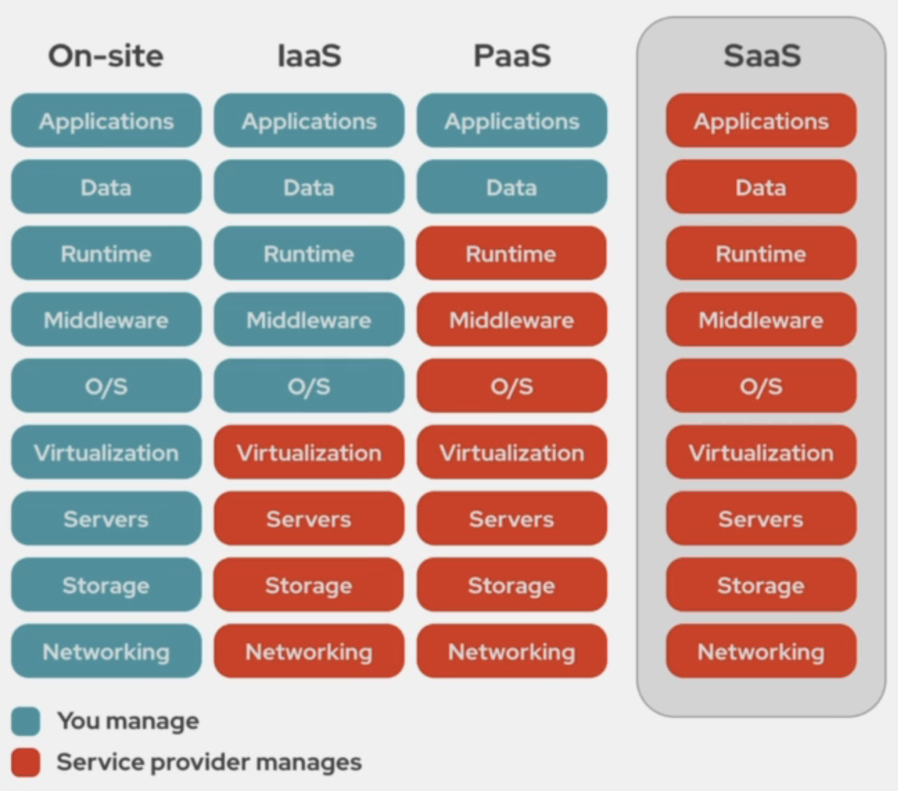

# CLF-C01 - AWS Cloud Practitioner

## Cloud Computing

A **computação em nuvem**, ou **cloud computing**, refere-se a um modelo de entrega de `serviços` de computação pela internet. Em vez de manter servidores e recursos locais, empresas e indivíduos podem acessar e utilizar poder de processamento, armazenamento e aplicativos virtualizados `hospedados em data centers remotos`. Isso permite escalabilidade flexível, custos mais controláveis e acesso conveniente a recursos tecnológicos, promovendo a agilidade e a eficiência nos negócios e nas atividades cotidianas.

### Benefícios

1. `Velocidade`: A computação em nuvem oferece a vantagem da rápida implantação de serviços e recursos. A capacidade de provisionar instantaneamente servidores, armazenamento e outros recursos permite que as empresas atendam rapidamente às demandas do mercado e às necessidades dos clientes, reduzindo o tempo necessário para colocar novos serviços em funcionamento.

2. `Updates`: Com a computação em nuvem, os provedores podem atualizar seus sistemas e serviços sem interromper a operação. Isso se traduz em menor tempo de inatividade para os usuários finais e garante que os serviços estejam sempre atualizados com as últimas melhorias de segurança, desempenho e funcionalidade.

3. `Custo`: A natureza escalonável da computação em nuvem permite que as empresas paguem apenas pelo que usam, evitando custos fixos e investimentos iniciais elevados em infraestrutura de TI. Além disso, muitos provedores oferecem modelos de pagamento flexíveis, como contratos de pagamento por uso, o que pode levar a descontos com base no volume de serviços contratados ou na duração do contrato.

4. `Data Security`: Os provedores de serviços em nuvem geralmente investem fortemente em segurança de dados. Eles implementam medidas de segurança avançadas, como criptografia de dados em repouso e em trânsito, autenticação de dois fatores e proteção contra ameaças cibernéticas. Além disso, os serviços em nuvem geralmente oferecem opções de backup automatizado, ajudando a garantir a recuperação de dados em caso de falhas.

5. `Escalabilidade`: A capacidade de dimensionar recursos para cima ou para baixo conforme a demanda é uma característica fundamental da computação em nuvem. Isso permite que as empresas se adaptem rapidamente a picos de tráfego sem comprometer o desempenho ou a disponibilidade dos serviços. A escalabilidade pode ser realizada manualmente ou configurada para ser automática, garantindo que os recursos estejam sempre alinhados com as necessidades reais.

### Tipos de serviços

Comparado à estrutura de TI local (**on-site**), na qual as empresas mantêm e gerenciam todos os aspectos da infraestrutura, a computação em nuvem oferece maior flexibilidade e eficiência. No entanto, as diferenças entre os modelos de nuvem são notáveis. No `IaaS`, você precisa gerenciar mais camadas, desde o sistema operacional até o aplicativo. No `PaaS`, o foco é principalmente no desenvolvimento do aplicativo, enquanto o provedor cuida das camadas mais baixas. No `SaaS`, a gestão é mínima, já que o provedor lida com todas as camadas.

#### IaaS (Infraestrutura como Serviço)

Nesse modelo, o provedor de nuvem oferece `infraestrutura virtualizada`, incluindo servidores, armazenamento, redes e recursos de processamento. Os usuários têm controle sobre sistemas operacionais, aplicativos e configurações, mas são responsáveis pelo gerenciamento de componentes de nível mais baixo, como atualizações de sistema operacional e segurança.

#### PaaS (Plataforma como Serviço)

Aqui, **além da infraestrutura**, o provedor oferece uma `plataforma completa para desenvolvimento e implantação de aplicativos`. Os usuários gerenciam principalmente suas próprias aplicações e dados, enquanto o provedor cuida da infraestrutura subjacente, incluindo sistema operacional, middleware e ambiente de desenvolvimento.

#### SaaS (Software como Serviço)

No modelo SaaS, os usuários acessam `aplicativos de software através da internet`, **sem a necessidade de instalação local**. Todas as camadas do software, desde a infraestrutura até o aplicativo em si, são gerenciadas pelo provedor do serviço. Os usuários se concentram principalmente no uso do software e nos dados relevantes.

### Modelos de implantação

#### Nuvem pública

A nuvem pública envolve a disponibilização de recursos de computação, como servidores, armazenamento e serviços, por meio da internet `para uso público`. Esses **recursos são compartilhados entre várias organizações e indivíduos**, geralmente hospedados e mantidos por provedores de serviços em nuvem. Ela oferece escalabilidade, flexibilidade e custos mais baixos, sendo ideal para empresas que desejam economizar em infraestrutura própria e pagar apenas pelos recursos utilizados. `A segurança e o isolamento são mantidos para garantir que os dados e as operações de cada cliente permaneçam protegidos e privados dentro desse ambiente`.

#### Nuvem privada

Uma nuvem privada é uma infraestrutura de `nuvem exclusiva de uma única organização`. Ela pode ser hospedada internamente pela própria organização ou por um provedor de serviços de nuvem dedicado. A nuvem privada oferece controle total sobre a segurança, personalização e conformidade, sendo **adequada para empresas com requisitos rigorosos de privacidade e segurança**, bem como para aquelas que desejam manter certos aplicativos ou dados sensíveis em um ambiente controlado.

#### Nuvem híbrida

A nuvem híbrida `combina elementos da nuvem pública e privada`. Nesse modelo, as organizações podem manter alguns recursos em uma nuvem privada para garantir segurança e controle, enquanto utilizam recursos da nuvem pública para lidar com picos de demanda, escalabilidade e flexibilidade. Isso **permite que as empresas equilibrem a eficiência da nuvem pública com a capacidade de gerenciar dados sensíveis e processos críticos** internamente.

### Shared responsibility model

O "**Shared Responsibility Model**" (**Modelo de Responsabilidade Compartilhada**) é um conceito chave na computação em nuvem que delineia as responsabilidades entre os provedores de serviços em nuvem e os clientes em relação à **segurança e gerenciamento dos recursos**.

> O provedor de nuvem é responsável pela segurança da infraestrutura física e virtual, bem como pela segurança da plataforma em que os serviços são executados.
>
> O cliente é responsável pela segurança dos dados, configurações de acesso e gerenciamento de aplicativos e sistemas implantados na nuvem.

### CLI e CloudShell

#### CLI

A CLI (**Command-Line Interface**) é uma ferramenta que permite aos usuários interagir com serviços em nuvem e `realizar tarefas por meio de comandos digitados em um terminal de linha de comando em suas máquinas locais`. Ela oferece flexibilidade e automação na gestão de recursos e configurações na nuvem, permitindo aos usuários executar operações complexas usando scripts ou comandos individuais.

#### Cloud Shell

O **Cloud Shell** é uma `interface interativa baseada em navegador` fornecida por alguns provedores de serviços em nuvem. Ele permite que os usuários acessem uma máquina virtual pré-configurada, já conectada às suas contas na nuvem, diretamente do navegador. Isso facilita a experimentação, a execução de comandos e a exploração de recursos **sem a necessidade de configurar ambientes locais**. O **Cloud Shell** é uma maneira conveniente de interagir com serviços em nuvem sem a necessidade de instalar ferramentas de linha de comando em sua máquina local.
