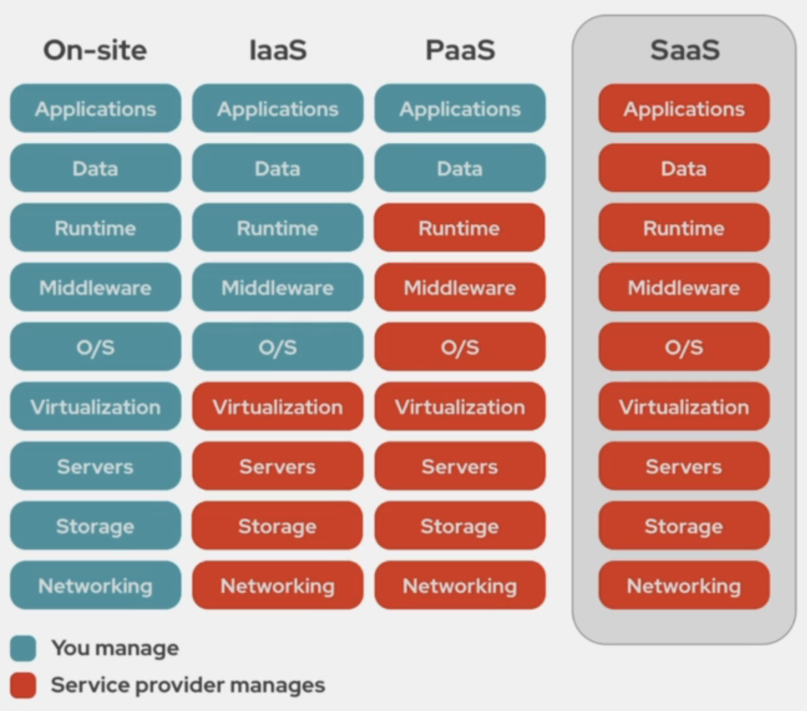

# CLF-C01 - AWS Cloud Practitioner

<!-- TOC tocDepth:2..6 chapterDepth:2..6 -->

- [1. Cloud Computing](#1-cloud-computing)
  - [1.1. Benefícios](#11-benefícios)
  - [1.2. Tipos de serviços](#12-tipos-de-serviços)
    - [1.2.1. IaaS (Infraestrutura como Serviço)](#121-iaas-infraestrutura-como-serviço)
    - [1.2.2. PaaS (Plataforma como Serviço)](#122-paas-plataforma-como-serviço)
    - [1.2.3. SaaS (Software como Serviço)](#123-saas-software-como-serviço)
  - [1.3. Modelos de implantação](#13-modelos-de-implantação)
    - [1.3.1. Nuvem pública](#131-nuvem-pública)
    - [1.3.2. Nuvem privada](#132-nuvem-privada)
    - [1.3.3. Nuvem híbrida](#133-nuvem-híbrida)
  - [1.4. Shared responsibility model](#14-shared-responsibility-model)
  - [1.5. CLI e CloudShell](#15-cli-e-cloudshell)
    - [1.5.1. CLI](#151-cli)
    - [1.5.2. Cloud Shell](#152-cloud-shell)
- [2. Arquitetura de infraestrutura global](#2-arquitetura-de-infraestrutura-global)
  - [2.1. Regiões da AWS](#21-regiões-da-aws)
  - [2.2. Zonas de disponibilidade](#22-zonas-de-disponibilidade)
  - [2.3. Zonas locais (Local zones)](#23-zonas-locais-local-zones)
  - [2.4. AWS Wavelength](#24-aws-wavelength)
  - [2.5. AWS Outposts](#25-aws-outposts)
- [3. IAM](#3-iam)
  - [3.1. Usuário (User)](#31-usuário-user)
  - [3.2. Grupos (Groups)](#32-grupos-groups)
  - [3.3. Funções (Roles)](#33-funções-roles)
  - [3.4. Políticas (Policies)](#34-políticas-policies)
- [4. Elastic Compute Cloud (EC2)](#4-elastic-compute-cloud-ec2)
  - [4.1. Benefícios](#41-benefícios)
  - [4.2. User data](#42-user-data)
- [5. Batch](#5-batch)
- [6. Lightsail](#6-lightsail)
- [7. Elastic Container Service (ECS)](#7-elastic-container-service-ecs)
- [8. Armazenamento](#8-armazenamento)
  - [8.1. Categorias](#81-categorias)
    - [8.1.1. Armazenamento em bloco (Block storage)](#811-armazenamento-em-bloco-block-storage)
    - [8.1.2. Armazenamento de arquivos (File storage)](#812-armazenamento-de-arquivos-file-storage)
    - [8.1.3. Armazenamento de objetos (Object storage)](#813-armazenamento-de-objetos-object-storage)
  - [8.2. Elastic Block Store (EBS):](#82-elastic-block-store-ebs)
    - [8.2.1. Tecnologias](#821-tecnologias)
    - [8.2.2. Snapshots e backups](#822-snapshots-e-backups)
  - [8.3. Simple Storage Service (S3)](#83-simple-storage-service-s3)
    - [8.3.1. Classes de armazenamento](#831-classes-de-armazenamento)
    - [8.3.2. Versionamento](#832-versionamento)
    - [8.3.3. Ciclo de vida](#833-ciclo-de-vida)
    - [8.3.4. Replicação de objetos](#834-replicação-de-objetos)
  - [8.4. Storage Gateway:](#84-storage-gateway)
- [9. Route 53](#9-route-53)
- [10. Auto scaling](#10-auto-scaling)
  - [10.1. Scaling Up (Escalonamento vertical)](#101-scaling-up-escalonamento-vertical)
  - [10.2. Scaling Out (Escalonamento horizontal)](#102-scaling-out-escalonamento-horizontal)
  - [10.3. Políticas de escalonamento](#103-políticas-de-escalonamento)
- [11. Load Balancer](#11-load-balancer)
  - [11.1. Application Load Balancer (ALB)](#111-application-load-balancer-alb)
  - [11.2. Network Load Balancer (NLB)](#112-network-load-balancer-nlb)

<!-- /TOC -->

## 1. Cloud Computing

A **computação em nuvem**, ou **cloud computing**, refere-se a um modelo de entrega de `serviços` de computação pela internet. Em vez de manter servidores e recursos locais, empresas e indivíduos podem acessar e utilizar poder de processamento, armazenamento e aplicativos virtualizados `hospedados em data centers remotos`. Isso permite escalabilidade flexível, custos mais controláveis e acesso conveniente a recursos tecnológicos, promovendo a agilidade e a eficiência nos negócios e nas atividades cotidianas.

### 1.1. Benefícios

- `Velocidade`: A computação em nuvem oferece a vantagem da rápida implantação de serviços e recursos. A capacidade de provisionar instantaneamente servidores, armazenamento e outros recursos permite que as empresas atendam rapidamente às demandas do mercado e às necessidades dos clientes, reduzindo o tempo necessário para colocar novos serviços em funcionamento.

- `Updates`: Com a computação em nuvem, os provedores podem atualizar seus sistemas e serviços sem interromper a operação. Isso se traduz em menor tempo de inatividade para os usuários finais e garante que os serviços estejam sempre atualizados com as últimas melhorias de segurança, desempenho e funcionalidade.

- `Custo`: A natureza escalonável da computação em nuvem permite que as empresas paguem apenas pelo que usam, evitando custos fixos e investimentos iniciais elevados em infraestrutura de TI. Além disso, muitos provedores oferecem modelos de pagamento flexíveis, como contratos de pagamento por uso, o que pode levar a descontos com base no volume de serviços contratados ou na duração do contrato.

- `Data Security`: Os provedores de serviços em nuvem geralmente investem fortemente em segurança de dados. Eles implementam medidas de segurança avançadas, como criptografia de dados em repouso e em trânsito, autenticação de dois fatores e proteção contra ameaças cibernéticas. Além disso, os serviços em nuvem geralmente oferecem opções de backup automatizado, ajudando a garantir a recuperação de dados em caso de falhas.

- `Escalabilidade`: A capacidade de dimensionar recursos para cima ou para baixo conforme a demanda é uma característica fundamental da computação em nuvem. Isso permite que as empresas se adaptem rapidamente a picos de tráfego sem comprometer o desempenho ou a disponibilidade dos serviços. A escalabilidade pode ser realizada manualmente ou configurada para ser automática, garantindo que os recursos estejam sempre alinhados com as necessidades reais.

### 1.2. Tipos de serviços

Comparado à estrutura de TI local (**on-site**), na qual as empresas mantêm e gerenciam todos os aspectos da infraestrutura, a computação em nuvem oferece maior flexibilidade e eficiência. No entanto, as diferenças entre os modelos de nuvem são notáveis. No `IaaS`, você precisa gerenciar mais camadas, desde o sistema operacional até o aplicativo. No `PaaS`, o foco é principalmente no desenvolvimento do aplicativo, enquanto o provedor cuida das camadas mais baixas. No `SaaS`, a gestão é mínima, já que o provedor lida com todas as camadas.

#### 1.2.1. IaaS (Infraestrutura como Serviço)

Nesse modelo, o provedor de nuvem oferece `infraestrutura virtualizada`, incluindo servidores, armazenamento, redes e recursos de processamento. Os usuários têm controle sobre sistemas operacionais, aplicativos e configurações, mas são responsáveis pelo gerenciamento de componentes de nível mais baixo, como atualizações de sistema operacional e segurança.

#### 1.2.2. PaaS (Plataforma como Serviço)

Aqui, **além da infraestrutura**, o provedor oferece uma `plataforma completa para desenvolvimento e implantação de aplicativos`. Os usuários gerenciam principalmente suas próprias aplicações e dados, enquanto o provedor cuida da infraestrutura subjacente, incluindo sistema operacional, middleware e ambiente de desenvolvimento.

#### 1.2.3. SaaS (Software como Serviço)

No modelo SaaS, os usuários acessam `aplicativos de software através da internet`, **sem a necessidade de instalação local**. Todas as camadas do software, desde a infraestrutura até o aplicativo em si, são gerenciadas pelo provedor do serviço. Os usuários se concentram principalmente no uso do software e nos dados relevantes.

### 1.3. Modelos de implantação

#### 1.3.1. Nuvem pública

A nuvem pública envolve a disponibilização de recursos de computação, como servidores, armazenamento e serviços, por meio da internet `para uso público`. Esses **recursos são compartilhados entre várias organizações e indivíduos**, geralmente hospedados e mantidos por provedores de serviços em nuvem. Ela oferece escalabilidade, flexibilidade e custos mais baixos, sendo ideal para empresas que desejam economizar em infraestrutura própria e pagar apenas pelos recursos utilizados. `A segurança e o isolamento são mantidos para garantir que os dados e as operações de cada cliente permaneçam protegidos e privados dentro desse ambiente`.

#### 1.3.2. Nuvem privada

Uma nuvem privada é uma infraestrutura de `nuvem exclusiva de uma única organização`. Ela pode ser hospedada internamente pela própria organização ou por um provedor de serviços de nuvem dedicado. A nuvem privada oferece controle total sobre a segurança, personalização e conformidade, sendo **adequada para empresas com requisitos rigorosos de privacidade e segurança**, bem como para aquelas que desejam manter certos aplicativos ou dados sensíveis em um ambiente controlado.

#### 1.3.3. Nuvem híbrida

A nuvem híbrida `combina elementos da nuvem pública e privada`. Nesse modelo, as organizações podem manter alguns recursos em uma nuvem privada para garantir segurança e controle, enquanto utilizam recursos da nuvem pública para lidar com picos de demanda, escalabilidade e flexibilidade. Isso **permite que as empresas equilibrem a eficiência da nuvem pública com a capacidade de gerenciar dados sensíveis e processos críticos** internamente.

### 1.4. Shared responsibility model

O "**Shared Responsibility Model**" (**Modelo de Responsabilidade Compartilhada**) é um conceito chave na computação em nuvem que delineia as responsabilidades entre os provedores de serviços em nuvem e os clientes em relação à **segurança e gerenciamento dos recursos**.

> O provedor de nuvem é responsável pela segurança da infraestrutura física e virtual, bem como pela segurança da plataforma em que os serviços são executados.
>
> O cliente é responsável pela segurança dos dados, configurações de acesso e gerenciamento de aplicativos e sistemas implantados na nuvem.

### 1.5. CLI e CloudShell

#### 1.5.1. CLI

A CLI (**Command-Line Interface**) é uma ferramenta que permite aos usuários interagir com serviços em nuvem e `realizar tarefas por meio de comandos digitados em um terminal de linha de comando em suas máquinas locais`. Ela oferece flexibilidade e automação na gestão de recursos e configurações na nuvem, permitindo aos usuários executar operações complexas usando scripts ou comandos individuais.

#### 1.5.2. Cloud Shell

O **Cloud Shell** é uma `interface interativa baseada em navegador` fornecida por alguns provedores de serviços em nuvem. Ele permite que os usuários acessem uma máquina virtual pré-configurada, já conectada às suas contas na nuvem, diretamente do navegador. Isso facilita a experimentação, a execução de comandos e a exploração de recursos **sem a necessidade de configurar ambientes locais**. O **Cloud Shell** é uma maneira conveniente de interagir com serviços em nuvem sem a necessidade de instalar ferramentas de linha de comando em sua máquina local.

## 2. Arquitetura de infraestrutura global

### 2.1. Regiões da AWS

As regiões da AWS são `localizações geográficas` onde a infraestrutura da AWS está hospedada. **Cada região é composta por várias zonas de disponibilidade** e oferece uma variedade de serviços da AWS. Exemplos de regiões incluem US East (Norte da Virgínia), Ásia-Pacífico (Tóquio) e Europa (Frankfurt).

### 2.2. Zonas de disponibilidade

Uma Zona de Disponibilidade (AZ) é um ou mais `data centers` fisicamente separados dentro de uma região. Isso ajuda a aumentar a **resiliência**, **redundância** e **disponibilidade** dos serviços. Os recursos implantados em diferentes AZs em uma região são isolados para garantir maior **confiabilidade**.

### 2.3. Zonas locais (Local zones)

As Zonas Locais são `extensões das regiões` da AWS que permitem a execução de aplicativos e serviços perto de **locais específicos onde há uma demanda mais intensa** de computação. Isso ajuda a **reduzir a latência** para os usuários finais e oferece maior flexibilidade na implantação de recursos.

### 2.4. AWS Wavelength

O AWS Wavelength é uma oferta que coloca recursos de computação e armazenamento da AWS em pontos de presença de `operadoras de telecomunicações`. Isso permite que aplicativos de baixa latência, como serviços de streaming de vídeo e jogos, sejam executados mais próximos dos usuários finais, aproveitando a infraestrutura de rede das operadoras.

### 2.5. AWS Outposts

O AWS Outposts é um serviço que permite a extensão dos serviços da AWS para `ambientes on-premise (locais físicos das empresas)`. Isso possibilita a execução de serviços da AWS em hardware dedicado nas instalações do cliente, proporcionando uma experiência semelhante à nuvem, porém em um ambiente controlado pela empresa.

## 3. IAM

O IAM (**Identity and Access Management**) da AWS é um serviço que `gerencia o acesso aos recursos e serviços` da AWS de forma segura. Ele permite que você controle **quem** pode acessar seus recursos na AWS e quais **ações** específicas eles podem realizar. Com o IAM, você pode criar e gerenciar identidades (como usuários, grupos e funções) e **atribuir permissões granulares** para garantir a segurança e o princípio do menor privilégio, restringindo o acesso apenas ao que é necessário para os usuários e processos.

### 3.1. Usuário (User)

Um usuário é uma `entidade com credenciais únicas que pode interagir com os serviços da AWS`. Os usuários são criados no IAM e podem ser pessoas reais ou processos automatizados. Cada usuário **possui um conjunto de credenciais** (nome de usuário e senha ou chaves de acesso) que são usadas para autenticar e autorizar suas ações na AWS.

### 3.2. Grupos (Groups)

Grupos são `conjuntos lógicos de usuários`. Eles facilitam a **atribuição de permissões a múltiplos usuários de uma vez**. Em vez de atribuir permissões individualmente a cada usuário, você pode associar políticas de permissão a grupos, e os membros desse grupo herdarão essas permissões.

### 3.3. Funções (Roles)

As funções são entidades do IAM que têm permissões associadas a elas e podem ser `temporariamente assumidas por usuários ou serviços dentro da AWS`. Elas são frequentemente usadas para permitir que serviços, como instâncias EC2 ou funções Lambda, `acessem recursos da AWS de maneira segura sem a necessidade de credenciais de longo prazo`. As funções também são usadas para fornecer **acesso temporário a usuários autenticados sem compartilhar chaves de acesso diretas**.

### 3.4. Políticas (Policies)

Políticas são `documentos que definem as permissões e ações` que os usuários, grupos e funções do IAM podem realizar em recursos específicos da AWS. Elas são escritas em **JSON (JavaScript Object Notation)** e detalham quais ações são permitidas ou negadas. As políticas **podem ser anexadas a usuários, grupos e funções** para controlar o acesso de maneira precisa.

## 4. Elastic Compute Cloud (EC2)

O Amazon EC2 é um serviço de computação em nuvem que permite aos usuários provisionar e gerenciar `máquinas virtuais escaláveis` em uma variedade de configurações. Essas máquinas virtuais, conhecidas como **instâncias EC2**, oferecem flexibilidade para escolher tipos de instâncias com diferentes recursos de CPU, memória, armazenamento e capacidades de rede.

Os usuários **podem selecionar imagens pré-configuradas** (conhecidas como `AMIs`) ou criar suas próprias imagens para iniciar instâncias EC2 com sistemas operacionais e softwares específicos. O EC2 é amplamente utilizado para **hospedar aplicativos, executar tarefas de processamento, criar ambientes de teste e desenvolvimento, bem como para cargas de trabalho de análise e outras computações intensivas**.

O `escalonamento vertical` (aumentar ou diminuir os recursos de uma única instância) e o `escalonamento horizontal` (adicionar ou remover instâncias) permitem adaptar facilmente a capacidade de computação às necessidades em constante mudança. O EC2 é um dos serviços fundamentais da AWS, que forma a base para muitas aplicações e arquiteturas na nuvem.

### 4.1. Benefícios

- `Controle total`: O Amazon EC2 oferece controle completo sobre as instâncias virtuais. Os usuários podem escolher tipos de instâncias, sistemas operacionais, configurações de segurança e personalizar as instâncias de acordo com suas necessidades.

- `Segurança`: O EC2 permite a aplicação de medidas de segurança personalizadas, como grupos de segurança e autenticação MFA, para proteger instâncias e dados. Isso ajuda a manter a integridade dos sistemas hospedados.

- `Conexão com outros serviços AWS`: As instâncias EC2 podem ser facilmente integradas a outros serviços da AWS, como o Amazon S3 para armazenamento de dados, o Amazon RDS para bancos de dados gerenciados e o Amazon CloudWatch para monitoramento. Isso cria ecossistemas de aplicativos completos.

- `Custo flexível`: O modelo de precificação do EC2 é pay-as-you-go, o que significa que você paga apenas pelo tempo de utilização e pelos recursos consumidos. Isso proporciona flexibilidade para dimensionar recursos de acordo com as necessidades sem custos iniciais elevados.

- `Facilidade de uso`: Com uma ampla gama de opções pré-configuradas, como as Amazon Machine Images (AMIs), e ferramentas de gerenciamento como o AWS Management Console, o EC2 simplifica o processo de implantação e administração de máquinas virtuais.

### 4.2. User data

User Data é um recurso do Amazon EC2 que permite aos usuários `especificar scripts ou comandos que serão executados automaticamente quando uma instância EC2 for inicializada`. Esses scripts podem ser usados para **realizar configurações, instalar software, aplicar atualizações ou executar outras tarefas** personalizadas durante o processo de inicialização da instância.

## 5. Batch

O AWS Batch é um serviço projetado para `executar facilmente cargas de trabalho de processamento em lote em escala`. Ele permite que você execute trabalhos em lote, como processamento de dados, análise, renderização de imagens ou qualquer tarefa que possa ser dividida em unidades independentes de trabalho.

Ele gerencia automaticamente a **escalabilidade, provisionamento de recursos e a execução dos trabalhos em contêineres Docker**. Isso permite otimizar a utilização de recursos, pois o AWS Batch ajusta automaticamente a capacidade de acordo com as demandas dos trabalhos.

## 6. Lightsail

O Amazon Lightsail é um serviço da AWS projetado para `simplificar a criação e a implantação de aplicações web e websites`. Ele oferece uma abordagem mais fácil e acessível em comparação com outros serviços da AWS, como o Amazon EC2.

Com o Lightsail, os usuários podem escolher `modelos pré-configurados` que incluem instâncias de servidor, armazenamento, rede e recursos de gerenciamento. Isso elimina a necessidade de configurar detalhes técnicos complexos, tornando o processo de lançamento de projetos online mais rápido.

## 7. Elastic Container Service (ECS)

O Amazon ECS é um serviço de `orquestração de contêineres` altamente escalável e gerenciado pela AWS. Ele permite que você execute e gerencie facilmente aplicativos em contêineres usando tecnologias como Docker.

As `tarefas do ECS representam unidades de trabalho individuais` que podem ser executadas em contêineres. Cada tarefa define quais contêineres serão executados juntos e como eles se comunicarão. O ECS gerencia a implantação e o escalonamento das tarefas em um cluster de instâncias **EC2** ou usando o serviço de instâncias **Fargate**, que permite executar contêineres sem a necessidade de provisionar ou gerenciar a infraestrutura subjacente.

O ECS também oferece o **Amazon Elastic Container Registry (ECR)**, um serviço de registro de contêineres privado e altamente seguro. Ele permite que você armazene, gerencie e implante imagens de contêineres do Docker. O ECR integra-se perfeitamente com o ECS e outras ferramentas da AWS, facilitando o armazenamento e a distribuição de suas imagens de contêineres.

## 8. Armazenamento

### 8.1. Categorias

#### 8.1.1. Armazenamento em bloco (Block storage)

Fornece volumes de armazenamento virtuais que `atuam como discos rígidos` conectados às instâncias de computação. Os exemplos incluem o Amazon Elastic Block Store (EBS), que oferece volumes persistentes que podem ser anexados e desanexados das instâncias EC2. É ideal para aplicativos que precisam de acesso de baixa latência a dados, como bancos de dados e sistemas de arquivos.

#### 8.1.2. Armazenamento de arquivos (File storage)

Fornece `sistemas de arquivos compartilhados` que podem ser acessados por várias instâncias de computação. O Amazon Elastic File System (EFS) é um exemplo, oferecendo armazenamento compartilhado altamente disponível e escalável para as instâncias EC2. É útil para aplicativos que requerem compartilhamento de arquivos entre instâncias.

#### 8.1.3. Armazenamento de objetos (Object storage)

É otimizado para `armazenar e recuperar grandes quantidades de dados não estruturados`, como imagens, vídeos e backups. O Amazon Simple Storage Service (S3) é um serviço de armazenamento de objetos altamente durável e escalável. Ele oferece recursos para gerenciar, proteger e recuperar objetos em uma variedade de classes de armazenamento, dependendo dos requisitos de acesso e durabilidade.

### 8.2. Elastic Block Store (EBS):

Serviço de armazenamento em bloco projetado para fornecer `volumes de armazenamento persistentes e de alto desempenho para as instâncias EC2`. Os volumes EBS atuam como discos virtuais que podem ser anexados a instâncias EC2, oferecendo armazenamento durável e de baixa latência.

#### 8.2.1. Tecnologias

O EBS oferece uma variedade de tecnologias de volumes, cada um otimizado para diferentes casos de uso, incluindo armazenamento padrão, `armazenamento com alto desempenho (SSD)`, `armazenamento com baixo custo (HDD)` e `volumes otimizados para I/O`.

#### 8.2.2. Snapshots e backups

O EBS permite criar snapshots (`instantâneos`) dos volumes, que são `cópias de backup incremental dos dados`. Esses snapshots podem ser usados para **restaurar volumes, criar novos volumes a partir deles ou até mesmo compartilhar com outras regiões da AWS**.

### 8.3. Simple Storage Service (S3)

O Amazon S3 é um `serviço de armazenamento de objetos altamente escalável e durável`. Ele pode lidar com qualquer quantidade de dados e é projetado para escalabilidade massiva e alta disponibilidade.

Oferece durabilidade elevada dos dados, replicando automaticamente os objetos em várias zonas de disponibilidade. Isso garante a proteção contra falhas de hardware e disponibilidade contínua.

Os `objetos armazenados no S3 podem ser acessados a partir de qualquer lugar através de uma URL única`, tornando-o um serviço globalmente disponível. Eles são armazenados em `buckets` (baldes, em português). O bucket é o principal contêiner de armazenamento no S3. Os nomes dos buckets são exclusivos em toda a AWS.

#### 8.3.1. Classes de armazenamento

O Amazon S3 oferece diferentes classes de armazenamento, cada uma `otimizada para atender a diferentes requisitos de desempenho`, acesso e custo. Aqui estão algumas das principais classes de armazenamento oferecidas pelo S3:

- `Standard`: Projetada para oferecer alta durabilidade e baixa latência. É adequada para dados frequentemente acessados e é uma boa escolha para aplicativos que exigem acesso rápido aos dados.

- `Intelligent-Tiering`: Nessa classe, o S3 move automaticamente objetos entre duas camadas: uma camada de acesso frequente e uma camada de acesso eventual. Isso ajuda a otimizar custos, pois dados menos acessados são movidos para a camada de acesso eventual, enquanto dados frequentemente acessados permanecem na camada de acesso frequente.

- `Glacier`: Projetada para armazenamento de arquivamento de longo prazo com custos mais baixos. Os objetos armazenados na classe Glacier podem levar mais tempo para serem recuperados, mas são uma opção econômica para retenção de dados a longo prazo.

- `Glacier Deep Archive`: Classe mais econômica do S3 e é ideal para dados de arquivamento de longo prazo que raramente precisam ser acessados. Os tempos de recuperação são mais longos, mas os custos são mais baixos.

- `One Zone-IA`: Essa classe oferece armazenamento de acesso eventual em uma única zona de disponibilidade, tornando-a mais econômica do que as classes de armazenamento replicadas em várias zonas.

#### 8.3.2. Versionamento

O versionamento permite o `controle e o armazenamento de múltiplas versões de objetos` em um bucket (repositório de objetos). Quando o versionamento é ativado para um bucket, o S3 mantém o histórico de todas as alterações feitas nos objetos, incluindo adições, modificações e exclusões.

#### 8.3.3. Ciclo de vida

O Amazon S3 oferece um recurso de gerenciamento de ciclo de vida que permite `automatizar o movimento de objetos entre classes de armazenamento diferentes à medida que envelhecem ou atendem a critérios específicos`. Isso ajuda a otimizar custos e manter o armazenamento eficiente ao longo do tempo.

#### 8.3.4. Replicação de objetos

A replicação de objetos no Amazon S3 é um recurso que permite `criar cópias dos objetos armazenados em um bucket do S3 e replicá-los em outro bucket`, seja na mesma região da AWS ou em uma região diferente. Esse recurso é útil para cenários em que você deseja ter cópias de backup ou manter cópias dos dados em diferentes regiões para fins de recuperação de desastres.

### 8.4. Storage Gateway:

O AWS Storage Gateway é um serviço que facilita a `integração de ambientes de armazenamento on-premises (locais) com a infraestrutura de nuvem da AWS`. Ele fornece uma ponte entre o armazenamento local e o armazenamento baseado em nuvem, permitindo que você aproveite os benefícios da nuvem sem necessariamente mover todos os seus dados.

## 9. Route 53

É o serviço de **Sistema de Nomes de Domínio (DNS)** altamente escalável e confiável oferecido pela AWS. Ele permite que você `registre domínios, roteie o tráfego da Internet para recursos da AWS e de outros provedores`, além de oferecer recursos avançados de gerenciamento de DNS.

O Route 53 suporta várias estratégias de roteamento de tráfego, como `balanceamento de carga, failover e roteamento geográfico`, permitindo direcionar o tráfego para recursos específicos com base em regras e localização geográfica dos usuários.

## 10. Auto scaling

Estratégia de escalonamento automático, que inclui o `Scaling Up` e o `Scaling Out`. Ela permite ajustar automaticamente a capacidade de recursos em resposta à demanda do aplicativo.

### 10.1. Scaling Up (Escalonamento vertical)

Nessa abordagem, você aumenta a capacidade de recursos, como CPU, RAM ou armazenamento, `em uma única instância`. Por exemplo, **você pode migrar para uma instância EC2 com mais recursos**, como CPU mais rápida ou mais memória RAM. Essa estratégia é mais rápida de implementar, mas pode atingir um limite de capacidade e pode ser mais custosa.

### 10.2. Scaling Out (Escalonamento horizontal)

Aqui, você aumenta a capacidade `adicionando mais instâncias idênticas` ao ambiente. Em vez de aumentar os recursos de uma única instância, você cria `várias instâncias que compartilham a carga`. Essa abordagem é mais flexível e escalável, permitindo lidar com grandes volumes de tráfego. É frequentemente usado com balanceadores de carga para distribuir o tráfego entre as instâncias.

### 10.3. Políticas de escalonamento

A AWS oferece dois tipos de políticas de escalonamento automáticas para o serviço Auto Scaling:

`Target Tracking Scaling`: Mantém uma métrica-alvo, como a utilização da CPU ou a quantidade de requisições por segundo, em um valor específico. O Auto Scaling ajusta automaticamente o número de instâncias para manter a métrica próxima ao valor-alvo. É uma abordagem simples para manter o desempenho desejado.

`Step Scaling`: Define ações específicas a serem tomadas em diferentes intervalos de métricas. Com base nas métricas, você pode configurar incrementos ou decrementos específicos no número de instâncias. Isso permite definir ajustes mais granulares em resposta a diferentes níveis de carga.

## 11. Load Balancer

Um Load Balancer (balanceador de carga) é um serviço que `distribui automaticamente o tráfego de entrada entre várias instâncias` de recursos, como instâncias EC2, para melhorar a disponibilidade, escalabilidade e confiabilidade dos aplicativos.

Com múltiplas instâncias servindo o tráfego, se uma instância falhar, o Load Balancer redireciona o tráfego para as instâncias restantes, mantendo o aplicativo disponível.

Com o Auto Scaling, os Load Balancers podem ser combinados para escalar horizontalmente, adicionando mais instâncias conforme a demanda aumenta.

Atualmente a AWS oferece dois tipos principais de Load Balancers:

### 11.1. Application Load Balancer (ALB)

O ALB é `otimizado para aplicativos da web e opera na camada 7` (HTTP/HTTPS). Ele suporta roteamento baseado em conteúdo, permitindo `direcionar o tráfego para diferentes instâncias com base em informações de URL, cabeçalhos HTTP e outros atributos de aplicativos`. É adequado para cenários em que é necessário roteamento flexível e recursos específicos para aplicativos da web.

### 11.2. Network Load Balancer (NLB)

O NLB opera na camada 4 (TCP/UDP) e é projetado para oferecer alto desempenho e baixa latência. Ele é ideal para cargas de trabalho que requerem distribuição de tráfego de rede de maneira eficiente, como aplicativos de streaming ou jogos online. Ele pode `enviar o tráfego para diferentes instâncias com base nas informações do tráfego, como o endereço de IP de origem ou a porta que está sendo usada`.
