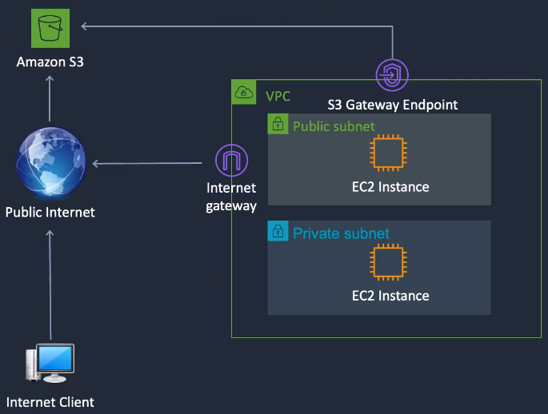
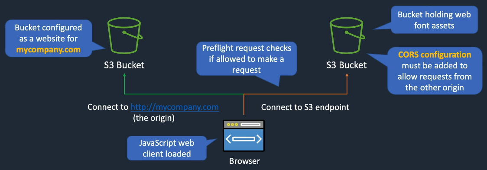
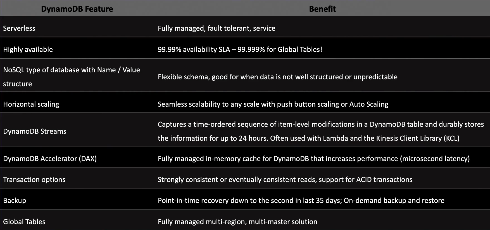
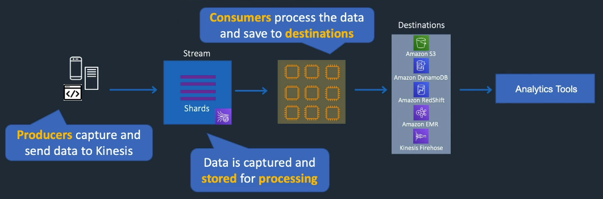
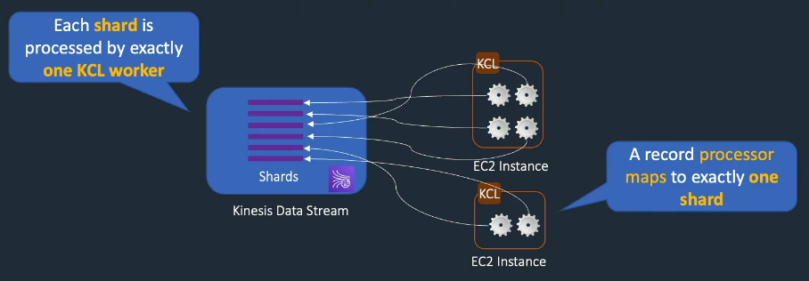

# DVA-C02 - AWS Certified Developer – Associate

[<- Voltar para a página principal](../../README.md)


---

**Sumário**

<!-- TOC -->

- [1. Conta AWS e IAM](#1-conta-aws-e-iam)
  - [1.1. Perfis](#11-perfis)
  - [1.2. IAM: Identity and Access Management](#12-iam-identity-and-access-management)
  - [1.3. Custos](#13-custos)
  - [1.4. STS: Security Token Service](#14-sts-security-token-service)
  - [1.5. Métodos de controle de acesso](#15-m%C3%A9todos-de-controle-de-acesso)
- [2. CLI: Command Line Interface](#2-cli-command-line-interface)
  - [2.1. Comandos](#21-comandos)
  - [2.2. Arquivos importantes](#22-arquivos-importantes)
- [3. VPC, EC2 e ELB](#3-vpc-ec2-e-elb)
  - [3.1. VPC: Virtual Private Cloud](#31-vpc-virtual-private-cloud)
    - [3.1.1. Conexões e Componentes Adicionais](#311-conex%C3%B5es-e-componentes-adicionais)
    - [3.1.2. Segurança](#312-seguran%C3%A7a)
  - [3.2. EC2: Elastic Compute Cloud](#32-ec2-elastic-compute-cloud)
    - [3.2.1. EBS: Elastic Block Store](#321-ebs-elastic-block-store)
    - [3.2.2. Instance Stores](#322-instance-stores)
    - [3.2.3. EFS: Elastic File System](#323-efs-elastic-file-system)
      - [3.2.3.1. Classes de armazenamento](#3231-classes-de-armazenamento)
      - [3.2.3.2. Desempenho](#3232-desempenho)
    - [3.2.4. Metadata](#324-metadata)
    - [3.2.5. User Data](#325-user-data)
    - [3.2.6. Access Keys e IAM Roles](#326-access-keys-e-iam-roles)
    - [3.2.7. Auto Scaling](#327-auto-scaling)
      - [3.2.7.1. ASG: Auto Scaling Groups](#3271-asg-auto-scaling-groups)
  - [3.3. ELB: Elastic Load Balancing](#33-elb-elastic-load-balancing)
    - [3.3.1. Tipos](#331-tipos)
- [4. Amazon S3 e CloudFront](#4-amazon-s3-e-cloudfront)
  - [4.1. S3: Simple Storage Service](#41-s3-simple-storage-service)
    - [4.1.1. Classes de Armazenamento](#411-classes-de-armazenamento)
    - [4.1.2. Controles de acesso](#412-controles-de-acesso)
      - [4.1.2.1. IAM Policies](#4121-iam-policies)
      - [4.1.2.2. Bucket Policies](#4122-bucket-policies)
      - [4.1.2.3. ACLs: Access Control Lists](#4123-acls-access-control-lists)
    - [4.1.3. Versioning](#413-versioning)
    - [4.1.4. Replication](#414-replication)
    - [4.1.5. Lifecycle Rules](#415-lifecycle-rules)
    - [4.1.6. MFA: Multi-Factor Authentication](#416-mfa-multi-factor-authentication)
    - [4.1.7. Criptografia](#417-criptografia)
    - [4.1.8. Registro de Acesso ao Servidor](#418-registro-de-acesso-ao-servidor)
    - [4.1.9. CORS: Cross-Origin Resource Sharing](#419-cors-cross-origin-resource-sharing)
  - [4.2. CloudFront](#42-cloudfront)
    - [4.2.1. Signed URLs](#421-signed-urls)
    - [4.2.2. Signed Cookies](#422-signed-cookies)
    - [4.2.3. OAC: Origin Access Control](#423-oac-origin-access-control)
    - [4.2.4. Route 53 DNS](#424-route-53-dns)
- [5. IaC e PaaS](#5-iac-e-paas)
  - [5.1. IaC: Infrastructure as Code com CloudFormation](#51-iac-infrastructure-as-code-com-cloudformation)
    - [5.1.1. CloudFormation Template](#511-cloudformation-template)
      - [5.1.1.1. Funções Intrínsecas](#5111-fun%C3%A7%C3%B5es-intr%C3%ADnsecas)
      - [5.1.1.2. Seções](#5112-se%C3%A7%C3%B5es)
  - [5.2. PaaS: Platform as a Service com AWS Elastic Beanstalk](#52-paas-platform-as-a-service-com-aws-elastic-beanstalk)
    - [5.2.1. Configurações avançadas e SSL/TLS](#521-configura%C3%A7%C3%B5es-avan%C3%A7adas-e-ssltls)
- [6. Lambda e SAM](#6-lambda-e-sam)
  - [6.1. Arquitetura Orientada a Eventos e Serverless Services](#61-arquitetura-orientada-a-eventos-e-serverless-services)
  - [6.2. AWS Lambda](#62-aws-lambda)
    - [6.2.1. Modos de execução](#621-modos-de-execu%C3%A7%C3%A3o)
    - [6.2.2. Versões](#622-vers%C3%B5es)
    - [6.2.3. Aliases](#623-aliases)
    - [6.2.4. Deploy de pacotes](#624-deploy-de-pacotes)
    - [6.2.5. Layers](#625-layers)
    - [6.2.6. Variáveis de Ambiente](#626-vari%C3%A1veis-de-ambiente)
    - [6.2.7. Limites](#627-limites)
    - [6.2.8. Destinations e DLQ: Dead-Letter Queues](#628-destinations-e-dlq-dead-letter-queues)
    - [6.2.9. Reserved e Provisioned Concurrency](#629-reserved-e-provisioned-concurrency)
    - [6.2.10. Monitoramento, Logging, e Tracing](#6210-monitoramento-logging-e-tracing)
    - [6.2.11. Usando com VPC e ALB](#6211-usando-com-vpc-e-alb)
    - [6.2.12. Signer](#6212-signer)
  - [6.3. SAM: Serverless Application Model](#63-sam-serverless-application-model)
    - [6.3.1. Comandos](#631-comandos)
- [7. Amazon DynamoDB](#7-amazon-dynamodb)
  - [7.1. Características](#71-caracter%C3%ADsticas)
  - [7.2. Componentes](#72-componentes)
  - [7.3. API](#73-api)
    - [7.3.1. Control Plane](#731-control-plane)
    - [7.3.2. Data Plane](#732-data-plane)
  - [7.4. Tipos de dados](#74-tipos-de-dados)
    - [7.4.1. Escalares](#741-escalares)
    - [7.4.2. Documento](#742-documento)
    - [7.4.3. Conjunto](#743-conjunto)
  - [7.5. Classes](#75-classes)
  - [7.6. Controle de acesso](#76-controle-de-acesso)
  - [7.7. Chaves](#77-chaves)
    - [7.7.1. Chave de Partição](#771-chave-de-parti%C3%A7%C3%A3o)
    - [7.7.2. Chave de Ordenação](#772-chave-de-ordena%C3%A7%C3%A3o)
    - [7.7.3. Chave Composta](#773-chave-composta)
    - [7.7.4. Melhores práticas](#774-melhores-pr%C3%A1ticas)
  - [7.8. Consistência](#78-consist%C3%AAncia)
  - [7.9. Transactions](#79-transactions)
  - [7.10. Performance](#710-performance)
  - [7.11. Scan API](#711-scan-api)
  - [7.12. Query API](#712-query-api)
  - [7.13. Índices](#713-%C3%ADndices)
    - [7.13.1. LSI: Local Secondary Index](#7131-lsi-local-secondary-index)
    - [7.13.2. GSI: Global Secondary Index](#7132-gsi-global-secondary-index)
  - [7.14. Optimistic Locking](#714-optimistic-locking)
  - [7.15. Streams](#715-streams)
  - [7.16. DAX](#716-dax)
- [8. Integrações e APIs](#8-integra%C3%A7%C3%B5es-e-apis)
  - [8.1. SQS: Simple Queue Service](#81-sqs-simple-queue-service)
    - [8.1.1. Tipos](#811-tipos)
    - [8.1.2. DLQ: Dead Letter Queue](#812-dlq-dead-letter-queue)
    - [8.1.3. Delay Queue](#813-delay-queue)
    - [8.1.4. Visibility Timeout](#814-visibility-timeout)
    - [8.1.5. SQS Long Polling x Short Polling](#815-sqs-long-polling-x-short-polling)
  - [8.2. SNS: Simple Notification Service](#82-sns-simple-notification-service)
    - [8.2.1. Fan-Out](#821-fan-out)
  - [8.3. Step Functions](#83-step-functions)
  - [8.4. EventBridge](#84-eventbridge)
  - [8.5. API Gateway](#85-api-gateway)
    - [8.5.1. Tipos de implantação](#851-tipos-de-implanta%C3%A7%C3%A3o)
    - [8.5.2. Recursos e métodos](#852-recursos-e-m%C3%A9todos)
    - [8.5.3. Tipos de integração](#853-tipos-de-integra%C3%A7%C3%A3o)
    - [8.5.4. Mapping Templates](#854-mapping-templates)
    - [8.5.5. Implantações e Estágios](#855-implanta%C3%A7%C3%B5es-e-est%C3%A1gios)
    - [8.5.6. Caching](#856-caching)
    - [8.5.7. Throttling](#857-throttling)
    - [8.5.8. Planos de Uso e Chaves de API](#858-planos-de-uso-e-chaves-de-api)
    - [8.5.9. Controle de acesso](#859-controle-de-acesso)
      - [8.5.9.1. Políticas Baseadas em Recursos](#8591-pol%C3%ADticas-baseadas-em-recursos)
      - [8.5.9.2. Lambda Authorizer](#8592-lambda-authorizer)
      - [8.5.9.3. Cognito User Pools](#8593-cognito-user-pools)
- [9. Contêineres](#9-cont%C3%AAineres)
  - [9.1. ECS: Elastic Container Service](#91-ecs-elastic-container-service)
    - [9.1.1. Componentes](#911-componentes)
    - [9.1.2. Funcionalidades](#912-funcionalidades)
    - [9.1.3. Cluster](#913-cluster)
    - [9.1.4. Imagens](#914-imagens)
    - [9.1.5. Task definition](#915-task-definition)
    - [9.1.6. Launch Type](#916-launch-type)
    - [9.1.7. Task Placement Strategies](#917-task-placement-strategies)
    - [9.1.8. CQL: Cluster Query Language](#918-cql-cluster-query-language)
    - [9.1.9. Scaling](#919-scaling)
      - [9.1.9.1. Service Auto Scaling](#9191-service-auto-scaling)
      - [9.1.9.2. Cluster Auto Scaling](#9192-cluster-auto-scaling)
  - [9.2. ECR: Elastic Container Registry](#92-ecr-elastic-container-registry)
    - [9.2.1. Componentes](#921-componentes)
    - [9.2.2. Funcionalidades](#922-funcionalidades)
  - [9.3. EKS: Elastic Kubernetes Service](#93-eks-elastic-kubernetes-service)
    - [9.3.1. Auto Scaling](#931-auto-scaling)
      - [9.3.1.1. Cluster Auto Scaling](#9311-cluster-auto-scaling)
      - [9.3.1.2. Workload Auto Scaling](#9312-workload-auto-scaling)
    - [9.3.2. Redes de pods](#932-redes-de-pods)
    - [9.3.3. Balanceamento de carga](#933-balanceamento-de-carga)
  - [9.4. AWS Copilot](#94-aws-copilot)
- [10. Developer Tools CI/CD](#10-developer-tools-cicd)
  - [10.1. CodeCommit](#101-codecommit)
  - [10.2. CodePipeline](#102-codepipeline)
    - [10.2.1. Definições](#1021-defini%C3%A7%C3%B5es)
  - [10.3. CodeGuru](#103-codeguru)
    - [10.3.1. CodeGuru Reviewer](#1031-codeguru-reviewer)
    - [10.3.2. CodeGuru Profiler](#1032-codeguru-profiler)
  - [10.4. CodeBuild](#104-codebuild)
    - [10.4.1. Componentes](#1041-componentes)
    - [10.4.2. CodeDeploy](#1042-codedeploy)
      - [10.4.2.1. Blue/Green Traffic Shifting](#10421-bluegreen-traffic-shifting)
  - [10.5. Cloud9](#105-cloud9)
  - [10.6. Amplify](#106-amplify)
  - [10.7. AppSync](#107-appsync)
- [11. Bancos de Dados e Análises](#11-bancos-de-dados-e-an%C3%A1lises)
  - [11.1. RDS: Relational Database Service](#111-rds-relational-database-service)
    - [11.1.1. Disponibilidade e escalabilidade](#1111-disponibilidade-e-escalabilidade)
    - [11.1.2. Backup and Recuperação](#1112-backup-and-recupera%C3%A7%C3%A3o)
    - [11.1.3. Aurora](#1113-aurora)
    - [11.1.4. Segurança](#1114-seguran%C3%A7a)
  - [11.2. ElastiCache](#112-elasticache)
    - [11.2.1. Comparações](#1121-compara%C3%A7%C3%B5es)
    - [11.2.2. Escalabilidade](#1122-escalabilidade)
      - [11.2.2.1. Memcached](#11221-memcached)
      - [11.2.2.2. Redis: Cluster Mode Disabled](#11222-redis-cluster-mode-disabled)
      - [11.2.2.3. Redis: Cluster Mode Enabled](#11223-redis-cluster-mode-enabled)
  - [11.3. MemoryDB para Redis](#113-memorydb-para-redis)
  - [11.4. Kinesis](#114-kinesis)
    - [11.4.1. Kinesis Data Streams](#1141-kinesis-data-streams)
    - [11.4.2. Kinesis Data Firehose](#1142-kinesis-data-firehose)
    - [11.4.3. Kinesis Data Analytics](#1143-kinesis-data-analytics)
    - [11.4.4. KCL: Kinesis Client Library](#1144-kcl-kinesis-client-library)
  - [11.5. OpenSearch Service](#115-opensearch-service)
  - [11.6. Athena](#116-athena)
  - [11.7. Glue](#117-glue)

<!-- /TOC -->

[<- Voltar para a página principal](../../README.md)

---

## 1. Conta AWS e IAM

### 1.1. Perfis

- **Conta Root**: A conta root em AWS é a conta de administrador principal, com acesso total a todos os serviços e recursos da AWS. No entanto, recomenda-se usá-la apenas para criar usuários, grupos, políticas e papéis, e não para atividades do dia a dia.

- **Usuário (User)**: Entidade com permissões específicas dentro da AWS. Eles representam pessoas ou aplicações que precisam de acesso aos recursos AWS.

- **Grupo (Group)**: Coleção de usuários. Permissões são aplicadas ao grupo, e todos os usuários dentro dele herdam essas permissões.

- **Política (Policy)**: Define permissões e especifica quais ações são permitidas ou negadas em quais recursos. Elas são escritas em formato JSON.

- **Papéis (Role)**: Semelhante a um usuário, mas não é associada a uma pessoa específica. São usados para conceder permissões temporárias a usuários ou serviços que precisem acessar recursos.

### 1.2. IAM: Identity and Access Management

O IAM é usado para gerenciar quem pode acessar os recursos AWS e de que forma. Ele permite a autenticação e autorização via API, console, e CLI, usando diferentes entidades chamadas principals.

### 1.3. Custos

Para uma gestão eficaz dos recursos na AWS, é crucial compreender e utilizar ferramentas que ajudem a monitorar e otimizar os custos dos serviços.

- **Budget**: Refere-se à criação e gerenciamento de orçamentos na AWS, nos quais você define limites de gastos e configura alertas para monitorar o uso e os custos dos serviços.

- **Cost Explorer**: É uma ferramenta usada para analisar os custos e o uso dos serviços na AWS. Permite visualizar tendências de gastos ao longo do tempo e identificar áreas nas quais os custos podem ser otimizados.

### 1.4. STS: Security Token Service

Serviço que fornece credenciais temporárias para aplicações acessarem outras aplicações.

### 1.5. Métodos de controle de acesso

- **Role-Based Access Control (RBAC)**: Atribui permissões com base nas funções dos usuários dentro de uma organização, facilitando a gestão de acesso em grandes ambientes.

- **Attribute-Based Access Control (ABAC)**: Oferece uma abordagem mais flexível e dinâmica, utilizando tags e múltiplos atributos (como localização e horário) para tomar decisões de acesso em tempo real.

## 2. CLI: Command Line Interface

Ferramenta de linha de comando para gerenciar serviços da AWS. Permite automatizar tarefas, configurar recursos e realizar operações diretamente do terminal. Você pode instalá-lo usando `pip` ou gerenciadores de pacotes e executar comandos no formato `aws [serviço] [operação]`.

### 2.1. Comandos

- `aws help`: Apresenta ajuda sobre os serviços disponíveis;
- `aws ec2 help`: Apresenta ajuda sobre os comandos disponíveis para o serviço EC2;

---

- `aws configure`: Configura credenciais **default** de acesso AWS;
- `aws configure --profile nome-perfil`: Configura credenciais de acesso AWS no perfil especificado;

---

- `aws s3 ls`: Lista todos os buckets S3;
- `aws s3 mb s3://my-bucket`: Cria o bucket **my-bucket**;
- `aws s3 cp arquivo.txt s3://my-bucket`: Faz o upload do **arquivo.txt** para o bucket **my-bucket**;
- `aws s3 ls s3://my-bucket`: Lista os arquivos no bucket **my-bucket**;
- `aws s3 rb s3://my-bucket`: Remove o bucket **my-bucket** (não apaga bucket com conteúdo);
- `aws s3 rb s3://my-bucket --force`: Remove o bucket **my-bucket** mesmo com conteúdo;

---

- `aws ec2 describe-instances`: Mostra detalhes das instâncias EC2.

> [!IMPORTANT]
> Sempre que os comandos são executados, o perfil usado é o **default** a menos que especifiquemos um usando: `aws comando --profile nome-perfil`.

### 2.2. Arquivos importantes

- `.aws/config`: Contém configurações, como região especificada;
- `.aws/credentials`: Contém os dados da credencial em texto **sem criptografia**.

> [!NOTE]
> No Linux: o diretório `.aws` está onde os arquivos de instalação foram descompactados;
>
> No Windows: o diretório `.aws` está na pasta `C:\Users\User`.

## 3. VPC, EC2 e ELB

### 3.1. VPC: Virtual Private Cloud

VPC é uma porção logicamente isolada dentro de uma região da AWS. Ela é uma rede virtual dedicada à sua conta AWS, equivalente a ter um datacenter próprio dentro da infraestrutura da AWS. Com a VPC, temos controle total sobre quem pode acessar os recursos internos, configurando regras de segurança e roteamento de acordo com as necessidades. Por padrão, é possível criar até 5 VPCs por região.

Dentro de uma VPC, existem **Zonas de Disponibilidade** (Availability Zones), que são unidades de isolamento físico para aumentar a resiliência da infraestrutura. Essas zonas são subdivididas em **subnets** (sub-redes), que podem ser classificadas como públicas ou privadas. As **subnets públicas** são acessíveis externamente, permitindo a comunicação com a Internet, enquanto as **subnets privadas** são isoladas e não possuem acesso direto à Internet. Os recursos, como instâncias EC2 e bancos de dados, são implantados dentro dessas subnets.

Para controlar o tráfego dentro da VPC, há um roteador interno que utiliza uma **tabela de roteamento** para definir como o tráfego deve ser encaminhado. Na "borda" da VPC, encontra-se o **Internet Gateway**, que é necessário para permitir que as instâncias dentro das subnets públicas acessem a Internet.


É possível criar várias VPCs em uma única região, e cada uma delas deve ter um bloco de endereços IP exclusivo, definido em formato **CIDR (Classless Inter-Domain Routing)**, que especifica o intervalo de endereços IP disponíveis. Dentro da VPC, cada subnet também possui seu próprio endereço IP CIDR, garantindo isolamento e segmentação de rede.


#### 3.1.1. Conexões e Componentes Adicionais

- **Peering Connection**: Uma conexão direta entre duas VPCs, permitindo que elas se comuniquem como se estivessem na mesma rede.

---

- **AWS Direct Connect**: Uma conexão de rede privada de alta velocidade e alta largura de banda, que liga a rede do cliente diretamente à AWS, sem passar pela Internet pública.

---

- **NAT Instance**: Uma instância que habilita o acesso à Internet para instâncias EC2 em subnets privadas, gerenciada por você.
- **NAT Gateway**: Similar à NAT Instance, porém gerenciada pela AWS, fornecendo acesso à Internet para instâncias em subnets privadas de forma mais escalável.

---

- **Virtual Private Gateway**: O lado da VPC que faz parte de uma conexão de VPN, usada para conectar a rede local do cliente à VPC da AWS.
- **Customer Gateway**: O lado do cliente de uma conexão de VPN, representando o dispositivo de borda que se conecta à VPC.

---

#### 3.1.2. Segurança

São dois firewalls usados para proteger o tráfego na VPC:

- **Network ACLs**: Aplicadas no nível da subnet, controlam o tráfego que entra e sai. Permitem ou negam o tráfego com base em regras de portas, protocolos e IPs.

- **Grupos de Segurança**: Aplicados no nível da instância, controlam o tráfego permitido para recursos específicos. Um mesmo grupo pode ser usado em instâncias de diferentes subnets.


### 3.2. EC2: Elastic Compute Cloud

Serviço que oferece servidores virtuais. A AWS gerencia os hosts físicos, enquanto nós gerenciamos as instâncias, que podem executar Windows, Linux ou macOS.

O EC2 é um tipo de **IaaS** (Infrastructure as a Service), permitindo que você escolha atributos de hardware para cada instância e instale suas aplicações. Cada instância opera dentro de uma _VPC (Virtual Private Cloud)_.

No Amazon EC2, as instâncias operam com três tipos de endereços IP:

- **IP Público**: Acessível pela Internet, mas é dinâmico e pode mudar se a instância for parada e iniciada novamente.

- **IP Privado**: Usado para comunicação interna entre instâncias na mesma VPC. Para que uma instância com IP privado acesse a Internet, é necessária a configuração de um NAT (Network Address Translation), que permite a tradução do IP privado para um IP público.

- **IP Elástico**: Um IP público estático que você pode associar a uma instância. O IP elástico não é perdido quando a instância é desligada, garantindo que você mantenha o mesmo endereço IP mesmo após reinicializações.


#### 3.2.1. EBS: Elastic Block Store

Oferece volumes de armazenamento para instâncias EC2. Esses volumes são um sistema de armazenamento em bloco, diferente do armazenamento em arquivo, e existem dentro de uma _Zona de Disponibilidade (AZ)_.


#### 3.2.2. Instance Stores

As instâncias EC2 também possuem instance store volumes, que são fisicamente conectados aos hosts EC2. Esses volumes oferecem alta performance, mas os dados são perdidos após o desligamento da instância.


Os backups do EBS são chamados de snapshots, que são armazenados no S3 (um serviço da AWS na mesma região) e não na AZ. Os snapshots são incrementais, ou seja, só fazem backup das alterações desde o último snapshot. A partir de um snapshot, você pode criar um novo volume EBS ou uma _Amazon Machine Image (AMI)_, que permite lançar instâncias pré-configuradas rapidamente.


#### 3.2.3. EFS: Elastic File System

O EFS é um sistema de arquivos compartilhado que permite que múltiplas instâncias EC2 se conectem a ele, mesmo em diferentes _Zonas de Disponibilidade (AZs)_. As instâncias se conectam a um ponto de montagem na AZ, utilizando o protocolo NFS (Network File System), que é **compatível apenas com Linux**.


> Para sistemas de arquivos regionais, as operações de gravação são duravelmente armazenadas em várias AZs, e aplicações clientes NFS podem usar bloqueios de arquivo NFS v4 para garantir consistência durante leituras e gravações.

##### 3.2.3.1. Classes de armazenamento

- **EFS Standard**: Usando SSDs para baixa latência.
- **EFS Infrequent Access (IA)**: Uma opção econômica para dados menos acessados.
- **EFS Archive**: A opção mais barata para dados arquivados.

> Todas as classes oferecem 99,999999999% de durabilidade.

É possível replicar um sistema de arquivos em outra região para recuperação de desastres, com RPO/RTO em minutos. Vários pontos de montagem podem ser criados na réplica, mas apenas como somente leitura. Também é viável conectar computadores on-premises a esses sistemas, desde que utilizem o EFS.


O EFS integra-se com o AWS Backup para backups automáticos do sistema de arquivos.

##### 3.2.3.2. Desempenho

Em termos de desempenho, existem duas opções:

- **Provisioned Throughput**: Permite especificar um nível de throughput independente do tamanho do sistema de arquivos.
- **Bursting Throughput**: O throughput escala com a quantidade de armazenamento, permitindo picos de desempenho conforme necessário.

> Throughput: quantidade de dados que pode ser processada ou transferida em um determinado período de tempo.

#### 3.2.4. Metadata

Informações sobre a instância EC2, como ID, IP etc.

- **IMDSv1**: Método antigo e menos seguro.
- **IMDSv2**: Requer uso de token para maior segurança.

#### 3.2.5. User Data

Script executado automaticamente na primeira inicialização da instância.

- Deve ser codificado em **base64** (feito automaticamente no console e AWS CLI).
- Limite de **16 KB** em formato bruto (antes de ser codificado).
- Executado apenas **uma vez**, no primeiro boot.

#### 3.2.6. Access Keys e IAM Roles

AWS Access Keys são usadas na CLI e têm as mesmas permissões do usuário IAM. O problema é que são credenciais de longo prazo, armazenadas em texto simples na instância, o que aumenta o risco de comprometimento. Para evitar isso, use IAM Roles com políticas atribuídas, que não são armazenadas na instância. O serviço utiliza o STS da AWS para obter tokens temporários.

#### 3.2.7. Auto Scaling

Ajusta automaticamente a quantidade de instâncias, substituindo ou adaptando a capacidade de clusters para atender à demanda. Ele é compatível com EC2, ECS e EKS, e se integra a outros serviços como _CloudWatch_ (monitoramento e escalonamento), ELB (balanceamento de carga), _EC2 Spot Instances_ (otimização de custo) e VPC (deploy entre AZs).


O escalonamento é horizontal (scale-out), proporcionando elasticidade e escalabilidade, aumentando a capacidade quando necessário e reduzindo quando possível. Possui health checks para EC2 e ELB, além de um período de espera (grace period) antes de iniciar operações. Existem quatro modos de escalonamento: manual, dinâmico (sob demanda), preditivo (usando ML) e agendado.

##### 3.2.7.1. ASG: Auto Scaling Groups

Permitem a criação e gerenciamento automáticos de grupos de instâncias EC2, ajustando a capacidade de acordo com a demanda. Com ASG, é possível configurar políticas de escalabilidade para aumentar ou reduzir o número de instâncias. Os ASG monitoram o estado das instâncias com health checks e, se necessário, substituem instâncias com falhas automaticamente. Suportam escalonamento manual, dinâmico, preditivo e agendado, atendendo tanto a picos de uso quanto a demandas mais previsíveis.

### 3.3. ELB: Elastic Load Balancing

Oferece alta disponibilidade e tolerância a falhas, permitindo que múltiplas instâncias fiquem atrás de um único endpoint. Ele distribui o tráfego de forma transparente entre EC2, ECS, endereços IP, Lambda e outros balanceadores. Se uma instância falhar, o ELB redireciona automaticamente a sessão para outra instância disponível.


#### 3.3.1. Tipos


- **Application Load Balancer (ALB)**: Opera na camada de aplicação (HTTP/HTTPS) e permite roteamento avançado com base em caminhos, hosts, parâmetros de consulta e endereços IP de origem.

- **Network Load Balancer (NLB)**: Opera na camada de transporte (TCP/UDP) e usa roteamento baseado no protocolo IP, oferecendo latência ultrabaixa para conexões de alto desempenho.

- **Gateway Load Balancer (GLB)**: Ideal para implantar, escalar e gerenciar appliances de terceiros (como firewalls e sistemas de detecção de intrusão) em redes VPC. Combina roteamento com um modelo de encaminhamento que facilita a implementação de soluções de segurança em larga escala.

## 4. Amazon S3 e CloudFront

### 4.1. S3: Simple Storage Service

O Amazon S3 é um serviço de armazenamento de objetos, onde cada bucket funciona como um contêiner para guardar arquivos de qualquer tipo, com capacidade para milhões de objetos. Com ótimo custo-benefício, ele permite gerenciar objetos por meio de métodos HTTP como GET, POST e DELETE e pode ser acessado globalmente pela internet via HTTPS.

Formas de acessar um objeto (key) em um bucket: \


> Cada objeto no S3 possui uma key (nome), ID de versão, conteúdo (valor), metadados e informações de controle de acesso.

Como o S3 está fora de redes privadas (VPCs) da AWS, conexões de instâncias EC2 ao S3 geralmente requerem acesso à internet por meio de um Internet Gateway. Para evitar isso, é possível configurar um S3 Gateway Endpoint, que permite o acesso ao S3 diretamente através de endereços privados, mantendo as conexões dentro da rede da AWS.



> File storage x Object storage
>
> File storage organiza dados em diretórios hierárquicos e é montado no sistema operacional, aparecendo como uma unidade de disco. A conexão é persistente, permitindo acesso imediato aos arquivos.
>
> Object storage armazena dados em buckets, sem hierarquia real (flat namespace). Nomes com pontos ou prefixos podem simular diretórios, mas não formam uma estrutura de pastas. O acesso é feito via API REST, e não é possível montar o storage como uma unidade de disco.

#### 4.1.1. Classes de Armazenamento

As classes de armazenamento S3 definem o preço e o método de armazenamento dos dados. A durabilidade, que protege contra perda e corrupção, é de 99.999999999% (11 9s) para todos os dados no S3. A disponibilidade, expressa como uma porcentagem do tempo em que os dados estão acessíveis durante o ano, varia por classe (ex.: 99,99%).

- **S3 Standard**: Armazenamento de alta durabilidade para acesso frequente.
- **S3 Intelligent Tiering**: Move dados automaticamente entre camadas conforme o uso.
- **S3 Standard-IA**: Para dados acessados ocasionalmente, com custo menor.
- **S3 One Zone-IA**: Similar ao Standard-IA, mas em uma única zona, mais barato.
- **S3 Glacier Instant Retrieval**: Armazenamento de arquivamento com recuperação imediata.
- **S3 Glacier Flexible Retrieval**: Arquivamento com recuperação em horas, custo mais baixo.
- **S3 Glacier Deep Archive**: Armazenamento de longo prazo, recuperação em dias, custo mais baixo.


#### 4.1.2. Controles de acesso

Existem diversas formas de controlar o acesso ao bucket e aos objetos contidos nele.

##### 4.1.2.1. IAM Policies

As **IAM Policies** são políticas baseadas em identidade que controlam permissões para usuários, grupos ou funções no AWS. Elas especificam quais ações são permitidas ou negadas em recursos específicos da AWS, definindo claramente o nível de acesso.

##### 4.1.2.2. Bucket Policies

As **Bucket Policies** são políticas baseadas em recurso, aplicáveis exclusivamente a buckets do Amazon S3. Elas utilizam a linguagem de políticas de acesso da AWS para definir permissões diretamente no bucket, controlando quem pode acessar e quais ações podem ser realizadas nos objetos do bucket, independentemente das permissões IAM individuais.

##### 4.1.2.3. ACLs: Access Control Lists

As **ACLs (Access Control Lists)** são um mecanismo de controle de acesso legado, anterior ao IAM. Elas podem ser aplicadas diretamente a um bucket ou objeto, mas possuem opções limitadas para definir permissões e usuários (grantees). A AWS geralmente recomenda o uso de políticas de bucket ou IAM em vez de ACLs, pois elas oferecem maior flexibilidade e controle sobre as permissões.

#### 4.1.3. Versioning

O versionamento permite manter múltiplas versões de um objeto no mesmo bucket, preservando cada variante. Com versionamento habilitado, é possível recuperar objetos excluídos ou sobrescritos acidentalmente.

#### 4.1.4. Replication

A replicação permite copiar buckets entre regiões ou dentro da mesma região, e até mesmo entre contas diferentes. Para usar a replicação, o versionamento deve estar ativado nos buckets de origem e destino.

#### 4.1.5. Lifecycle Rules

Gerenciamento do ciclo de vida define ações automáticas para objetos:

- Transição: Move objetos para outra classe de armazenamento após um período.
- Expiração: Define quando os objetos expiram e são automaticamente excluídos pelo S3.

**Possíveis transições**: \


#### 4.1.6. MFA: Multi-Factor Authentication

O MFA Delete adiciona uma camada extra de segurança ao exigir um segundo fator de autenticação, além da senha, normalmente um código gerado por um dispositivo físico. Ele é usado por proprietários de buckets para ações críticas, como mudar o estado de versionamento de um bucket ou excluir permanentemente uma versão de um objeto. Para usar o MFA Delete, é necessário incluir o cabeçalho x-amz-mfa nas requisições.

#### 4.1.7. Criptografia

Todos os buckets no Amazon S3 vêm com criptografia ativada por padrão. Objetos novos são automaticamente criptografados sem custo adicional ou impacto na performance, usando **SSE-S3**, na qual a criptografia e descriptografia são gerenciadas diretamente pelo S3 com chaves da AWS.

**Tipos de Criptografia no S3**:

- **SSE-S3**: Criptografia feita no lado do servidor com chaves gerenciadas pela AWS. Os objetos são protegidos via TLS no upload e armazenados criptografados; ao fazer download, a descriptografia é automática.
- **SSE-KMS**: Criptografia feita com o AWS Key Management Service (KMS), permitindo o uso de chaves gerenciadas pela AWS ou personalizadas pelo cliente. A criptografia e descriptografia acontecem no S3.

- **SSE-C**: O cliente fornece e gerencia suas próprias chaves para criptografia no servidor. A chave é temporária e passada junto com o upload; a AWS a usa para criptografar e descriptografar o objeto, mas não a armazena.

- **Client-Side Encryption**: A criptografia é feita do lado do cliente, com o objeto já criptografado antes de ser enviado ao S3. O cliente gerencia a chave, que pode ser do KMS, mas a descriptografia não ocorre no servidor.

> Objetos não criptografados podem ser criptografados posteriormente com o **Amazon S3 Batch Operations**, a **CopyObject API** ou o comando `copy-object` da AWS CLI.

#### 4.1.8. Registro de Acesso ao Servidor

Permite registrar eventos detalhados de acesso aos buckets, incluindo informações como solicitante, nome do bucket, horário da solicitação etc. Esse registro está desativado por padrão e só gera custos de armazenamento do espaço usado pelos logs. Para ativar, é necessário configurar um bucket separado como destino dos logs.

#### 4.1.9. CORS: Cross-Origin Resource Sharing

Permite que um bucket S3 aceite solicitações de diferentes origens, essencial para cenários onde um site ou aplicativo precisa acessar recursos de outro domínio. A configuração de CORS é feita no bucket que está sendo acessado, e não na origem da solicitação.

> Uma "origem" é definida por DNS, protocolo e porta.



### 4.2. CloudFront

**Amazon CloudFront** é uma rede de distribuição de conteúdo (CDN) que melhora a performance de acesso a objetos e arquivos em todo o mundo, reduzindo a latência ao aproximar o conteúdo dos usuários. As **origens do CloudFront** são os locais de onde o conteúdo é servido, normalmente dentro de uma região da AWS. As **edge locations** são os pontos de presença da CloudFront, distribuídos globalmente, onde o conteúdo é armazenado em cache para acesso rápido.


Quando o conteúdo não está disponível em uma edge location ou já expirou no cache, ele é buscado na origem através da rede da AWS, evitando o tráfego pela internet pública. No CloudFront, você cria distribuições, recebe um endpoint e especifica uma ou mais origens, como S3 ou EC2.

#### 4.2.1. Signed URLs

Oferecem um controle mais granular sobre o acesso ao conteúdo. Com essas URLs, é possível disponibilizar objetos que, de outra forma, não seriam acessíveis publicamente. Podem ter um tempo de expiração definido, limitando o período em que o acesso é permitido.

Além disso, é possível restringir o acesso por endereço IP, garantindo que apenas usuários de determinados locais possam acessar o conteúdo. Elas são especialmente úteis para arquivos individuais ou quando se trabalha com clientes que não suportam cookies

#### 4.2.2. Signed Cookies

Alternativa às Signed URLs, permitindo controle de acesso sem a necessidade de alterar as URLs dos arquivos. Elas são úteis quando você deseja fornecer acesso a múltiplos arquivos restritos ao mesmo tempo.

#### 4.2.3. OAC: Origin Access Control

É um mecanismo de controle de acesso que permite ao Amazon CloudFront acessar conteúdo protegido em um bucket do S3 de maneira segura. A AWS recomenda o uso do OAC em vez do OAI (Origin Access Identity), pois oferece uma configuração mais simplificada e flexível.

#### 4.2.4. Route 53 DNS

Serviço de DNS altamente escalável e confiável que oferece uma variedade de recursos inteligentes. Ele permite o registro de domínios e fornece funcionalidades avançadas de gerenciamento de tráfego.

Entre os recursos estão os **health checks**, que monitoram a saúde dos recursos e garantem que o tráfego seja direcionado apenas para endpoints disponíveis. O **Traffic Flow** permite criar políticas de roteamento complexas, otimizando a distribuição do tráfego com base em critérios como localização geográfica, latência e desempenho.

## 5. IaC e PaaS

### 5.1. IaC: Infrastructure as Code com CloudFormation

**IaC** com o **AWS CloudFormation** permite implementar a infraestrutura usando código, proporcionando uma maneira eficiente e padronizada de gerenciar recursos da AWS. Com CloudFormation, podemos definir a estrutura da infraestrutura em arquivos de texto no formato **JSON** ou **YAML**, que são então usados para criar e gerenciar os recursos de forma consistente e reutilizável.


Principais componentes do CloudFormation:

- **Templates**: Arquivos JSON ou YAML que contêm as instruções para construir o ambiente da AWS.
- **Stacks**: A implementação completa do ambiente descrito por um template, gerenciada como uma única unidade para criação, atualização ou exclusão de recursos.
- **StackSets**: Expande a funcionalidade dos stacks permitindo a criação, atualização ou exclusão de stacks em várias contas e regiões com uma única operação.
- **Change Sets**: Um resumo das mudanças propostas em um stack, permitindo visualizar como essas alterações afetarão os recursos existentes antes de sua implementação.

#### 5.1.1. CloudFormation Template

O **Template** é um arquivo em **YAML** ou **JSON** que descreve o estado final da infraestrutura que você está provisionando ou alterando. Após criar o template, ele pode ser enviado diretamente para o CloudFormation ou armazenado no **Amazon S3**.

O CloudFormation lê o template e executa as chamadas de API necessárias em seu nome, criando os recursos definidos. Esses recursos gerados são conhecidos como um **Stack**. No template, você utiliza **IDs Lógicos** para referenciar os recursos internamente, enquanto os **IDs Físicos** identificam os recursos fora do CloudFormation, disponíveis apenas após sua criação.

##### 5.1.1.1. Funções Intrínsecas

O AWS CloudFormation oferece diversas funções integradas que facilitam a gestão dos seus stacks. Essas funções permitem atribuir valores a propriedades que só estão disponíveis em tempo de execução, tornando os templates mais dinâmicos e adaptáveis.

- **Ref**: Retorna o valor do parâmetro ou recurso especificado. Se você utilizar o nome lógico de um parâmetro, obterá seu valor; se usar o nome lógico de um recurso, receberá um valor que geralmente se refere ao ID físico desse recurso.

- **Fn::GetAtt**: Retorna o valor de um atributo de um recurso definido no template, permitindo acessar informações específicas sobre os recursos.

- **Fn::FindInMap**: Recupera um valor correspondente a chaves em um mapa de duas camadas definido na seção **Mappings**. Isso é útil para gerenciar valores que variam com base em condições, como regiões ou ambientes.

##### 5.1.1.2. Seções

Os templates do AWS CloudFormation são organizados em seções que definem como os recursos serão provisionados e gerenciados:

- **Resources** (obrigatória): Declara os recursos da AWS que você deseja incluir no stack, como instâncias do Amazon EC2 ou buckets do Amazon S3. Os recursos podem se referenciar mutuamente, permitindo dependências entre eles.

- **Parameters** (opcional): Permite a personalização do template, possibilitando a entrada de valores personalizados toda vez que um stack é criado ou atualizado. Isso é útil para a reutilização de templates.

- **Mappings** (opcional): Permite criar correspondências entre chaves e um conjunto de valores nomeados, facilitando a adaptação do template a diferentes ambientes ou condições.

- **Outputs** (opcional): Declara valores que podem ser importados para outros stacks, retornados em respostas ou visualizados no console do AWS CloudFormation.

- **Conditions** (opcional): Define as circunstâncias sob as quais os recursos são criados ou configurados, permitindo um provisionamento mais dinâmico.

- **Transforms** (opcional): Especifica macros que o CloudFormation usa para processar o template, permitindo referenciar código adicional armazenado no S3.

**Exemplo de Código**

```yaml
AWSTemplateFormatVersion: "2010-09-09"
Description: Exemplo de Template do CloudFormation

Parameters:
  InstanceType:
    Type: String
    Default: t2.micro
    Description: Tipo de instância EC2 a ser criado

Mappings:
  RegionMap:
    us-east-1:
      AMI: ami-0abcdef1234567890
    us-west-1:
      AMI: ami-0abcdef1234567891

Resources:
  MyEC2Instance:
    Type: AWS::EC2::Instance
    Properties:
      InstanceType: !Ref InstanceType
      ImageId: !FindInMap [RegionMap, !Ref "AWS::Region", AMI]

Outputs:
  InstanceId:
    Description: ID da Instância EC2
    Value: !Ref MyEC2Instance
```

### 5.2. PaaS: Platform as a Service com AWS Elastic Beanstalk

O **Elastic Beanstalk** é uma solução de PaaS que facilita o gerenciamento de aplicações na nuvem. Ele dá acesso ao sistema operacional e suporta diversas linguagens e ambientes. Utiliza serviços fundamentais da AWS, como EC2, ECS, Auto Scaling e Elastic Load Balancing, garantindo alta disponibilidade e desempenho.

Também oferece uma interface de usuário (UI) para monitorar e gerenciar a saúde das aplicações, além de atualizações gerenciadas da plataforma, que garantem que você esteja sempre usando as versões mais recentes do software e correções de segurança.

**Estruturas do Elastic Beanstalk**

- **Aplicações**: Contêm ambientes, configurações de ambiente e versões de aplicação. É possível ter várias versões de uma aplicação armazenadas dentro dela.

- **Versão da Aplicação**: Refere-se a um código implantável específico, que normalmente aponta para um bucket do Amazon S3 contendo o código.

- **Ambientes**: São versões de aplicação implantadas em recursos da AWS, configurados e provisionados pelo Elastic Beanstalk. O ambiente abrange todos os recursos criados, não se limitando apenas à instância EC2 com o código carregado.


Dentro do Beanstalk existem dois tipos de componentes: **Web Servers** e **Workers**.

> **Web Servers** são aplicações padrão que escutam e processam requisições HTTP, geralmente na porta 80, permitindo que os usuários acessem o conteúdo de forma rápida e eficiente.
>
> **Workers** são aplicações especializadas que executam tarefas de processamento em segundo plano, ouvindo mensagens em uma fila do Amazon SQS. Eles são ideais para lidar com tarefas de longa duração, permitindo que as aplicações web permaneçam responsivas enquanto processam trabalhos intensivos de forma assíncrona.
>
> 

#### 5.2.1. Configurações avançadas e SSL/TLS

O AWS Elastic Beanstalk permite personalizar seu ambiente usando arquivos de configuração localizados em um diretório chamado `.ebextensions` dentro do código-fonte da aplicação. Esses arquivos têm a extensão `.config` e são escritos em formato YAML ou JSON.

Ele também permite a configuração de certificados SSL/TLS para o Elastic Load Balancer do ambiente, garantindo conexões seguras entre os clientes e o load balancer.

## 6. Lambda e SAM

### 6.1. Arquitetura Orientada a Eventos e Serverless Services

**Arquitetura Orientada a Eventos** é um padrão arquitetônico em que os serviços respondem a eventos de forma assíncrona, permitindo que as operações sejam desencadeadas apenas quando ocorrem eventos específicos, como mudanças de dados ou ações do usuário. Isso torna a comunicação entre serviços mais eficiente e desacoplada.

**Serverless Services** significa que o usuário não gerencia os servidores subjacentes. Esse modelo oferece serviços de computação, armazenamento e bancos de dados nos quais a infraestrutura é completamente gerenciada pela AWS, como é o caso do S3. Com Serverless, não há instâncias para gerenciar, e você não precisa provisionar hardware ou sistemas operacionais. Pode reduzir custos por funcionar de forma altamente otimizada e sob demanda.

> **Exemplo**
>
> 
>
> 1. Um usuário realiza o upload de um arquivo em um bucket S3, que aciona uma função Lambda graças a uma notificação de evento configurada no próprio bucket.
>
> 2. A função Lambda processa o arquivo e o transfere para outro bucket S3. Simultaneamente, ela pode enviar uma mensagem para uma fila SQS, onde outras funções Lambda podem monitorar e identificar novos itens a serem processados.
>
> 3. A fila SQS pode acionar automaticamente outra função Lambda que, ao detectar um novo evento, grava os dados em uma tabela DynamoDB e envia uma notificação por e-mail via SNS.

### 6.2. AWS Lambda

AWS Lambda é um serviço serverless que permite executar código em resposta a eventos. O desenvolvedor cria o código e define os acionadores, que podem ser outros serviços, como CLI, API, SDKs ou triggers de eventos. Também suporta execução agendada e possui um limite de duração de 15 minutos; para execuções mais longas, considere EC2. O serviço gerencia automaticamente o escalonamento e o balanceamento, podendo instanciar várias execuções simultâneas. O modelo de pagamento é baseado apenas no tempo de execução, o que o torna uma opção econômica.

> Funções Lambda também podem ser invocadas diretamente pelo console Lambda, por um endpoint HTTP(S) dedicado, pela API Lambda, CLI AWS, AWS SDKs e Toolkits

#### 6.2.1. Modos de execução

- **Síncrono**: a função é executada e o cliente aguarda a resposta, permitindo tratamento de erros no lado do cliente, como tentativas de execução. Esse modo é útil para integrações que requerem feedback imediato, e o comando para invocar funções via AWS CLI é `invoke`.

- **Assíncrono**: o evento é enfileirado, e a resposta é retornada imediatamente ao cliente. O AWS Lambda tenta processar o evento até três vezes e gerencia as tentativas de forma automática. Para invocar uma função de maneira assíncrona, basta definir o parâmetro de tipo de invocação como `Event`.

- **Event Source Mapping**: permite à função Lambda fazer polling em uma origem de eventos, processando registros em ordem (exceto no caso de SQS standard). Isso facilita o processamento de itens de streams ou filas, como Amazon SQS, Kinesis e DynamoDB. O mapeamento de origem de eventos utiliza permissões no papel de execução da função para gerenciar itens na fonte de eventos.

#### 6.2.2. Versões

O AWS Lambda permite o uso de **versões** para gerenciar diferentes iterações de suas funções. Cada versão contém informações essenciais, como o código da função e suas dependências. Além disso, cada versão possui um ARN (Amazon Resource Name) exclusivo, facilitando a identificação e o gerenciamento das funções em ambientes distintos, como produção, homologação e desenvolvimento.

Ao trabalhar com a versão `$LATEST`, você está lidando com a versão mais recente do código, chamada quando uma versão não é especificada. Quando uma versão está pronta para publicação, um número é atribuído a ela, começando em 1 e aumentando sequencialmente para cada nova versão. Essas versões são imutáveis, ou seja, não podem ser alteradas após a publicação. Apenas a `$LATEST` pode ser alterada até que se transforme em uma versão numerada.

#### 6.2.3. Aliases

São **ponteiros** que permitem referenciar versões específicas de uma função, oferecendo flexibilidade e controle na invocação. Com um alias, você pode chamar uma função sem precisar saber exatamente qual versão está em uso. São mutáveis, ou seja, você pode alterá-los conforme necessário, e possuem ARNs estáticos que garantem uma referência constante, independentemente da versão que apontam.

Possibilitam a configuração de implantações do tipo **blue/green**, permitindo dividir o tráfego entre duas versões diferentes. Isso permite que você teste novas funcionalidades com um número limitado de usuários antes de um lançamento completo.

> O alias não pode apontar para a versão **$LATEST**. Você deve ter uma versão previamente publicada.


#### 6.2.4. Deploy de pacotes

É o processo de enviar o código da função e suas dependências para execução na plataforma. Existem duas opções para empacotar e implantar funções:

- **Imagens de contêiner** incluem o sistema operacional base, o runtime, extensões do Lambda e o código da aplicação com suas dependências. Elas são carregadas no Amazon Elastic Container Registry (ECR) e, em seguida, implantadas na função Lambda. Essa abordagem oferece flexibilidade, permitindo usar qualquer linguagem ou biblioteca que funcione em um contêiner.

- **Arquivos .zip** contêm o código da aplicação e suas dependências, podendo ser enviados do seu computador ou diretamente do Amazon S3. Há limites de tamanho: 50 MB para arquivos compactados, 250 MB quando descompactados e 3 MB ao usar o editor do console. Para criar uma função Lambda usando um pacote .zip, é necessário armazenar o arquivo no S3 na mesma região onde o CloudFormation está sendo executado.

#### 6.2.5. Layers

Permitem que você adicione código e conteúdos à sua função Lambda sem incluir essas dependências diretamente no pacote de implantação. Uma camada é um arquivo ZIP que pode conter bibliotecas, um runtime personalizado ou outras dependências.

Uma função Lambda pode usar até cinco camadas simultaneamente, que são extraídas para o diretório `/opt` no ambiente de execução. Para adicionar camadas à sua função, você pode usar o comando `update-function-configuration`.

#### 6.2.6. Variáveis de Ambiente

Permitem que você passe configurações e parâmetros para suas funções sem precisar modificar o código. Elas são úteis para gerenciar dados sensíveis, como credenciais, URLs de APIs e configurações específicas do ambiente (por exemplo, desenvolvimento ou produção). As variáveis são acessíveis dentro da função durante a execução, permitindo que você ajuste o comportamento da aplicação dinamicamente. Podem ser criptografadas usando o AWS Key Management Service (KMS).

#### 6.2.7. Limites


#### 6.2.8. Destinations e DLQ: Dead-Letter Queues

Permitem gerenciar o fluxo de eventos e o tratamento de falhas durante invocações assíncronas. Quando uma função Lambda é invocada, você pode enviar registros de execução para um destino específico, como uma fila SQS, um tópico SNS, outra função Lambda ou um barramento de eventos do EventBridge. Isso proporciona uma forma de monitorar e registrar o sucesso ou a falha da invocação para tomar ações apropriadas com base nos resultados.

Os registros de execução são enviados em formato JSON e incluem informações como versão, timestamp e contexto da requisição. Para casos em que eventos não possam ser processados, as **DLQs** armazenam essas ocorrências, possibilitando que você as analise posteriormente. É possível configurar o número de tentativas de reprocessamento antes que um evento seja enviado para a **DLQ**.

#### 6.2.9. Reserved e Provisioned Concurrency

Ajudam a gerenciar o limite de execuções simultâneas, especialmente em cenários com múltiplas instâncias de função. O limite padrão de concorrência por região é de 1.000 invocações simultâneas, com capacidade de burst de 500 a 3.000, variando por região.

> Caso o limite de concorrência seja excedido, é gerado o erro "Rate exceeded" com o código `429` - "TooManyRequestsException".

- **Reserved Concurrency** garante um número mínimo de execuções simultâneas, evitando problemas de disponibilidade. Definir a concorrência reservada para zero efetivamente bloqueia a função, impedindo qualquer processamento até que o limite seja removido.

- **Provisioned Concurrency** garante que instâncias da função sejam mantidas prontas para atender a demandas imediatas, reduzindo a latência. Ela permite que a função escale com a mesma capacidade de burst da concorrência padrão, com a possibilidade de escalar automaticamente via Application Auto Scaling para lidar com aumentos repentinos de tráfego.

#### 6.2.10. Monitoramento, Logging, e Tracing

O **monitoramento e logging** usam o Amazon CloudWatch para registrar métricas de desempenho e armazenar logs de execução.

Para **tracing e análise de desempenho**, o AWS X-Ray coleta e visualiza dados sobre as execuções, tornando possível mapear os componentes da aplicação, identificar gargalos e depurar erros.

#### 6.2.11. Usando com VPC e ALB

Conectar uma função Lambda a uma VPC privada implica em perda de acesso direto à internet. Para habilitar essa comunicação, é necessário configurar uma **NAT Gateway** em uma sub-rede pública que se conecta ao **Internet Gateway** da VPC. Isso permite que a função Lambda na VPC use a internet conforme necessário, mas pode reduzir a velocidade de execução.


Além disso, o **Application Load Balancer (ALB)** permite que funções Lambda sejam alvos diretos. Com isso, é possível registrar uma função Lambda como target e configurar regras no listener do ALB para redirecionar as requisições ao grupo-alvo da função, otimizando o roteamento e a distribuição de tráfego para a Lambda.


#### 6.2.12. Signer

Serviço de assinatura de código totalmente gerenciado que garante a integridade e a confiabilidade do código executado nas funções Lambda. Com ele, o código é validado por meio de uma assinatura digital, o que impede a execução de código não confiável. O Signer permite a criação de pacotes assinados digitalmente para implantação, e políticas do IAM podem ser configuradas para exigir que as funções Lambda só sejam criadas se tiverem a assinatura ativada. Em caso de mudanças na equipe, é possível revogar todas as versões do perfil de assinatura, garantindo que o código antigo não possa ser executado.

### 6.3. SAM: Serverless Application Model

Oferece uma sintaxe abreviada para configurar funções, APIs, tabelas de banco de dados e mapeamentos de eventos. Você define todos os recursos de uma aplicação serverless em um único arquivo de configuração YAML, conhecido como **template SAM**. Oferece recursos como:

- `AWS::Serverless::Function` para Lambda
- `AWS::Serverless::Api` para API Gateway
- `AWS::Serverless::SimpleTable` para DynamoDB.

> **Template SAM**: \
> 
>
> Um template SAM utiliza o cabeçalho `Transform: 'AWS::Serverless-2016-10-31'`

#### 6.3.1. Comandos

- **`sam package` / `aws cloudformation package`**: Empacota o código e recursos da aplicação, armazenando-os em um bucket S3 e gerando um template atualizado com os caminhos dos recursos. Esse template serve para a implantação.

- **`sam deploy` / `aws cloudformation deploy`**: Usa o template atualizado para criar ou atualizar os recursos definidos, permitindo o deploy e a atualização contínua da aplicação na AWS.

## 7. Amazon DynamoDB

Serviço de banco de dados NoSQL serverless totalmente gerenciado, que opera como um armazenamento de chave/valor e de documentos. O dimensionamento é horizontal, aumentando a taxa de transferência à medida que a demanda cresce, com dados armazenados em partições e replicados em várias Zonas de Disponibilidade.

Oferece baixa latência, geralmente na faixa de milissegundos, e pode atingir latências em microssegundos com o uso do **DynamoDB Accelerator (DAX)**. O recurso de _Tabelas Globais_ permite a sincronização de tabelas entre diferentes regiões.

### 7.1. Características



### 7.2. Componentes

- **Tabelas**: Estruturas de dados primárias que armazenam os dados. Cada tabela possui uma chave primária, que pode ser simples (chave de partição) ou composta (chave de partição e chave de classificação).

- **Itens**: Representam entradas individuais nas tabelas. Cada item deve ter uma chave primária única e pode conter atributos adicionais que armazenam dados relevantes.

- **Atributos**: Características ou propriedades dos itens. Podem ser de diferentes tipos, como strings, números, listas ou mapas, proporcionando flexibilidade na modelagem dos dados.

### 7.3. API

#### 7.3.1. Control Plane

Gerenciam a configuração e o estado das tabelas e índices.

- **CreateTable**: Cria uma nova tabela.
- **DescribeTable**: Retorna informações sobre uma tabela, como esquema da chave primária, configurações de throughput e informações de índices.
- **ListTables**: Retorna os nomes de todas as suas tabelas.
- **UpdateTable**: Modifica as configurações de uma tabela ou seus índices.
- **DeleteTable**: Remove uma tabela e todos os seus objetos dependentes.

#### 7.3.2. Data Plane

Lidam com a manipulação de dados dentro das tabelas. As operações podem ser realizadas usando PartiQL (compatível com SQL) ou as APIs clássicas CRUD do DynamoDB.

- **PutItem**: Escreve um único item em uma tabela.
- **BatchWriteItem**: Escreve até 25 itens em uma tabela.
- **GetItem**: Recupera um único item de uma tabela.
- **BatchGetItem**: Recupera até 100 itens de uma ou mais tabelas.
- **UpdateItem**: Modifica um ou mais atributos em um item.
- **DeleteItem**: Deleta um único item de uma tabela.

### 7.4. Tipos de dados

#### 7.4.1. Escalares

Representam exatamente um único valor.

- **Número**: Números inteiros ou de ponto flutuante.
- **String**: Cadeias de texto.
- **Binário**: Dados em formato binário.
- **Booleano**: Valores verdadeiro ou falso.
- **Nulo**: Representa a ausência de valor.

#### 7.4.2. Documento

Representam estruturas complexas com atributos aninhados, semelhantes aos encontrados em documentos JSON.

- **Lista**: Uma coleção ordenada de elementos.
- **Mapa**: Uma coleção de pares chave-valor.

#### 7.4.3. Conjunto

Representam múltiplos valores escalares.

- **Conjunto de Strings**: Conjunto de valores do tipo string.
- **Conjunto de Números**: Conjunto de valores numéricos.
- **Conjunto Binário**: Conjunto de valores binários.
- etc.

### 7.5. Classes

- **DynamoDB Standard**: Classe padrão e recomendada para a maioria das cargas de trabalho. Ideal para aplicações que exigem acesso frequente a dados e oferecem baixa latência.

- **DynamoDB Standard-Infrequent Access (DynamoDB Standard-IA)**: Classe projetada para armazenamento de dados que são acessados com pouca frequência, oferecendo custos reduzidos.

### 7.6. Controle de acesso

**Controle de Acesso no DynamoDB**

O controle de acesso e a autenticação no DynamoDB são gerenciados exclusivamente pelo AWS Identity and Access Management (IAM). As políticas baseadas em identidade permitem:

- **Anexar políticas de permissão** a usuários ou grupos em sua conta.
- **Anexar políticas de permissão** a roles para conceder permissões entre contas.

> Não suporta políticas baseadas em recursos. Mas é possível utilizar uma condição IAM especial para restringir o acesso dos usuários apenas aos seus próprios registros.

### 7.7. Chaves

#### 7.7.1. Chave de Partição

Atributo exclusivo (como um ID de usuário) que determina a localização física dos dados no DynamoDB. O valor dessa chave é processado por uma função hash interna, garantindo que cada item tenha um valor único. Se a chave de partição for utilizada como chave primária, nenhum item pode compartilhar o mesmo valor.

#### 7.7.2. Chave de Ordenação

Permite a organização dos itens que compartilham a mesma chave de partição. Todos os itens com a mesma chave de partição são armazenados juntos e ordenados de acordo com o valor da chave de ordenação, permitindo consultas mais eficientes e acesso a conjuntos de dados relacionados.

#### 7.7.3. Chave Composta

A chave composta combina uma chave de partição e uma chave de ordenação. Isso permite armazenar múltiplos itens sob a mesma chave de partição, desde que tenham valores diferentes na chave de ordenação. Por exemplo, em um fórum, a chave de partição poderia ser o ID do usuário, enquanto a chave de ordenação poderia ser o timestamp do post. Assim, você pode ter vários posts de um mesmo usuário, todos organizados e ordenados por data e hora.

#### 7.7.4. Melhores práticas

Para otimizar a performance, é crucial garantir uma distribuição uniforme do _throughput_ (unidades de capacidade de leitura e gravação) entre as partições. Se o acesso a um único valor de chave de partição ultrapassar _3000 RCU_ ou _1000 WCU_, as solicitações podem ser limitadas. Isso pode ocorrer devido à escolha inadequada da chave de partição ou ao acesso frequente a um mesmo item (chave "quente"). É recomendado usar atributos de alta cardinalidade e chaves compostas, além de adicionar números aleatórios para cenários de alta taxa de gravação, como um sufixo em um número de fatura.

### 7.8. Consistência

- **Eventually Consistent Reads**: usa a consistência eventual por padrão. Isso significa que, após uma gravação bem-sucedida, uma leitura imediata pode retornar dados desatualizados, enquanto dados mais recentes se tornam disponíveis após um curto período. Esse tipo de leitura exige menos capacidade de _throughput_ e é útil para alta performance:

  

  > **Throughput**: capacidade provisionada para operações de leitura e gravação em uma tabela.

- **Strongly Consistent Reads**: retorna os dados mais atualizados, refletindo todas as operações de gravação anteriores e bem-sucedidas. Pode ter maior latência e consumir mais _throughput_ que a leitura eventual. Em casos de latência de rede ou falhas, DynamoDB pode retornar erro HTTP 500. É importante notar que leituras consistentes fortes não são suportadas em índices globais secundários.

> [!NOTE]
>
> Para usar leituras consistentes fortes, é necessário definir o parâmetro `--consistent-read` (ou `ConsistentRead`) como `true` ao utilizar as operações **GetItem**, **Query** e **Scan**.

### 7.9. Transactions

Suporta transações que permitem mudanças coordenadas e "tudo ou nada" em múltiplos itens, tanto dentro quanto entre tabelas. Isso garante **atomicidade, consistência, isolamento e durabilidade (ACID)**, permitindo que múltiplos itens sejam lidos ou escritos em operação única.

> "Tudo ou nada" significa que várias operações são tratadas como uma unidade: ou todas são executadas com sucesso, ou nenhuma é aplicada.

- **Verificação de Condições**: Transações verificam condições prévias antes de escrever nos itens, aumentando a integridade dos dados.

- **Cobrança e Execução**: Não há custo adicional para habilitar transações, mas cada operação na transação envolve duas leituras ou gravações — uma para preparar e outra para confirmar.

- **APIs de Transação**:
  - **TransactWriteItems**: agrupa várias operações como `Put`, `Update`, `Delete` e `ConditionCheck`, no modo tudo ou nada.
  - **TransactGetItems**: agrupa múltiplas operações de `Get` em uma única solicitação para recuperação de dados de maneira atômica.

### 7.10. Performance

**Throttling** ocorre quando a taxa de leitura (RCU) ou gravação (WCU) configurada é excedida, resultando no erro `ProvisionedThroughputExceededException`. As SDKs da AWS automaticamente tentam novamente as solicitações, tornando-as bem-sucedidas, a menos que a fila de retentativas fique sobrecarregada.

- **Causas de problemas de desempenho**:
  - **Hot keys**: Uma única chave de partição é acessada com muita frequência, sobrecarregando a partição.
  - **Hot partitions**: Quando o acesso aos dados é desequilibrado, algumas partições recebem mais tráfego de leitura e gravação que outras.
  - **Itens grandes**: Itens maiores consomem mais RCUs e WCUs, o que aumenta a chance de throttling.

### 7.11. Scan API

A operação **Scan** permite recuperar um ou mais itens e atributos, acessando todos os itens de uma tabela ou índice secundário. Como o Scan acessa cada item, ele pode consumir muitas unidades de capacidade de leitura (RCUs), principalmente em tabelas grandes. Para limitar o número de itens retornados, é possível usar o parâmetro `Limit` ou aplicar filtros com `FilterExpression`.

Cada operação Scan lê até 1 MB de dados por vez e procede de forma sequencial, mas pode ser paralelizada com os parâmetros `Segment` e `TotalSegments`, distribuindo a carga de leitura em múltiplas threads.

> **Padrão de leitura**: eventualmente consistente

### 7.12. Query API

A operação **Query** é usada para localizar itens em uma tabela com base em um valor específico de chave primária. Por exemplo, é possível buscar um item por um ID de usuário e retornar todos os atributos relacionados. Para resultados mais refinados, a operação permite definir um valor de **chave de ordenação** adicional, como um timestamp, para recuperar apenas os itens em um intervalo de tempo específico.

> **Padrão de leitura**: eventualmente consistente

### 7.13. Índices

#### 7.13.1. LSI: Local Secondary Index

Permite definir uma chave de ordenação alternativa para buscas e queries, proporcionando uma visão adicional dos dados com base em uma organização distinta. Cada tabela pode ter até 5 LSIs, e eles precisam ser criados no momento da criação da tabela, sem possibilidade de alteração posterior. Usa a mesma chave de partição da tabela original, mas com uma chave de ordenação diferente.


#### 7.13.2. GSI: Global Secondary Index

Utilizado para acelerar consultas em atributos que não são chaves primárias. Ele pode ser criado no momento da criação da tabela ou em qualquer outro momento posterior. Permite especificar uma chave de partição e uma chave de ordenação diferentes, oferecendo uma perspectiva totalmente nova dos dados.


### 7.14. Optimistic Locking

Estratégia para gerenciar a concorrência durante operações de leitura e escrita. Ele permite que múltiplas transações acessem o mesmo item simultaneamente, assumindo que os conflitos são raros. Geralmente se utiliza um atributo de versão (como um número ou timestamp) no item.

Quando uma atualização é feita, o sistema verifica se a versão do item na base de dados corresponde à versão que foi lida inicialmente. Se houver uma discrepância, isso indica que outra transação modificou o item, resultando em um erro que pode ser tratado na lógica da aplicação.

### 7.15. Streams

É um recurso que captura uma sequência ordenada de modificações em nível de item em qualquer tabela do DynamoDB. As alterações são registradas em um log por até 24 horas, permitindo que as aplicações acessem os dados antes e depois das modificações em quase tempo real. Isso é útil para monitoramento, replicação de dados e processamento de eventos. Para ativar ou modificar, você pode usar as operações da API **CreateTable** ou **UpdateTable**.

> **`Exemplo:`** quando uma aplicação insere, atualiza ou exclui um item, um registro correspondente é escrito no stream. Em seguida, uma função **Lambda** pode ser acionada para processar essa alteração, como gravar informações em **CloudWatch Logs**, permitindo análises e monitoramento das operações realizadas.
>
> 

### 7.16. DAX

Oferece aceleração em memória para tabelas do DynamoDB, melhorando o desempenho de leituras de milissegundos para _**`microsegundos`**_, mesmo em cenários com milhões de requisições por segundo. A habilitação do DAX é simples, podendo ser feita pelo AWS Management Console ou utilizando o AWS SDK.


> O DAX não requer modificações na aplicação.

## 8. Integrações e APIs

### 8.1. SQS: Simple Queue Service

Serviço de fila baseado em **pull** (solicitação ativa), em que sistemas distribuídos colocam mensagens em uma fila para serem processadas de forma assíncrona, sem a necessidade de interação direta entre o remetente e o destinatário. Permite a troca de mensagens de até 256KB entre sistemas; para mensagens maiores, é possível usar a _SQS Extended Client Library for Java_. As mensagens podem ser mantidas na fila de 1 minuto a 14 dias, com um padrão de 4 dias. Garante que cada mensagem seja processada ao menos uma vez.


#### 8.1.1. Tipos

- **Standard Queue**: Suporta alto throughput, permitindo um número praticamente ilimitado de transações por segundo (TPS) por ação de API. A entrega de mensagens é garantida pelo menos uma vez, mas pode ocorrer duplicação. A ordem de entrega é baseada em "best-effort" (melhor esforço), então algumas mensagens podem ser recebidas em ordem diferente da enviada.

- **FIFO Queue**: Garante ordem estrita de entrega e processamento único de mensagens, evitando duplicatas (recurso chamado _deduplication_). Suporta até 300 operações por segundo (envio, recebimento ou exclusão) ou até 3.000 mensagens por segundo quando agrupadas em lotes de 10. Ideal para cenários nos quais a ordem das mensagens e processamento exato são críticos.


#### 8.1.2. DLQ: Dead Letter Queue

Serve para isolar mensagens que não puderam ser processadas com sucesso, ajudando a identificar e resolver problemas de processamento. É apenas uma fila, Standard ou FIFO, configurada para receber mensagens falhas de outra fila.

As mensagens são enviadas para ela quando o número de tentativas de processamento (_ReceiveCount_) excede o limite definido (_maxReceiveCount_). Em filas FIFO, o uso de DLQs pode comprometer a ordem das mensagens. Evite configurar DLQs para filas Standard se o aplicativo for tentar reenviar indefinidamente.


#### 8.1.3. Delay Queue

Permite atrasar o processamento de mensagens em toda a fila, útil para cenários nos quais é necessário um tempo extra antes de processar eventos. Esse atraso pode ser configurado para introduzir uma pausa antes que as mensagens fiquem disponíveis para leitura, ajudando a sincronizar processos em aplicações distribuídas.


> Exemplo: pode ser usada para esperar alguns segundos após uma transação online, garantindo que dados de estoque ou de vendas sejam atualizados antes de notificar o cliente.

#### 8.1.4. Visibility Timeout

Define o tempo que uma mensagem fica invisível na fila após ser lida, garantindo que apenas uma instância de processamento trabalhe nela. Se a mensagem for processada antes desse tempo expirar, ela será excluída da fila. Caso contrário, ela se torna visível novamente, podendo ser reprocessada por outra instância, o que pode resultar em mensagens duplicadas.

> [!IMPORTANT]
>
> O tempo padrão de invisibilidade é de 30 segundos, com um limite máximo de 12 horas.

#### 8.1.5. SQS Long Polling x Short Polling

O _long polling_ permite que a aplicação espere por mensagens antes de receber uma resposta, evitando retornos vazios e ajudando a reduzir custos. O _short polling_, por outro lado, verifica a fila e responde imediatamente, mesmo que não haja mensagens, o que pode gerar mais requisições.

O _long polling_ pode ser configurado na fila ou via API com o parâmetro `WaitTimeSeconds`, que pode ser definido entre 1 e 20 segundos. Isso permite que a fila aguarde a chegada de novas mensagens antes de responder, melhorando a eficiência.

### 8.2. SNS: Simple Notification Service

Serviço de mensagens pub/sub gerenciado, altamente disponível e seguro, ideal para enviar mensagens push de alta taxa de transferência em sistemas distribuídos. Você pode configurar tópicos que agrupam múltiplos destinatários e permitem o envio de notificações idênticas para diferentes tipos de endpoint, como Amazon SQS, funções Lambda, webhooks HTTP/S, notificações push para dispositivos móveis e SMS.

Os tópicos são "pontos de acesso" nos quais os sistemas publicadores enviam mensagens que são automaticamente replicadas para todos os assinantes. A API é simples, permitindo integração ágil com aplicações e suporte a múltiplos protocolos para entrega flexível das mensagens.


> - **Publicadores**: sistemas que enviam mensagens para um ponto central, conhecido como tópico.
>
> - **Assinantes**: sistemas ou serviços que "assinam" o tópico para receber mensagens enviadas pelos publicadores.

#### 8.2.1. Fan-Out

Permite enviar uma mensagem publicada em um tópico para várias filas SQS inscritas simultaneamente. O SQS gerencia as permissões de assinatura, garantindo que cada fila receba uma cópia da mensagem para processamento independente, ideal para notificar múltiplos sistemas ao mesmo tempo.

### 8.3. Step Functions

Permite construir e executar aplicações distribuídas organizadas como uma série de etapas visuais em fluxos de trabalho, usando máquinas de estado. Você define cada passo no **Amazon States Language** (formato JSON), e a interface gráfica exibe a sequência de execução para fácil visualização. Ao iniciar uma execução, o Step Functions gerencia e escala automaticamente cada etapa, garantindo que a aplicação funcione de maneira confiável, mesmo sob aumento de demanda.


### 8.4. EventBridge

Sistema de comunicação que permite que diferentes serviços, aplicativos e componentes de uma arquitetura troquem informações de forma assíncrona e em tempo real. Permite configurar regras para rotear eventos em tempo real de fontes como aplicações AWS, SaaS e sistemas personalizados para serviços de destino, incluindo Lambda, SQS e Step Functions.


### 8.5. API Gateway

Serviço gerenciado da AWS que facilita a criação, publicação, monitoramento e segurança de APIs em escala. Ele permite que aplicações cliente (como web, mobile e IoT) se comuniquem com serviços de backend de forma segura e eficiente, possibilitando a criação de APIs RESTful e WebSocket. Lida automaticamente com o gerenciamento de tráfego, controle de acesso e monitoramento, além de oferecer opções de autenticação (como AWS IAM, Lambda Authorizers e Amazon Cognito) e recursos de throttling para proteger suas APIs contra sobrecarga. Suporta **REST APIs**, **HTTP APIs** e **WebSocket APIs**.


#### 8.5.1. Tipos de implantação

- **Edge-optimized endpoint**: Reduz a latência para solicitações de qualquer lugar do mundo, utilizando a rede de distribuição de conteúdo (CDN) da AWS, o Amazon CloudFront. É ideal para clientes geograficamente distribuídos, pois as solicitações são roteadas para o ponto de presença (POP) mais próximo. Este é o tipo de endpoint **padrão** para APIs REST do API Gateway.

- **Regional endpoint**: Ideal para solicitações originadas na mesma região, proporciona baixa latência e permite a configuração de uma CDN personalizada, além de proteger a aplicação com o AWS WAF. É destinado a clientes na mesma região. Domínios personalizados são específicos para a região em que a API está implantada e podem ser usados em várias regiões.

- **Private endpoint**: Permite expor suas APIs REST de forma segura apenas para serviços dentro de sua VPC ou através de conexões dedicadas via _AWS Direct Connect_, garantindo que os dados permaneçam privados e seguros. Pode ser acessada apenas a partir de uma VPC usando um endpoint de interface VPC.

#### 8.5.2. Recursos e métodos


Um **recurso** representa um caminho na sua API, que pode ser usado para organizar e gerenciar suas operações. Os **métodos** são criados dentro desses recursos e representam a interface que o cliente utiliza para interagir com a API e acessar os recursos de backend. Cada método é associado a um verbo HTTP específico ou pode ser configurado para aceitar qualquer verbo utilizando a opção **ANY**.


#### 8.5.3. Tipos de integração

- **AWS**: Permite que a API exponha ações de serviços da AWS. Requer a configuração das solicitações e respostas de integração, além do mapeamento de dados entre a solicitação do método e a solicitação de integração.

- **AWS_PROXY (Lambda Proxy Integration)**: Facilita a interação direta entre o cliente e a função Lambda. O API Gateway passa a solicitação recebida diretamente para a função Lambda, que extrai dados de cabeçalhos, parâmetros e corpo, retornando o resultado em um formato específico. Não é necessário configurar solicitações e respostas de integração.

- **HTTP**: Expõe endpoints HTTP no backend e requer a configuração das solicitações e respostas de integração. É necessário estabelecer o mapeamento de dados entre a solicitação do método e a solicitação de integração.

- **MOCK**: Permite que o API Gateway retorne uma resposta sem encaminhar a solicitação ao backend, útil para testar configurações e apoiar o desenvolvimento colaborativo. As equipes podem simular componentes da API sem incorrer em custos de uso do backend.

#### 8.5.4. Mapping Templates

Scripts escritos em _Velocity Template Language (VTL)_, que possibilitam a transformação do payload da requisição para o formato adequado da requisição de integração e vice-versa.

> **Payload**: é a parte de uma mensagem que contém os dados enviados em uma requisição ou resposta em APIs, ou seja, dados que o cliente envia para a API e os dados que a API retorna ao cliente.

#### 8.5.5. Implantações e Estágios

Implantações no Amazon API Gateway representam uma _snapshot_ dos recursos e métodos da API. Para que a API seja acessível, as implantações devem ser criadas e associadas a um estágio, que serve como uma referência lógica a um estado do ciclo de vida da API (por exemplo, 'dev', 'prod', 'beta'). Cada estágio é identificado pelo ID da API e pelo nome do estágio.


As variáveis de estágio funcionam como variáveis de ambiente para o API Gateway e podem ser utilizadas em diversas configurações, como ARNs de funções Lambda, endpoints HTTP e templates de mapeamento de parâmetros.

#### 8.5.6. Caching

O Amazon API Gateway permite adicionar caching às chamadas da API através da provisão de um cache, com tamanho especificado em gigabytes. O caching armazena a resposta do endpoint, reduzindo o número de chamadas ao backend e melhorando a latência das requisições à API. As respostas são armazenadas em cache por um período determinado, conhecido como _Time to Live (TTL)_, com um valor padrão de 300 segundos (mínimo de 0, máximo de 3600).

Os caches são definidos por estágio e têm capacidade que varia de 0,5 GB a 237 GB. É possível criptografar os caches e sobrescrever as configurações de cache para métodos específicos. Se necessário, todo o cache pode ser invalidado imediatamente. Além disso, os clientes têm a opção de invalidar o cache utilizando o cabeçalho: `Cache-Control: max-age=0`.


#### 8.5.7. Throttling

O Amazon API Gateway impõe limites à taxa de requisições em estado constante e a picos de submissão de requisições em todas as APIs da sua conta. Por padrão, a taxa de requisições contínuas é limitada a 10.000 requisições por segundo, enquanto o número máximo de requisições simultâneas é de 5.000. Exceder esses limites resulta em um erro **429 (Too Many Requests)**, e o cliente deve reencaminhar as requisições com uma abordagem de controle de taxa, respeitando os limites de throttling.

Existem dois tipos básicos de configurações relacionadas ao throttling no API Gateway:

- os limites de throttling do lado do servidor, que se aplicam a todos os clientes para evitar sobrecarga, e;
- os limites de throttling por cliente, que se aplicam a clientes utilizando chaves de API associadas às suas políticas de uso.

#### 8.5.8. Planos de Uso e Chaves de API

Um plano de uso define quem pode acessar um ou mais estágios e métodos de API implantados, além de regular a quantidade e a velocidade de acesso. Com ele, é possível configurar limites de throttling e cotas, que são aplicados a chaves de API específicas de cada cliente.


Os planos de uso utilizam chaves de API para identificar os clientes e monitorar o acesso aos estágios da API associados. Eles permitem a configuração de limites de throttling e cotas, que são aplicados a cada chave de API individualmente.

#### 8.5.9. Controle de acesso

##### 8.5.9.1. Políticas Baseadas em Recursos

São documentos JSON que você anexa a uma API para controlar se um principal específico pode invocá-la. Esse método permite definir permissões detalhadas diretamente nos recursos da API.

> [!NOTE]
>
> "Principal" refere-se à entidade que está fazendo uma chamada ou tentando acessar um recurso. Um principal pode ser um usuário, uma função (role), uma conta da AWS ou um serviço que está fazendo a solicitação de acesso a um recurso.

##### 8.5.9.2. Lambda Authorizer

Utilizam funções Lambda para controlar o acesso às APIs, retornando uma política IAM com base na identidade do chamador. Existem dois tipos:

- **Token-based**: recebe a identidade através de um token bearer, como JWT ou OAuth.
- **Request parameter-based**: utiliza uma combinação de cabeçalhos, parâmetros de consulta e variáveis de contexto. Esse tipo é o único suportado para APIs WebSocket.

##### 8.5.9.3. Cognito User Pools

Funcionam como um diretório de usuários, permitindo logins via Amazon Cognito ou provedores de identidade externos, como Google, Facebook ou SAML. Com um user pool, você pode criar um authorizer do tipo `COGNITO USER POOLS` e configurá-lo para controlar o acesso aos métodos da API.

## 9. Contêineres

### 9.1. ECS: Elastic Container Service

Serviço gerenciado para executar e gerenciar contêineres na AWS. Ele organiza os contêineres em grupos chamados _clusters_, no qual cada _cluster_ é um conjunto de recursos que roda as _tasks_ (tarefas). Uma _task_ é a menor unidade de execução no ECS e pode conter um ou mais contêineres definidos em um arquivo de configuração.

Os contêineres utilizam imagens armazenadas no Amazon _ECR (Elastic Container Registry)_, um repositório seguro e integrado ao ECS para gerenciar imagens de contêiner. Essas imagens são baixadas pelo ECS para criar e executar os contêineres necessários.


#### 9.1.1. Componentes

| **Nome**           | **Descrição**                                                                                                     |
| ------------------ | ----------------------------------------------------------------------------------------------------------------- |
| Cluster            | Agrupamento lógico de tarefas (_tasks_) ou serviços (_services_) no ECS.                                          |
| Container Instance | Instância EC2 executando o agente ECS para comunicação e execução de tarefas dentro de um cluster.                |
| Task Definition    | Blueprint que define como um contêiner Docker deve ser lançado, incluindo configurações de CPU, memória e imagem. |
| Task               | Contêiner em execução baseado em uma Task Definition, podendo conter um ou mais contêineres.                      |
| Service            | Controla tarefas de execução contínua, permitindo definir contagem de tarefas e usar Auto Scaling e ELB.          |

#### 9.1.2. Funcionalidades

- **AWS Fargate**: Execução sem servidor, totalmente gerenciada e escalável para contêineres.
- **Orquestração de contêineres gerenciada**: Plano de controle automatizado pela AWS.
- **Suporte a Docker**: Execução e gerenciamento de contêineres Docker, com integração ao Docker Compose CLI.
- **Suporte a contêineres Windows**: Gerenciamento de contêineres baseados no Windows.
- **Integração com Elastic Load Balancing**: Distribuição de tráfego entre contêineres usando ALB ou NLB.
- **Amazon ECS Anywhere (Novo)**: Permite usar o controle do ECS para gerenciar implementações locais (on-premises).

#### 9.1.3. Cluster

Agrupamento lógico de instâncias de contêineres onde você pode executar tarefas. Por padrão, um cluster é criado, mas é possível criar múltiplos clusters para separar recursos conforme necessário. O ECS permite definir um número específico de tarefas (_desired count_) para rodar em cada cluster.

#### 9.1.4. Imagens

Os **contêineres** são criados a partir de imagens, que são templates somente leitura com instruções para construir contêineres Docker. As imagens são geradas a partir de um **Dockerfile** e somente contêineres Docker são compatíveis. Elas podem ser armazenadas em repositórios como **DockerHub** ou o **Amazon Elastic Container Registry (ECR)**. Você pode usar a **Docker CLI** para fazer push, pull e gerenciar as imagens armazenadas.

#### 9.1.5. Task definition

É necessária para executar contêineres Docker. Ela é um arquivo em formato JSON que descreve um ou mais contêineres, com limite de até 10 contêineres por definição. A **task definition** especifica qual imagem Docker será usada para lançar os contêineres.

> Você também define o número de tarefas (contêineres) a serem executadas, permitindo controlar quantas instâncias de cada contêiner devem rodar simultaneamente.

#### 9.1.6. Launch Type

- **EC2 Launch Type**: Você deve provisionar e gerenciar manualmente as instâncias EC2. O custo é baseado nas instâncias EC2 em execução, e você tem mais controle sobre a infraestrutura, incluindo otimização de clusters e integração com EFS e EBS. Esse tipo oferece maior flexibilidade, mas exige mais gestão e configuração.

- **Fargate Launch Type**: O Fargate provisiona e gerencia automaticamente os recursos, eliminando a necessidade de gerenciar instâncias EC2. O custo é baseado nas tarefas em execução, e a otimização do cluster é feita automaticamente. Embora o Fargate seja mais fácil de usar, ele oferece menos controle sobre a infraestrutura e não possui integração com EBS.


#### 9.1.7. Task Placement Strategies

São algoritmos usados para selecionar instâncias para a colocação de tarefas ou para decidir quando terminar uma tarefa. Essas estratégias são aplicáveis apenas ao **EC2 launch type** e podem ser definidas ao executar uma tarefa ou ao criar um novo serviço:

- **binpack**: Aloca tarefas com base na menor quantidade disponível de CPU ou memória, minimizando o número de instâncias em uso.

- **random**: Coloca as tarefas aleatoriamente nas instâncias.

- **spread**: Distribui as tarefas de forma equilibrada, conforme um valor especificado, como `instanceId` ou `host`.

#### 9.1.8. CQL: Cluster Query Language

Permite criar expressões para agrupar objetos com base em atributos específicos. É útil para organizar instâncias de contêineres por características como tipo de instância, zona de disponibilidade ou metadados personalizados.

> Exemplos:
>
> Selecionar instâncias com um tipo específico de instância:  
>  `attribute:ecs.instance-type == t2.small`
>
> Selecionar instâncias em zonas de disponibilidade específicas:  
>  `attribute:ecs.availability-zone in [us-east-la, us-east-lb]`
>
> Selecionar instâncias que estão executando tarefas de um grupo de serviço:  
>  `task:group == service:production`

#### 9.1.9. Scaling

##### 9.1.9.1. Service Auto Scaling

Ajusta automaticamente a contagem desejada de tarefas para cima ou para baixo, utilizando o serviço **Application Auto Scaling**. Ele suporta três tipos de políticas de escalonamento:

1. **Target Tracking Scaling Policies**: Aumenta ou diminui o número de tarefas com base em um valor-alvo de uma métrica específica do _CloudWatch_.
2. **Step Scaling Policies**: Ajusta o número de tarefas em resposta a alarmes do _CloudWatch_, com ajustes baseados no tamanho da violação do alarme.
3. **Scheduled Scaling**: Permite aumentar ou diminuir o número de tarefas em horários específicos.


##### 9.1.9.2. Cluster Auto Scaling

Utiliza um tipo de recurso do ECS chamado **Capacity Provider**, que pode ser associado a um **EC2 Auto Scaling Group (ASG)**. O ASG pode escalar automaticamente utilizando:

- **Managed Scaling**: Criação automática de políticas de escalonamento no ASG.
- **Managed Instance Termination Protection**: Proteção que permite a resiliência das instâncias em execução durante o processo de redução de escala, garantindo que as instâncias com tarefas ativas sejam mantidas.


### 9.2. ECR: Elastic Container Registry

É um registro de contêiner totalmente gerenciado e integrado ao **Amazon ECS** e **Amazon EKS**, suportando os padrões **OCI** e **Docker Registry HTTP API V2**. Ele permite o uso de ferramentas Docker e comandos como `push`, `pull`, `list` e `tag`, sendo acessível a partir de qualquer ambiente Docker: nuvem, localmente ou on-premises.

As **imagens de contêiner e artefatos** são armazenados no Amazon S3, e o ECR permite a organização dos repositórios por namespaces. Há suporte para **repositórios públicos** (para acesso global) e **repositórios privados** (com controle de acesso).

> O controle de acesso em repositórios privados inclui:
>
> - **IAM Access Control**: Configuração de políticas para definir permissões de acesso a imagens em repositórios privados.
>
> - **Resource-based Policies**: Controle de acesso específico para ações como `create`, `list`, `describe`, `delete` e `get`.

#### 9.2.1. Componentes

| **Nome**                | **Descrição**                                                                                                                                                                                    |
| ----------------------- | ------------------------------------------------------------------------------------------------------------------------------------------------------------------------------------------------ |
| **Registry**            | Cada conta AWS tem um registro privado Amazon ECR, no qual é possível criar múltiplos repositórios para armazenar imagens.                                                                       |
| **Authorization Token** | O cliente deve autenticar-se no Amazon ECR com um token de autorização como usuário AWS para realizar operações de `push` e `pull` de imagens.                                                   |
| **Repository**          | Um repositório Amazon ECR armazena imagens Docker, imagens compatíveis com OCI e artefatos compatíveis com OCI, permitindo a organização e versionamento dos contêineres.                        |
| **Repository Policy**   | Políticas de repositório permitem definir o controle de acesso sobre os repositórios e as imagens contidas neles, garantindo segurança e permissões personalizadas.                              |
| **Image**               | Imagens de contêiner que podem ser enviadas (`push`) para o repositório ou baixadas (`pull`) a partir dele, facilitando o armazenamento, a distribuição e a execução de contêineres gerenciados. |

#### 9.2.2. Funcionalidades

- **Lifecycle Policies**: Automatizam a gestão do ciclo de vida das imagens nos repositórios, permitindo a limpeza e a retenção de imagens conforme as regras definidas.

- **Image Scanning**: Permite a verificação de vulnerabilidades de segurança em imagens de contêiner, ajudando a identificar e mitigar riscos antes da implantação.

- **Cross-Region e Cross-Account Replication**: Facilita a replicação de imagens entre diferentes contas e regiões AWS, garantindo alta disponibilidade e conformidade geográfica.

- **Pull Through Cache Rules**: Habilita o cache de repositórios em registros públicos remotos dentro do ECR privado, reduzindo a latência de acesso e otimizando o tempo de resposta.


### 9.3. EKS: Elastic Kubernetes Service

Serviço gerenciado que facilita a orquestração de contêineres com Kubernetes, ideal para padronizar operações em múltiplos ambientes. Ele é útil para quatro cenários:

- **Implantação híbrida**: Permite gerenciar clusters e aplicações Kubernetes em ambientes híbridos, tanto na AWS quanto on-premises, oferecendo flexibilidade para arquiteturas mistas.

- **Processamento em lote**: Suporta cargas de trabalho sequenciais ou paralelas via API de Jobs do Kubernetes, otimizando o planejamento e execução de tarefas em lote.

- **Machine Learning**: Com _Kubeflow_ integrado ao EKS, você organiza fluxos de trabalho de ML e realiza treinos distribuídos usando instâncias EC2 avançadas, incluindo GPUs e _Inferentia_.

- **Aplicações Web**: Ideal para construir aplicações web escaláveis, com alta disponibilidade e distribuição em múltiplas Zonas de Disponibilidade (AZs), garantindo robustez e desempenho.


#### 9.3.1. Auto Scaling

Oferece escalabilidade automatizada para clusters e workloads, ajustando dinamicamente os recursos para maximizar o desempenho e otimizar custos. Ele abrange duas abordagens:

##### 9.3.1.1. Cluster Auto Scaling

- **Vertical Pod Autoscaler** ajusta automaticamente as reservas de CPU e memória dos pods, garantindo que cada aplicação tenha a quantidade exata de recursos necessária.
- **Horizontal Pod Autoscaler** ajusta o número de pods em um **deployment**, **replication controller** ou **replica set** com base na utilização de CPU, aumentando a capacidade conforme a demanda.

##### 9.3.1.2. Workload Auto Scaling

- **Kubernetes Cluster Autoscaler**, que utiliza grupos de escalabilidade da AWS para ajustar o número de nós no cluster.
- **Karpenter**, um projeto open source que interage diretamente com a frota EC2 para escalar de forma mais flexível e rápida, sem depender de grupos de escalabilidade.

#### 9.3.2. Redes de pods

O Amazon EKS oferece suporte ao VPC nativo para redes de pods, garantindo que cada pod receba um endereço IP privado (IPv4 ou IPv6) da sua VPC. Faz isso através de um plugin que é implementado como um _DaemonSet_ chamado `aws-node` em cada instância Amazon EC2.

#### 9.3.3. Balanceamento de carga

O Amazon EKS integra-se aos serviços de balanceamento de carga da AWS, suportando _Network Load Balancers (NLB)_ e _Application Load Balancers (ALB)_ para distribuir tráfego de rede em seus clusters Kubernetes. Esse gerenciamento é feito pelo **AWS Load Balancer Controller**, que configura e mantém os Load Balancers automaticamente para o cluster. O controlador gerencia dois recursos:

- **Application Load Balancer (ALB)**: Provisionado ao criar um recurso _Kubernetes Ingress_, direcionando o tráfego HTTP/HTTPS para os pods.
- **Network Load Balancer (NLB)**: Criado ao configurar um serviço Kubernetes do tipo LoadBalancer, roteando o tráfego em nível de rede para os pods.

### 9.4. AWS Copilot

É uma interface de linha de comando (CLI) que facilita o lançamento e gerenciamento de contêineres em serviços como **Amazon ECS**, **Fargate** e **AWS AppRunner**. Ele é baseado em templates de **Infrastructure as Code (IaC)**, permitindo a criação e configuração de ambientes e serviços de forma simples e automatizada.


**Alguns comandos**:

- `copilot init`: Cria e inicializa um ambiente de contêiner.
- `copilot app show`: Exibe informações sobre o aplicativo e seus serviços.
- `copilot env ls`: Mostra os ambientes existentes.
- `copilot svc ls`: Lista todos os serviços de um aplicativo.
- `copilot svc status`: Exibe o status de um serviço específico.

## 10. Developer Tools (CI/CD)

**CI/CD** é um conjunto de práticas para automatizar o desenvolvimento, testes e implantação de software.


**Continuous Integration (CI)**: Integra frequentemente o código de desenvolvedores em um repositório central, onde é automaticamente compilado e testado. Isso permite identificar rapidamente erros e garantir que o código esteja sempre funcional.

**Continuous Deployment (CD)**: Automatiza a entrega do código para ambientes de produção ou staging, garantindo atualizações rápidas e consistentes. Na AWS, é possível configurar pipelines que realizam desde o build até a implantação em instâncias EC2, ECS, Lambda ou outros serviços.

### 10.1. CodeCommit

Serviço totalmente gerenciado de controle de versão baseado em Git, similar ao **GitHub** ou **GitLab**, permitindo hospedar repositórios privados de código. Ele oferece armazenamento centralizado para código, binários, imagens e bibliotecas, além de gerenciar mudanças de código, manter o histórico de versões e facilitar a colaboração entre equipes.

O CodeCommit é integrado com ferramentas de CI/CD como **Jenkins** e **AWS CodeBuild** e oferece escalabilidade automática. Seus repositórios são criptografados automaticamente com o **AWS KMS** para segurança. Você pode acessar seus repositórios usando **HTTPS** ou **SSH**, e o IAM fornece diferentes tipos de credenciais, como **Git credentials**, **SSH keys** e **AWS access keys**, para facilitar o acesso e a comunicação com os repositórios.

### 10.2. CodePipeline

Serviço totalmente gerenciado de entrega contínua, semelhante ao **Jenkins** ou **GitLab CI/CD**, que automatiza as fases de **build**, **test** e **deploy** de seu processo de lançamento sempre que há uma alteração no código. Ele permite criar pipelines de forma rápida e confiável para atualizações de aplicações e infraestrutura.

É altamente integrável, com suporte para várias ferramentas da AWS e de terceiros, incluindo **S3**, **CodeCommit**, **GitHub**, **Jenkins**, **CodeBuild**, **CloudFormation**, **ECS**, **Elastic Beanstalk**, entre outras, em cada estágio da pipeline.

#### 10.2.1. Definições

- **Pipelines**: Fluxos de trabalho que descrevem como as mudanças de software passam pelo processo de lançamento.
- **Artefatos**: Arquivos ou alterações trabalhadas nas ações e estágios da pipeline. São passados entre os estágios e armazenados no **Amazon S3**.
- **Estágios**: Cada pipeline é dividida em estágios como **build**, **test**, **deploy**, **load test**, etc. Ações sequenciais ou paralelas podem ser realizadas em cada estágio.
- **Ações**: Cada estágio contém ao menos uma ação, que afeta os artefatos e pode ter entradas, saídas ou ambos.
- **Transições**: Movimentação de um estágio para outro na pipeline, podendo envolver aprovação manual em qualquer estágio.

### 10.3. CodeGuru

Ferramenta da AWS semelhante ao **SonarQube** e **FindBugs**, fornecendo recomendações inteligentes para melhorar o desempenho, a eficiência e a qualidade do código. Ele é composto por dois serviços:

#### 10.3.1. CodeGuru Reviewer

Analisa código Java e Python, oferecendo sugestões baseadas em boas práticas, como a detecção de vazamentos de recursos e análise de segurança. Ele integra-se com serviços como **AWS CodeCommit**, **Bitbucket**, **GitHub** e **Amazon S3**. Além disso, usa o **Secrets Manager** para detectar segredos não protegidos no código.

#### 10.3.2. CodeGuru Profiler

Coleta dados de desempenho em tempo real de aplicações em produção, fornecendo recomendações para otimizar o uso de CPU e reduzir custos de infraestrutura. Ele ajuda a identificar problemas de latência, utilização de CPU e uso de heap, com visualizações que permitem entender o comportamento da aplicação e melhorar seu desempenho.

### 10.4. CodeBuild

Serviço totalmente gerenciado de **integração contínua (CI)**, semelhante ao **Jenkins**. Ele compila código-fonte, executa testes e gera pacotes de software prontos para implantação, escalando automaticamente para processar vários builds simultaneamente. O custo é baseado no tempo de execução de cada build.

O CodeBuild pode buscar o código-fonte em repositórios como **GitHub**, **CodeCommit**, **CodePipeline** e **S3**. As instruções de build são configuradas no arquivo **`buildspec.yml`**, e os logs gerados durante o processo podem ser armazenados em **Amazon S3** e **Amazon CloudWatch Logs** para monitoramento e análise.


#### 10.4.1. Componentes

- **Build project**: Define como o CodeBuild executará o build, incluindo a localização do código-fonte, o ambiente de build a ser utilizado, os comandos a serem executados e onde armazenar os resultados do build.

- **Build environment**: Especifica o sistema operacional, o ambiente de execução da linguagem e as ferramentas necessárias para o processo de build.

- **Build specification (buildspec.yml)**: Arquivo YAML que descreve os comandos e configurações que o CodeBuild usará para executar o build, oferecendo controle sobre as etapas de compilação, teste e implantação.

#### 10.4.2. CodeDeploy

Serviço de implantação que automatiza o processo de deploy de aplicações em diversas plataformas, como instâncias EC2, instâncias on-premises, funções serverless Lambda e Amazon ECS. Ele é capaz de gerenciar uma ampla variedade de conteúdos de aplicação, como funções Lambda, arquivos web, executáveis, pacotes, scripts e arquivos multimídia.

Um **CodeDeploy application** contém informações sobre o que e como implantar, exigindo que você escolha a plataforma de computação adequada:

- **EC2/On-Premises**: Usa instâncias EC2 ou servidores locais, com o tráfego redirecionado por dois tipos de deployment: in-place (atualiza a aplicação no lugar) ou blue/green (cria um novo ambiente e troca o tráfego para ele).

- **AWS Lambda**: Deploys para funções Lambda com opções de controle do tráfego: canário (distribuição gradual), linear ou total (toda a carga é direcionada de uma vez).

- **Amazon ECS**: Deploys de aplicativos containerizados no ECS, usando o modelo blue/green para criar um novo conjunto de tarefas. O tráfego de produção é redirecionado para a nova versão após a conclusão do deployment, com opções de controle de tráfego similares ao Lambda.

##### 10.4.2.1. Blue/Green Traffic Shifting

Permite a atualização gradual ou total do tráfego para novas versões de aplicativos. Ele funciona de forma diferente dependendo da plataforma:

- **AWS Lambda**: O tráfego é redirecionado de uma versão para outra da função Lambda durante o deployment.
- **Amazon ECS**: O tráfego é transferido de um conjunto de tarefas para um conjunto de tarefas substituto no mesmo serviço ECS.
- **EC2/On-Premises**: O tráfego é movido de um conjunto de instâncias para outro em um ambiente EC2 ou servidores locais.

No **ECS** e **AWS Lambda**, existem três formas de movimentação do tráfego durante o deployment:

- **Canary**: O tráfego é movido em dois incrementos, com uma porcentagem do tráfego transferido na primeira parte e o restante após um intervalo determinado.
- **Linear**: O tráfego é movido em incrementos iguais, com intervalos regulares entre cada um.
- **All-at-once**: Todo o tráfego é transferido de uma vez para a nova versão.

### 10.5. Cloud9

É um ambiente de desenvolvimento integrado (IDE) que permite aos desenvolvedores escrever, executar e depurar código diretamente na nuvem. Ele oferece recursos como destaque de sintaxe, autocompletar e verificação de erros, além de um terminal para navegação no sistema de arquivos, execução de comandos e gerenciamento de código.

A plataforma facilita a colaboração em tempo real, permitindo que múltiplos desenvolvedores trabalhem simultaneamente na mesma base de código. Também integra-se facilmente com serviços da AWS, como **AWS Lambda**, **Amazon EC2** e **AWS CodePipeline**, proporcionando uma experiência de desenvolvimento mais fluida e integrada.

> [!TIP]
>
> **AWS Cloud9** é semelhante ao **Visual Studio Code** em termos de funcionalidade, mas com a vantagem de ser totalmente gerenciado e baseado na nuvem, sem a necessidade de instalação local.

### 10.6. Amplify

Plataforma para desenvolvimento de aplicações full-stack, oferecendo ferramentas para construir backends de aplicativos móveis e web, além de interfaces frontend, como o **Firebase** do Google. **Amplify Studio** é uma interface visual que permite criar aplicativos móveis e web sem a necessidade de conhecimentos aprofundados de backend, incluindo funcionalidades como definição de modelos de dados, autenticação de usuários e armazenamento de arquivos.

Você também pode integrar serviços AWS adicionais usando o **AWS Cloud Development Kit (CDK)**, além de conectar apps móveis e web com **Amplify Libraries** para diversas plataformas como iOS, Android, Flutter, React Native e JavaScript. O **AWS Amplify Hosting** oferece um serviço totalmente gerenciado para CI/CD e hospedagem de aplicações estáticas e renderizadas no lado do servidor, garantindo rapidez e segurança.

### 10.7. AppSync

Serviço totalmente gerenciado que facilita o desenvolvimento de APIs **GraphQL**, como o **Apollo Server**. Ele permite que aplicações acessem, manipulem e recebam atualizações em tempo real de múltiplas fontes de dados, como bancos de dados e APIs. O AppSync escala automaticamente o motor de execução da API GraphQL conforme o volume de requisições, além de suportar integrações com **AWS Lambda**, **Amazon DynamoDB** e **Amazon Elasticsearch**.


Além disso, o AppSync permite configurar quais dados devem ser acessados em tempo real usando **GraphQL Subscriptions** e possui recursos de cache de dados no lado do servidor, reduzindo a necessidade de acessar diretamente as fontes de dados. Esse serviço elimina a sobrecarga operacional de gerenciar clusters de cache.

## 11. Bancos de Dados e Análises

### 11.1. RDS: Relational Database Service

Serviço gerenciado de banco de dados relacional, ideal para casos de uso de processamento de transações online (OLTP). Ele é executado em instâncias do **Amazon EC2** e utiliza volumes do **Amazon EBS** para armazenamento, com a possibilidade de realizar backups por meio de **EBS snapshots**. No RDS, você escolhe o tipo de instância de banco de dados, e uma instância pode hospedar múltiplos bancos de dados criados pelo usuário.

O RDS oferece suporte a diferentes mecanismos de banco de dados, como:

- **Amazon Aurora**: compatível com MySQL e PostgreSQL;
- **MySQL**: um dos sistemas de gerenciamento de banco de dados relacional open-source mais populares;
- **PostgreSQL**: que suporta consultas relacionais e não-relacionais (JSON);
- **Oracle**: com opções de licenciamento "_License Included_" ou "_Bring Your Own License (BYOL)_";
- **Microsoft SQL Server**: com várias edições disponíveis;
- **MariaDB**: um fork comunitário do MySQL, mantido como open-source sob a licença GNU GPL.

#### 11.1.1. Disponibilidade e escalabilidade

O Amazon RDS oferece alta disponibilidade com a opção Multi-AZ (Multi-Availability Zone), que replica os dados para uma instância de banco de dados em outra zona de disponibilidade. A **instância de espera (standby)** é uma réplica passiva que fica pronta para assumir o papel de instância principal em caso de falha, garantindo failover automático e minimizando o tempo de inatividade.

Além disso, o RDS permite **escalabilidade vertical**, aumentando os recursos da instância de banco de dados (CPU, memória), e **escalabilidade horizontal**, permitindo a adição de réplicas de leitura para distribuir a carga de trabalho e melhorar o desempenho das consultas.

#### 11.1.2. Backup and Recuperação

**RDS Automated Backups** são backups diários automáticos realizados pela AWS, sem interrupção do serviço. Eles incluem todo o banco de dados e são armazenados por até 35 dias. O RDS faz backup de suas bases de dados em nível de instância, possibilitando a restauração para qualquer ponto no tempo dentro do período de retenção.


**RDS Manual Backups (Snapshots)** são backups manuais tirados da instância de banco de dados inteira, não apenas de bancos individuais. Para instâncias **Single-AZ**, pode ocorrer uma breve suspensão de I/O. Para instâncias **Multi-AZ**, o backup é tirado da instância de espera (standby), evitando impacto no serviço. Snapshots não têm período de retenção e não expiram.

**Amazon RDS Maintenance Windows** são períodos programados para manutenção do sistema operacional e do banco de dados, que podem exigir que a instância seja colocada offline. Por padrão, é configurada uma janela de manutenção semanal, mas o usuário pode definir sua própria janela para maior controle.

#### 11.1.3. Aurora

Banco de dados gerenciado da AWS, compatível com MySQL e PostgreSQL, projetado para a nuvem. Ele é até cinco vezes mais rápido que bancos de dados MySQL padrão e três vezes mais rápido que PostgreSQL padrão, oferecendo alto desempenho. Utiliza um sistema de armazenamento distribuído, tolerante a falhas e auto-curável, que escala automaticamente até 128 TB por instância de banco de dados, garantindo alta disponibilidade e escalabilidade.

> Possui replicação entre três zonas de disponibilidade (AZs). Utiliza um único volume lógico para armazenamento, facilitando a consistência e recuperação de dados. Para escalar as leituras, você pode adicionar **Aurora Replicas**, que distribuem as requisições de leitura. Essas réplicas podem ser promovidas a instâncias primárias ou usadas para criar novas instâncias primárias, permitindo maior flexibilidade e escalabilidade.
>
> 

#### 11.1.4. Segurança

O Amazon RDS oferece criptografia em repouso para proteger dados em DB storage, backups, réplicas de leitura e snapshots. A criptografia pode ser ativada somente no momento da criação da instância de banco de dados, não podendo ser desabilitada posteriormente.

> **Criptografia em repouso** protege os dados armazenados, garantindo segurança mesmo quando não estão sendo acessados, por meio de criptografia.

Utiliza criptografia **AES 256** com impacto mínimo no desempenho, sendo transparente para o usuário. No caso de _RDS for Oracle e SQL Server_, a criptografia é realizada por meio de **Transparent Data Encryption (TDE)**, o que _pode gerar impacto no desempenho_. As chaves de criptografia são gerenciadas pelo AWS KMS.


As réplicas de leitura são criptografadas automaticamente quando a instância principal também está criptografada. Se a réplica estiver em outra região, será usada uma chave KMS diferente.


> [!CAUTION]
>
> Não é possível criar réplicas de leitura criptografadas a partir de instâncias não criptografadas nem restaurar backups ou snapshots não criptografados em instâncias criptografadas.

### 11.2. ElastiCache

É um serviço totalmente gerenciado que oferece implementações de _Redis_ e _Memcached_, duas soluções populares de **banco de dados em memória**. Ele funciona como um armazenamento de chave/valor, proporcionando alto desempenho e baixa latência. O ElastiCache pode ser usado como cache na frente de bancos de dados como RDS e DynamoDB para otimizar o acesso aos dados. Os nós do ElastiCache rodam em instâncias EC2, o que permite escolher o tipo de instância adequado.


Entre os principais casos de uso do ElastiCache estão armazenar dados relativamente estáticos e frequentemente acessados, onde a aplicação pode tolerar dados desatualizados. É útil em cenários onde a recuperação de dados é mais lenta ou cara do que o acesso ao cache. É ideal para escalabilidade automatizada de memória, leituras e gravações, e é `comumente utilizado para armazenar estados de sessão`.

#### 11.2.1. Comparações

| Feature                         | Memcached                                                    | Redis (cluster mode disabled)                               | Redis (cluster mode enabled)                                |
| ------------------------------- | ------------------------------------------------------------ | ----------------------------------------------------------- | ----------------------------------------------------------- |
| Data persistence                | No                                                           | Yes                                                         | Yes                                                         |
| Data types                      | Simple                                                       | Complex                                                     | Complex                                                     |
| Data partitioning               | Yes                                                          | No                                                          | Yes                                                         |
| Encryption                      | No                                                           | Yes                                                         | Yes                                                         |
| High availability (replication) | No                                                           | Yes                                                         | Yes                                                         |
| Multi-AZ                        | Yes, place nodes in multiple AZs. No failover or replication | Yes, with auto-failover. Uses read replicas (0-5 per shard) | Yes, with auto-failover. Uses read replicas (0-5 per shard) |
| Scaling                         | Up (node type); out (add nodes)                              | Up (node type); out (replica)                               | Up (node type); out (add shards)                            |
| Multithreaded                   | Yes                                                          | No                                                          | No                                                          |
| Backup and restore              | No (and no snapshots)                                        | Yes, automatic and manual snapshots                         | Yes, automatic and manual snapshots                         |

#### 11.2.2. Escalabilidade

##### 11.2.2.1. Memcached

Permite escalar adicionando nós a um cluster. A escalabilidade vertical (alteração do tipo de nó) requer a criação manual de um novo cluster.


##### 11.2.2.2. Redis: Cluster Mode Disabled

É possível adicionar réplicas ou alterar o tipo de nó, o que cria um novo cluster e migra os dados.


##### 11.2.2.3. Redis: Cluster Mode Enabled

Oferece **resharding online** para adicionar ou remover shards e escalar verticalmente alterando o tipo de nó. Já o **resharding offline** permite adicionar ou remover shards, alterar o tipo de nó ou atualizar a versão do engine, oferecendo maior flexibilidade em comparação ao resharding online.


### 11.3. MemoryDB para Redis

Amazon MemoryDB é um serviço de banco de dados in-memory compatível com Redis, projetado para alta durabilidade e desempenho ultra-rápido. Ele armazena todo o dataset na memória, permitindo microsecond latência para leitura e latência de escrita em milissegundos, com alta taxa de transferência. É ideal para aplicações modernas e arquiteturas de microserviços, utilizando as estruturas de dados, APIs e comandos Redis de forma nativa.

Para durabilidade, os dados são distribuídos em um log transacional replicado em múltiplas zonas de disponibilidade (AZs). Permite escalabilidade de escrita com sharding e de leitura com réplicas, suportando uma grande quantidade de acessos simultâneos sem comprometer o desempenho.

> **MemoryDB for Redis $\times$ ElastiCache**
>
> | Característica                | **MemoryDB for Redis**                                       | **ElastiCache**                          |
> | ----------------------------- | ------------------------------------------------------------ | ---------------------------------------- |
> | **Propósito**                 | Solução completa de banco de dados e cache                   | Cache de dados para melhorar performance |
> | **Persistência de dados**     | Sim, dados duráveis com log distribuído                      | Opcional, geralmente volátil             |
> | **Latência**                  | Microsegundos para leitura, milissegundos para gravação      | Depende do engine e da configuração      |
> | **Consistência**              | Consistência forte nos nós principais, eventual nas réplicas | Pode variar de acordo com a configuração |
> | **Escalabilidade de leitura** | Réplicas adicionais                                          | Réplicas (Redis), escalável em cluster   |
> | **Escalabilidade de escrita** | Sharding e réplicas                                          | Sharding (Redis cluster mode)            |
> | **Cenário de uso**            | Soluções que exigem persistência e baixa latência            | Cache de consultas para reduzir latência |

Esta tabela ajuda a escolher a melhor solução com base nas necessidades de persistência, consistência e performance da aplicação.

### 11.4. Kinesis

É uma família de serviços da AWS para coleta, processamento e análise de dados em tempo real, ideal para aplicações que exigem baixa latência.


#### 11.4.1. Kinesis Data Streams

Coleta e processa dados em tempo real, ideal para grandes volumes de dados contínuos. Suporta armazenamento em "shards" (partições) com persistência de até 7 dias. Os produtores enviam dados para o Kinesis, onde ficam armazenados em shards por 24 horas (padrão), podendo ser consumidos em ~200ms (`tempo real`) por consumidores que os processam e direcionam para outros serviços da AWS.



#### 11.4.2. Kinesis Data Firehose

Entrega dados de streaming de forma simplificada e totalmente gerenciada para serviços como S3, Redshift, Elasticsearch e Splunk, com transformação opcional via _AWS Lambda_. É escalável e não usa shards, sendo ideal para entregas **próximas** ao tempo real, com latência de aproximadamente 60 segundos. Destinos incluem _S3_, _Redshift_ (usando _S3_ intermediário), _Elasticsearch_, Splun*k, \_Datadog*, _MongoDB_, _New Relic_ e endpoints HTTP.


#### 11.4.3. Kinesis Data Analytics

Processa dados em tempo real vindos de _Kinesis Data Streams_ e Firehose usando SQL, permitindo monitoramento e detecção de anomalias. Os resultados das análises podem ser direcionados para _Kinesis Data Streams_, _Firehose_ ou _AWS Lambda_, otimizando cenários de monitoramento de eventos e insights em tempo real.


#### 11.4.4. KCL: Kinesis Client Library

É uma biblioteca que facilita o consumo e processamento de dados do _Kinesis Data Streams_. Abstrai o processamento dos dados especificamente para a função de consumidor.


Cada "shard" é atribuído a um único trabalhador KCL, que usa um processador de registro exclusivo, garantindo que não haja duplicação de processamento. Um único trabalhador KCL pode gerenciar múltiplos shards, permitindo escalabilidade mesmo quando o número de shards ultrapassa o número de instâncias, otimizando o uso de recursos para grandes volumes de dados.



### 11.5. OpenSearch Service

Solução distribuída para buscas e análises baseada no popular _Elasticsearch_, oferecendo recursos de consulta em SQL e integração com ferramentas open-source. Ele permite escalabilidade ao adicionar ou remover instâncias e pode operar em até três zonas de disponibilidade para alta disponibilidade. Backups são feitos por snapshots, e o serviço garante criptografia tanto em repouso quanto em trânsito.

Clusters, chamados de "domínios", podem ser configurados pelo Console de Gerenciamento, API ou CLI. O usuário define o número e tipo de instâncias, além das opções de armazenamento, que incluem _UltraWarm_ e _Cold Storage_ para otimizar custos e desempenho em dados menos acessados.


### 11.6. Athena

Permite realizar consultas SQL diretamente nos dados armazenados no S3, sem necessidade de um servidor. É compatível com formatos como CSV, TSV, JSON, Parquet e ORC e pode ser integrado a outras fontes de dados via AWS Lambda. O serviço utiliza o AWS Glue como catálogo de dados gerenciado para armazenar informações e esquemas de bancos de dados e tabelas.

**Para melhorar o desempenho das consultas no Athena**:

- Particione e organize os dados em buckets dentro das partições.
- Utilize compressão recomendada (Parquet ou ORC) e ajuste o tamanho dos arquivos.
- Prefira formatos de dados colunar (Parquet e ORC) para otimizar operações de leitura.
- Utilize funções aproximadas e selecione apenas as colunas necessárias para reduzir tempo de execução e custos.

### 11.7. Glue

Serviço totalmente gerenciado de _ETL (extrair, transformar e carregar)_ voltado para a preparação de dados para análise, executando tarefas de ETL em um ambiente escalável de _Apache Spark_. Ele descobre dados automaticamente e armazena o metadado associado (como definições de tabela e esquemas) no _AWS Glue Data Catalog_, facilitando a integração com data lakes (como dados no S3), data warehouses (como o RedShift) e data stores (como RDS e bancos de dados no EC2).

O AWS Glue utiliza crawlers para automatizar a criação e atualização de tabelas no _Data Catalog_, permitindo que múltiplos data stores sejam varridos em uma única execução. As tabelas do _Data Catalog_ são então usadas como fontes e alvos nos jobs de ETL, simplificando a integração e o processamento dos dados para uso em aplicações analíticas.
