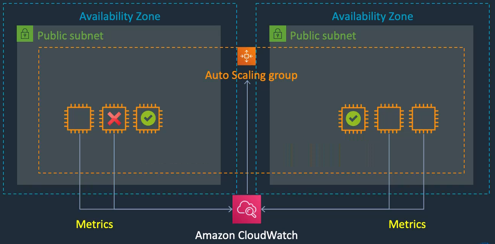
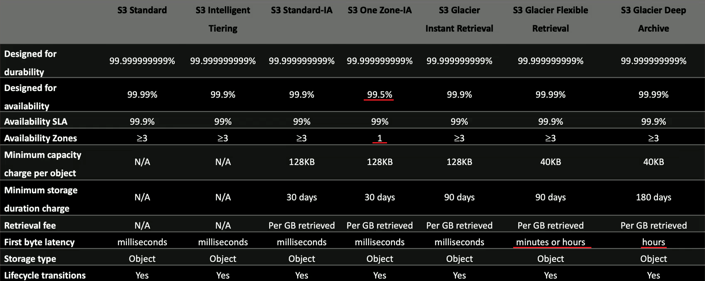
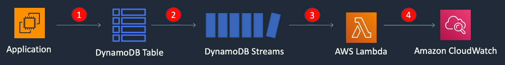

# DVA-C02 - AWS Certified Developer – Associate

[<- Voltar para a página principal](../../README.md)


---

**Sumário**

<!-- TOC -->

- [1. Conta AWS e IAM](#1-conta-aws-e-iam)
  - [1.1. Conta AWS](#11-conta-aws)
  - [1.2. IAM: Identity and Access Management](#12-iam-identity-and-access-management)
  - [1.3. Custos](#13-custos)
  - [1.4. STS: Security Token Service](#14-sts-security-token-service)
  - [1.5. Access Control Methods](#15-access-control-methods)
- [2. CLI: Command Line Interface](#2-cli-command-line-interface)
  - [2.1. Comandos](#21-comandos)
  - [2.2. Arquivos importantes](#22-arquivos-importantes)
- [3. VPC, EC2 e ELB](#3-vpc-ec2-e-elb)
  - [3.1. VPC: Virtual Private Cloud](#31-vpc-virtual-private-cloud)
    - [3.1.1. Grupos de Segurança e NACLs](#311-grupos-de-seguran%C3%A7a-e-nacls)
  - [3.2. EC2: Elastic Compute Cloud](#32-ec2-elastic-compute-cloud)
    - [3.2.1. EBS: Elastic Block Store](#321-ebs-elastic-block-store)
    - [3.2.2. Instance Stores](#322-instance-stores)
    - [3.2.3. EFS: Elastic File System](#323-efs-elastic-file-system)
      - [3.2.3.1. Classes de armazenamento](#3231-classes-de-armazenamento)
      - [3.2.3.2. Desempenho](#3232-desempenho)
    - [3.2.4. Metadata e User Data](#324-metadata-e-user-data)
    - [3.2.5. Access Keys e IAM Roles](#325-access-keys-e-iam-roles)
    - [3.2.6. Auto Scaling](#326-auto-scaling)
      - [3.2.6.1. ASG: Auto Scaling Groups](#3261-asg-auto-scaling-groups)
    - [3.2.7. ECB: Elastic Load Balancing](#327-ecb-elastic-load-balancing)
- [4. Amazon S3 e CloudFront](#4-amazon-s3-e-cloudfront)
  - [4.1. S3: Simple Storage Service](#41-s3-simple-storage-service)
    - [4.1.1. Classes de Armazenamento](#411-classes-de-armazenamento)
    - [4.1.2. Controles de acesso](#412-controles-de-acesso)
      - [4.1.2.1. IAM Policies](#4121-iam-policies)
      - [4.1.2.2. Bucket Policies](#4122-bucket-policies)
      - [4.1.2.3. ACLs: Access Control Lists](#4123-acls-access-control-lists)
    - [4.1.3. Versioning](#413-versioning)
    - [4.1.4. Replication](#414-replication)
    - [4.1.5. Lifecycle Rules](#415-lifecycle-rules)
    - [4.1.6. MFA: Multi-Factor Authentication](#416-mfa-multi-factor-authentication)
    - [4.1.7. Criptografia](#417-criptografia)
    - [4.1.8. Registro de Acesso ao Servidor](#418-registro-de-acesso-ao-servidor)
    - [4.1.9. CORS: Cross-Origin Resource Sharing](#419-cors-cross-origin-resource-sharing)
  - [4.2. CloudFront](#42-cloudfront)
    - [4.2.1. Signed URLs](#421-signed-urls)
    - [4.2.2. Signed Cookies](#422-signed-cookies)
    - [4.2.3. OAC: Origin Access Control](#423-oac-origin-access-control)
    - [4.2.4. Route 53 DNS](#424-route-53-dns)
- [5. IaC e PaaS](#5-iac-e-paas)
  - [5.1. IaC: Infrastructure as Code com CloudFormation](#51-iac-infrastructure-as-code-com-cloudformation)
    - [5.1.1. CloudFormation Template](#511-cloudformation-template)
      - [5.1.1.1. Funções Intrínsecas](#5111-fun%C3%A7%C3%B5es-intr%C3%ADnsecas)
      - [5.1.1.2. Seções](#5112-se%C3%A7%C3%B5es)
  - [5.2. PaaS: Platform as a Service com AWS Elastic Beanstalk](#52-paas-platform-as-a-service-com-aws-elastic-beanstalk)
    - [5.2.1. Configurações avançadas e SSL/TLS](#521-configura%C3%A7%C3%B5es-avan%C3%A7adas-e-ssltls)
- [6. Lambda e SAM](#6-lambda-e-sam)
  - [6.1. Arquitetura Orientada a Eventos e Serverless Services](#61-arquitetura-orientada-a-eventos-e-serverless-services)
  - [6.2. AWS Lambda](#62-aws-lambda)
    - [6.2.1. Modos de execução](#621-modos-de-execu%C3%A7%C3%A3o)
    - [6.2.2. Versões](#622-vers%C3%B5es)
    - [6.2.3. Aliases](#623-aliases)
    - [6.2.4. Deploy de pacotes](#624-deploy-de-pacotes)
    - [6.2.5. Layers](#625-layers)
    - [6.2.6. Variáveis de Ambiente](#626-vari%C3%A1veis-de-ambiente)
    - [6.2.7. Limites](#627-limites)
    - [6.2.8. Destinations e DLQ: Dead-Letter Queues](#628-destinations-e-dlq-dead-letter-queues)
    - [6.2.9. Reserved e Provisioned Concurrency](#629-reserved-e-provisioned-concurrency)
    - [6.2.10. Monitoramento, Logging, e Tracing](#6210-monitoramento-logging-e-tracing)
    - [6.2.11. Usando com VPC e ALB](#6211-usando-com-vpc-e-alb)
    - [6.2.12. Signer](#6212-signer)
  - [6.3. SAM: Serverless Application Model](#63-sam-serverless-application-model)
    - [6.3.1. Comandos](#631-comandos)
- [7. Amazon DynamoDB](#7-amazon-dynamodb)
  - [7.1. Características](#71-caracter%C3%ADsticas)
  - [7.2. Componentes](#72-componentes)
  - [7.3. API](#73-api)
    - [7.3.1. Control Plane](#731-control-plane)
    - [7.3.2. Data Plane](#732-data-plane)
  - [7.4. Tipos de dados](#74-tipos-de-dados)
    - [7.4.1. Escalares](#741-escalares)
    - [7.4.2. Documento](#742-documento)
    - [7.4.3. Conjunto](#743-conjunto)
  - [7.5. Classes](#75-classes)
  - [7.6. Controle de acesso](#76-controle-de-acesso)
  - [7.7. Chaves](#77-chaves)
    - [7.7.1. Chave de Partição](#771-chave-de-parti%C3%A7%C3%A3o)
    - [7.7.2. Chave de Ordenação](#772-chave-de-ordena%C3%A7%C3%A3o)
    - [7.7.3. Chave Composta](#773-chave-composta)
    - [7.7.4. Melhores práticas](#774-melhores-pr%C3%A1ticas)
  - [7.8. Consistência](#78-consist%C3%AAncia)
  - [7.9. Transactions](#79-transactions)
  - [7.10. Performance](#710-performance)
  - [7.11. Scan API](#711-scan-api)
  - [7.12. Query API](#712-query-api)
  - [7.13. Índices](#713-%C3%ADndices)
    - [7.13.1. LSI: Local Secondary Index](#7131-lsi-local-secondary-index)
    - [7.13.2. GSI: Global Secondary Index](#7132-gsi-global-secondary-index)
  - [7.14. Optimistic Locking](#714-optimistic-locking)
  - [7.15. Streams](#715-streams)
  - [7.16. DAX](#716-dax)
- [8. Integrações e APIs](#8-integra%C3%A7%C3%B5es-e-apis)
  - [8.1. SQS: Simple Queue Service](#81-sqs-simple-queue-service)
    - [8.1.1. Tipos](#811-tipos)
    - [8.1.2. DLQ: Dead Letter Queue](#812-dlq-dead-letter-queue)
    - [8.1.3. Delay Queue](#813-delay-queue)
    - [8.1.4. Visibility Timeout](#814-visibility-timeout)
    - [8.1.5. SQS Long Polling x Short Polling](#815-sqs-long-polling-x-short-polling)
  - [8.2. SNS: Simple Notification Service](#82-sns-simple-notification-service)
    - [8.2.1. Fan-Out](#821-fan-out)

<!-- /TOC -->

[<- Voltar para a página principal](../../README.md)

---

## 1. Conta AWS e IAM

### 1.1. Conta AWS

A conta root em AWS é a conta de administrador principal, com acesso total a todos os serviços e recursos da AWS. No entanto, recomenda-se usá-la apenas para criar usuários, grupos, políticas e papéis, e não para atividades do dia a dia.

- **Usuário (User):** Entidade com permissões específicas dentro da AWS. Eles representam pessoas ou aplicações que precisam de acesso aos recursos AWS.

- **Grupo (Group):** Coleção de usuários. Permissões são aplicadas ao grupo, e todos os usuários dentro dele herdam essas permissões.

- **Política (Policy):** Define permissões e especifica quais ações são permitidas ou negadas em quais recursos. Elas são escritas em formato JSON.

- **Papéis (Role):** Semelhante a um usuário, mas não é associada a uma pessoa específica. São usados para conceder permissões temporárias a usuários ou serviços que precisem acessar recursos.

### 1.2. IAM: Identity and Access Management

O IAM é usado para gerenciar quem pode acessar os recursos AWS e de que forma. Ele permite a autenticação e autorização via API, console, e CLI, usando diferentes entidades chamadas principals.

### 1.3. Custos

Para uma gestão eficaz dos recursos na AWS, é crucial compreender e utilizar ferramentas que ajudem a monitorar e otimizar os custos dos serviços.

- **Budget:** Refere-se à criação e gerenciamento de orçamentos na AWS, onde você define limites de gastos e configura alertas para monitorar o uso e os custos dos serviços.

- **Cost Explorer:** É uma ferramenta usada para analisar os custos e o uso dos serviços na AWS. Permite visualizar tendências de gastos ao longo do tempo e identificar áreas onde os custos podem ser otimizados.

### 1.4. STS: Security Token Service

Serviço que fornece credenciais temporárias para aplicações acessarem outras aplicações.

### 1.5. Access Control Methods

- **Role-Based Access Control (RBAC):** Atribui permissões com base nas funções dos usuários dentro de uma organização, facilitando a gestão de acesso em grandes ambientes.

- **Attribute-Based Access Control (ABAC):** Oferece uma abordagem mais flexível e dinâmica, utilizando tags e múltiplos atributos (como localização e horário) para tomar decisões de acesso em tempo real.

## 2. CLI: Command Line Interface

O AWS CLI é uma ferramenta de linha de comando para gerenciar serviços da AWS. Permite automatizar tarefas, configurar recursos e realizar operações diretamente do terminal. Você pode instalá-lo usando pip ou gerenciadores de pacotes e executar comandos no formato `aws [serviço] [operação]`.

### 2.1. Comandos

- `aws help`: Apresenta ajuda sobre os serviços disponíveis;
- `aws ec2 help`: Apresenta ajuda sobre os comandos disponíveis para o serviço EC2;

---

- `aws configure`: Configura credenciais **default** de acesso AWS;
- `aws configure --profile nome-perfil`: Configura credenciais de acesso AWS no perfil especificado;

---

- `aws s3 ls`: Lista todos os buckets S3;
- `aws s3 mb s3://my-bucket`: Cria o bucket **my-bucket**;
- `aws s3 cp arquivo.txt s3://my-bucket`: Faz o upload do **arquivo.txt** para o bucket **my-bucket**;
- `aws s3 ls s3://my-bucket`: Lista os arquivos no bucket **my-bucket**;
- `aws s3 rb s3://my-bucket`: Remove o bucket **my-bucket** (não apaga bucket com conteúdo);
- `aws s3 rb s3://my-bucket --force`: Remove o bucket **my-bucket** mesmo com conteúdo;

---

- `aws ec2 describe-instances`: Mostra detalhes das instâncias EC2.

> [!IMPORTANT]
> Sempre que os comandos são executados, o perfil usado é o **default** a menos que especifiquemos um usando: `aws comando --profile nome-perfil`.

### 2.2. Arquivos importantes

- `.aws/config`: Contém configurações, como região especificada;
- `.aws/credentials`: Contém os dados da credencial em texto sem criptografia.

> [!NOTE]
> No Linux: o diretório `.aws` está onde os arquivos de instalação foram descompactados;
>
> No Windows: o diretório `.aws` está na pasta `C:\Users\User`.

## 3. VPC, EC2 e ELB

### 3.1. VPC: Virtual Private Cloud

VPC é uma porção logicamente isolada dentro de uma região da AWS. Ela é uma rede virtual dedicada à sua conta AWS, equivalente a ter um datacenter próprio dentro da infraestrutura da AWS. Com a VPC, temos controle total sobre quem pode acessar os recursos internos, configurando regras de segurança e roteamento de acordo com as necessidades. Por padrão, é possível criar até 5 VPCs por região.

Dentro de uma VPC, existem **Zonas de Disponibilidade** (Availability Zones), que são unidades de isolamento físico para aumentar a resiliência da infraestrutura. Essas zonas são subdivididas em **subnets** (sub-redes), que podem ser classificadas como públicas ou privadas. As **subnets públicas** são acessíveis externamente, permitindo a comunicação com a Internet, enquanto as **subnets privadas** são isoladas e não possuem acesso direto à Internet. Os recursos, como instâncias EC2 e bancos de dados, são implantados dentro dessas subnets.

Para controlar o tráfego dentro da VPC, há um roteador interno que utiliza uma **tabela de roteamento** para definir como o tráfego deve ser encaminhado. Na "borda" da VPC, encontra-se o **Internet Gateway**, que é necessário para permitir que as instâncias dentro das subnets públicas acessem a Internet.


É possível criar várias VPCs em uma única região, e cada uma delas deve ter um bloco de endereços IP exclusivo, definido em formato **CIDR (Classless Inter-Domain Routing)**, que especifica o intervalo de endereços IP disponíveis. Dentro da VPC, cada subnet também possui seu próprio endereço IP CIDR, garantindo isolamento e segmentação de rede.


**Conexões e Componentes Adicionais**

- **Peering Connection:** Uma conexão direta entre duas VPCs, permitindo que elas se comuniquem como se estivessem na mesma rede.
- **NAT Instance:** Uma instância que habilita o acesso à Internet para instâncias EC2 em subnets privadas, gerenciada por você.
- **NAT Gateway:** Similar à NAT Instance, porém gerenciada pela AWS, fornecendo acesso à Internet para instâncias em subnets privadas de forma mais escalável.
- **Virtual Private Gateway:** O lado da VPC que faz parte de uma conexão de VPN, usada para conectar a rede local do cliente à VPC da AWS.
- **Customer Gateway:** O lado do cliente de uma conexão de VPN, representando o dispositivo de borda que se conecta à VPC.
- **AWS Direct Connect:** Uma conexão de rede privada de alta velocidade e alta largura de banda, que liga a rede do cliente diretamente à AWS, sem passar pela Internet pública.
- **Security Group:** Um firewall a nível de instância, que controla o tráfego de entrada e saída para os recursos implantados.
- **Network ACL (Access Control List):** Um firewall a nível de subnet, que controla o tráfego para e a partir das subnets na VPC.

#### 3.1.1. Grupos de Segurança e NACLs

Os Network ACLs (NACLs) e Grupos de Segurança são firewalls usados para proteger o tráfego na VPC:

- **Network ACLs:** Aplicadas no nível da subnet, controlam o tráfego que entra e sai. Permitem ou negam o tráfego com base em regras de portas, protocolos e IPs.

- **Grupos de Segurança:** Aplicados no nível da instância, controlam o tráfego permitido para recursos específicos. Um mesmo grupo pode ser usado em instâncias de diferentes subnets.


### 3.2. EC2: Elastic Compute Cloud

EC2 é um serviço essencial da AWS que oferece servidores virtuais. A AWS gerencia os hosts físicos, enquanto nós gerenciamos as instâncias, que podem executar Windows, Linux ou macOS.

O EC2 é um tipo de IaaS (Infrastructure as a Service), permitindo que você escolha atributos de hardware para cada instância e instale suas aplicações. Cada instância opera dentro de uma VPC (Virtual Private Cloud).

No Amazon EC2, as instâncias operam com três tipos de endereços IP:

- **IP Público:** Acessível pela Internet, mas é dinâmico e pode mudar se a instância for parada e iniciada novamente.

- **IP Privado:** Usado para comunicação interna entre instâncias na mesma VPC. Para que uma instância com IP privado acesse a Internet, é necessária a configuração de um NAT (Network Address Translation), que permite a tradução do IP privado para um IP público.

- **IP Elástico:** Um IP público estático que você pode associar a uma instância. Ao contrário do IP público dinâmico, o IP elástico não é perdido quando a instância é desligada, garantindo que você mantenha o mesmo endereço IP mesmo após reinicializações.


#### 3.2.1. EBS: Elastic Block Store

O EBS oferece volumes de armazenamento para instâncias EC2. Esses volumes são um sistema de armazenamento em bloco, diferente do armazenamento em arquivo, e existem dentro de uma Zona de Disponibilidade (AZ).


#### 3.2.2. Instance Stores

As instâncias EC2 também possuem instance store volumes, que são fisicamente conectados aos hosts EC2. Esses volumes oferecem alta performance, mas os dados não são persistidos após o desligamento da instância.


Os backups do EBS são chamados de snapshots, que são armazenados no S3 (um serviço da AWS na mesma região) e não na AZ. Os snapshots são incrementais, ou seja, só fazem backup das alterações desde o último snapshot. A partir de um snapshot, você pode criar um novo volume EBS ou uma Amazon Machine Image (AMI), que permite lançar instâncias pré-configuradas rapidamente.


#### 3.2.3. EFS: Elastic File System

O EFS é um sistema de arquivos compartilhado que permite que múltiplas instâncias EC2 se conectem a ele, mesmo em diferentes Zonas de Disponibilidade (AZs). As instâncias se conectam a um ponto de montagem na AZ, utilizando o protocolo NFS (Network File System), que é compatível apenas com Linux.


Para sistemas de arquivos regionais, as operações de gravação são duravelmente armazenadas em várias AZs, e aplicações clientes NFS podem usar bloqueios de arquivo NFS v4 para garantir consistência durante leituras e gravações.

##### 3.2.3.1. Classes de armazenamento

- **EFS Standard:** Usando SSDs para baixa latência.
- **EFS Infrequent Access (IA):** Uma opção econômica para dados menos acessados.
- **EFS Archive:** A opção mais barata para dados arquivados.

> Todas as classes oferecem 99,999999999% de durabilidade.

É possível replicar um sistema de arquivos em outra região para recuperação de desastres, com RPO/RTO em minutos. Vários pontos de montagem podem ser criados na réplica, mas apenas como somente leitura. Também é viável conectar computadores on-premises a esses sistemas, desde que utilizem o EFS.


O EFS integra-se com o AWS Backup para backups automáticos do sistema de arquivos.

##### 3.2.3.2. Desempenho

Em termos de desempenho, existem duas opções:

- **Provisioned Throughput:** Permite especificar um nível de throughput independente do tamanho do sistema de arquivos.
- **Bursting Throughput:** O throughput escala com a quantidade de armazenamento, permitindo picos de desempenho conforme necessário.

> Throughput: quantidade de dados que pode ser processada ou transferida em um determinado período de tempo.

#### 3.2.4. Metadata e User Data

- **EC2 Metadata**: Informações sobre a instância EC2, como ID, IP etc.
  - **IMDSv1**: Método antigo e menos seguro.
  - **IMDSv2**: Requer uso de token para maior segurança.
- **User Data**: Script executado automaticamente na primeira inicialização da instância.
  - Deve ser codificado em **base64** (feito automaticamente no console e AWS CLI).
  - Limite de **16 KB** em formato bruto (antes de ser codificado).
  - Executado apenas **uma vez**, no primeiro boot.

#### 3.2.5. Access Keys e IAM Roles

AWS Access Keys são usadas na CLI e têm as mesmas permissões do usuário IAM. O problema é que são credenciais de longo prazo, armazenadas em texto simples na instância, o que aumenta o risco de comprometimento. Para evitar isso, use IAM Roles com políticas atribuídas, que não são armazenadas na instância. O serviço utiliza o STS da AWS para obter tokens temporários.

#### 3.2.6. Auto Scaling

EC2 Auto Scaling ajusta automaticamente a quantidade de instâncias, substituindo ou adaptando a capacidade de clusters para atender à demanda. Ele é compatível com EC2, ECS e EKS, e se integra a outros serviços como CloudWatch (monitoramento e escalonamento), ELB (balanceamento de carga), EC2 Spot Instances (otimização de custo) e VPC (deploy entre AZs).



O escalonamento é horizontal (scale-out), proporcionando elasticidade e escalabilidade, aumentando a capacidade quando necessário e reduzindo quando possível. Possui health checks para EC2 e ELB, além de um período de espera (grace period) antes de iniciar operações. Existem quatro modos de escalonamento: manual, dinâmico (sob demanda), preditivo (usando ML) e agendado.

##### 3.2.6.1. ASG: Auto Scaling Groups

Auto Scaling Groups permitem a criação e gerenciamento automáticos de grupos de instâncias EC2, ajustando a capacidade de acordo com a demanda. Com ASG, é possível configurar políticas de escalabilidade para aumentar ou reduzir o número de instâncias, promovendo alta disponibilidade e otimização de custos. ASG monitora o estado das instâncias com health checks e, se necessário, substitui instâncias com falhas automaticamente. Ele suporta escalonamento manual, dinâmico, preditivo e agendado, atendendo tanto a picos de uso quanto a demandas mais previsíveis.

#### 3.2.7. ECB: Elastic Load Balancing

Amazon ELB (Elastic Load Balancing) oferece alta disponibilidade e tolerância a falhas, permitindo que múltiplas instâncias fiquem atrás de um único endpoint. Ele distribui o tráfego de forma transparente entre EC2, ECS, endereços IP, Lambda e outros balanceadores. Se uma instância falhar, o ELB redireciona automaticamente a sessão para outra instância disponível.


**Tipos de Load Balancer:**

- **Application Load Balancer (ALB):** Opera na camada de aplicação (HTTP/HTTPS) e permite roteamento avançado com base em caminhos, hosts, parâmetros de consulta e endereços IP de origem.

- **Network Load Balancer (NLB):** Opera na camada de transporte (TCP/UDP) e usa roteamento baseado no protocolo IP, oferecendo latência ultrabaixa para conexões de alto desempenho.

- **Gateway Load Balancer (GLB):** Ideal para implantar, escalar e gerenciar appliances de terceiros (como firewalls e sistemas de detecção de intrusão) em redes VPC. Combina roteamento com um modelo de encaminhamento que facilita a implementação de soluções de segurança em larga escala.


## 4. Amazon S3 e CloudFront

### 4.1. S3: Simple Storage Service

O Amazon S3 é um serviço de armazenamento de objetos, onde cada bucket funciona como um contêiner para guardar arquivos de qualquer tipo, com capacidade para milhões de objetos. Com ótimo custo-benefício, ele permite gerenciar objetos por meio de métodos HTTP como GET, POST e DELETE e pode ser acessado globalmente pela internet via HTTPS.

Formas de acessar um objeto (key) em um bucket: \


> Cada objeto no S3 possui uma key (nome), ID de versão, conteúdo (valor), metadados e informações de controle de acesso.

Como o S3 está fora de redes privadas (VPCs) da AWS, conexões de instâncias EC2 ao S3 geralmente requerem acesso à internet por meio de um Internet Gateway. Para evitar isso, é possível configurar um S3 Gateway Endpoint, que permite o acesso ao S3 diretamente através de endereços privados, mantendo as conexões dentro da rede da AWS.


> File storage x Object storage
>
> File storage organiza dados em diretórios hierárquicos e é montado no sistema operacional, aparecendo como uma unidade de disco. A conexão é persistente, permitindo acesso imediato aos arquivos.
>
> Object storage armazena dados em buckets, sem hierarquia real (flat namespace). Nomes com pontos ou prefixos podem simular diretórios, mas não formam uma estrutura de pastas. O acesso é feito via API REST, e não é possível montar o storage como uma unidade de disco.

#### 4.1.1. Classes de Armazenamento

As classes de armazenamento S3 definem o preço e o método de armazenamento dos dados. A durabilidade, que protege contra perda e corrupção, é de 99.999999999% (11 9s) para todos os dados no S3. A disponibilidade, expressa como uma porcentagem do tempo em que os dados estão acessíveis durante o ano, varia por classe (ex.: 99,99%).

- **S3 Standard**: Armazenamento de alta durabilidade para acesso frequente.
- **S3 Intelligent Tiering**: Move dados automaticamente entre camadas conforme o uso.
- **S3 Standard-IA**: Para dados acessados ocasionalmente, com custo menor.
- **S3 One Zone-IA**: Similar ao Standard-IA, mas em uma única zona, mais barato.
- **S3 Glacier Instant Retrieval**: Armazenamento de arquivamento com recuperação imediata.
- **S3 Glacier Flexible Retrieval**: Arquivamento com recuperação em horas, custo mais baixo.
- **S3 Glacier Deep Archive**: Armazenamento de longo prazo, recuperação em dias, custo mais baixo.



#### 4.1.2. Controles de acesso

Existem diversas formas de controlar o acesso ao bucket e aos objetos contidos nele.

##### 4.1.2.1. IAM Policies

As **IAM Policies** são políticas baseadas em identidade que controlam permissões para usuários, grupos ou funções no AWS. Elas especificam quais ações são permitidas ou negadas em recursos específicos da AWS, definindo claramente o nível de acesso.

##### 4.1.2.2. Bucket Policies

As **Bucket Policies** são políticas baseadas em recurso, aplicáveis exclusivamente a buckets do Amazon S3. Elas utilizam a linguagem de políticas de acesso da AWS para definir permissões diretamente no bucket, controlando quem pode acessar e quais ações podem ser realizadas nos objetos do bucket, independentemente das permissões IAM individuais.

##### 4.1.2.3. ACLs: Access Control Lists

As **ACLs (Access Control Lists)** são um mecanismo de controle de acesso legado, anterior ao IAM. Elas podem ser aplicadas diretamente a um bucket ou objeto, mas possuem opções limitadas para definir permissões e usuários (grantees). A AWS geralmente recomenda o uso de políticas de bucket ou IAM em vez de ACLs, pois elas oferecem maior flexibilidade e controle sobre as permissões.

#### 4.1.3. Versioning

O versionamento permite manter múltiplas versões de um objeto no mesmo bucket, preservando cada variante. Com versionamento habilitado, é possível recuperar objetos excluídos ou sobrescritos acidentalmente.

#### 4.1.4. Replication

A replicação permite copiar buckets entre regiões ou dentro da mesma região, e até mesmo entre contas diferentes. Para usar a replicação, o versionamento deve estar ativado nos buckets de origem e destino.

#### 4.1.5. Lifecycle Rules

Gerenciamento do ciclo de vida define ações automáticas para objetos:

- Transição: Move objetos para outra classe de armazenamento após um período.
- Expiração: Define quando os objetos expiram e são automaticamente excluídos pelo S3.

**Possíveis transições:** \


#### 4.1.6. MFA: Multi-Factor Authentication

O MFA Delete adiciona uma camada extra de segurança ao exigir um segundo fator de autenticação, além da senha, normalmente um código gerado por um dispositivo físico. Ele é usado por proprietários de buckets para ações críticas, como mudar o estado de versionamento de um bucket ou excluir permanentemente uma versão de um objeto. Para usar o MFA Delete, é necessário incluir o cabeçalho x-amz-mfa nas requisições.

#### 4.1.7. Criptografia

Todos os buckets no Amazon S3 vêm com criptografia ativada por padrão. Objetos novos são automaticamente criptografados sem custo adicional ou impacto na performance, usando **SSE-S3**, na qual a criptografia e descriptografia são gerenciadas diretamente pelo S3 com chaves da AWS.

**Tipos de Criptografia no S3**:

- **SSE-S3**: Criptografia feita no lado do servidor com chaves gerenciadas pela AWS. Os objetos são protegidos via TLS no upload e armazenados criptografados; ao fazer download, a descriptografia é automática.
- **SSE-KMS**: Criptografia feita com o AWS Key Management Service (KMS), permitindo o uso de chaves gerenciadas pela AWS ou personalizadas pelo cliente. A criptografia e descriptografia acontecem no S3.

- **SSE-C**: O cliente fornece e gerencia suas próprias chaves para criptografia no servidor. A chave é temporária e passada junto com o upload; a AWS a usa para criptografar e descriptografar o objeto, mas não a armazena.

- **Client-Side Encryption**: A criptografia é feita do lado do cliente, com o objeto já criptografado antes de ser enviado ao S3. O cliente gerencia a chave, que pode ser do KMS, mas a descriptografia não ocorre no servidor.

> Objetos não criptografados podem ser criptografados posteriormente com o **Amazon S3 Batch Operations**, a **CopyObject API** ou o comando `copy-object` da AWS CLI.

#### 4.1.8. Registro de Acesso ao Servidor

Permite registrar eventos detalhados de acesso aos buckets, incluindo informações como solicitante, nome do bucket, horário da solicitação etc. Esse registro está desativado por padrão e só gera custos de armazenamento do espaço usado pelos logs. Para ativar, é necessário configurar um bucket separado como destino dos logs.

#### 4.1.9. CORS: Cross-Origin Resource Sharing

Permite que um bucket S3 aceite solicitações de diferentes origens, essencial para cenários onde um site ou aplicativo precisa acessar recursos de outro domínio. A configuração de CORS é feita no bucket que está sendo acessado, e não na origem da solicitação.

> Uma "origem" é definida por DNS, protocolo e porta.


### 4.2. CloudFront

**Amazon CloudFront** é uma rede de distribuição de conteúdo (CDN) que melhora a performance de acesso a objetos e arquivos em todo o mundo, reduzindo a latência ao aproximar o conteúdo dos usuários. As **origens do CloudFront** são os locais de onde o conteúdo é servido, normalmente dentro de uma região da AWS. As **edge locations** são os pontos de presença da CloudFront, distribuídos globalmente, onde o conteúdo é armazenado em cache para acesso rápido.


Quando o conteúdo não está disponível em uma edge location ou já expirou no cache, ele é buscado na origem através da rede da AWS, evitando o tráfego pela internet pública. No CloudFront, você cria distribuições, recebe um endpoint e especifica uma ou mais origens, como S3 ou EC2.

#### 4.2.1. Signed URLs

Oferecem um controle mais granular sobre o acesso ao conteúdo. Com essas URLs, é possível disponibilizar objetos que, de outra forma, não seriam acessíveis publicamente. Podem ter um tempo de expiração definido, limitando o período em que o acesso é permitido.

Além disso, é possível restringir o acesso por endereço IP, garantindo que apenas usuários de determinados locais possam acessar o conteúdo. Elas são especialmente úteis para arquivos individuais ou quando se trabalha com clientes que não suportam cookies

#### 4.2.2. Signed Cookies

Alternativa às Signed URLs, permitindo controle de acesso sem a necessidade de alterar as URLs dos arquivos. Elas são úteis quando você deseja fornecer acesso a múltiplos arquivos restritos ao mesmo tempo.

#### 4.2.3. OAC: Origin Access Control

É um mecanismo de controle de acesso que permite ao Amazon CloudFront acessar conteúdo protegido em um bucket do S3 de maneira segura. A AWS recomenda o uso do OAC em vez do OAI (Origin Access Identity), pois oferece uma configuração mais simplificada e flexível.

#### 4.2.4. Route 53 DNS

Serviço de DNS altamente escalável e confiável que oferece uma variedade de recursos inteligentes. Ele permite o registro de domínios e fornece funcionalidades avançadas de gerenciamento de tráfego.

Entre os recursos principais estão os **health checks**, que monitoram a saúde dos recursos e garantem que o tráfego seja direcionado apenas para endpoints disponíveis. O **Traffic Flow** permite criar políticas de roteamento complexas, otimizando a distribuição do tráfego com base em critérios como localização geográfica, latência e desempenho.

## 5. IaC e PaaS

### 5.1. IaC: Infrastructure as Code com CloudFormation

**IaC** com o **AWS CloudFormation** permite implementar a infraestrutura usando código, proporcionando uma maneira eficiente e padronizada de gerenciar recursos da AWS. Com CloudFormation, podemos definir a estrutura da infraestrutura em arquivos de texto no formato **JSON** ou **YAML**, que são então usados para criar e gerenciar os recursos de forma consistente e reutilizável.


Principais componentes do CloudFormation:

- **Templates**: Arquivos JSON ou YAML que contêm as instruções para construir o ambiente da AWS.
- **Stacks**: A implementação completa do ambiente descrito por um template, gerenciada como uma única unidade para criação, atualização ou exclusão de recursos.
- **StackSets**: Expande a funcionalidade dos stacks permitindo a criação, atualização ou exclusão de stacks em várias contas e regiões com uma única operação.
- **Change Sets**: Um resumo das mudanças propostas em um stack, permitindo visualizar como essas alterações afetarão os recursos existentes antes de sua implementação.

#### 5.1.1. CloudFormation Template

O **Template** é um arquivo em **YAML** ou **JSON** que descreve o estado final da infraestrutura que você está provisionando ou alterando. Após criar o template, ele pode ser enviado diretamente para o CloudFormation ou armazenado no **Amazon S3**.

O CloudFormation lê o template e executa as chamadas de API necessárias em seu nome, criando os recursos definidos. Esses recursos gerados são conhecidos como um **Stack**. No template, você utiliza **IDs Lógicos** para referenciar os recursos internamente, enquanto os **IDs Físicos** identificam os recursos fora do CloudFormation, disponíveis apenas após sua criação.

##### 5.1.1.1. Funções Intrínsecas

O AWS CloudFormation oferece diversas funções integradas que facilitam a gestão dos seus stacks. Essas funções permitem atribuir valores a propriedades que só estão disponíveis em tempo de execução, tornando os templates mais dinâmicos e adaptáveis.

- **Ref**: Retorna o valor do parâmetro ou recurso especificado. Se você utilizar o nome lógico de um parâmetro, obterá seu valor; se usar o nome lógico de um recurso, receberá um valor que geralmente se refere ao ID físico desse recurso.

- **Fn::GetAtt**: Retorna o valor de um atributo de um recurso definido no template, permitindo acessar informações específicas sobre os recursos.

- **Fn::FindInMap**: Recupera um valor correspondente a chaves em um mapa de duas camadas definido na seção **Mappings**. Isso é útil para gerenciar valores que variam com base em condições, como regiões ou ambientes.

##### 5.1.1.2. Seções

Os templates do AWS CloudFormation são organizados em seções que definem como os recursos serão provisionados e gerenciados:

- **Resources** (obrigatória): Declara os recursos da AWS que você deseja incluir no stack, como instâncias do Amazon EC2 ou buckets do Amazon S3. Os recursos podem se referenciar mutuamente, permitindo dependências entre eles.

- **Parameters** (opcional): Permite a personalização do template, possibilitando a entrada de valores personalizados toda vez que um stack é criado ou atualizado. Isso é útil para a reutilização de templates.

- **Mappings** (opcional): Permite criar correspondências entre chaves e um conjunto de valores nomeados, facilitando a adaptação do template a diferentes ambientes ou condições.

- **Outputs** (opcional): Declara valores que podem ser importados para outros stacks, retornados em respostas ou visualizados no console do AWS CloudFormation.

- **Conditions** (opcional): Define as circunstâncias sob as quais os recursos são criados ou configurados, permitindo um provisionamento mais dinâmico.

- **Transforms** (opcional): Especifica macros que o CloudFormation usa para processar o template, permitindo referenciar código adicional armazenado no S3.

**Exemplo de Código**

```yaml
AWSTemplateFormatVersion: "2010-09-09"
Description: Exemplo de Template do CloudFormation

Parameters:
  InstanceType:
    Type: String
    Default: t2.micro
    Description: Tipo de instância EC2 a ser criado

Mappings:
  RegionMap:
    us-east-1:
      AMI: ami-0abcdef1234567890
    us-west-1:
      AMI: ami-0abcdef1234567891

Resources:
  MyEC2Instance:
    Type: AWS::EC2::Instance
    Properties:
      InstanceType: !Ref InstanceType
      ImageId: !FindInMap [RegionMap, !Ref "AWS::Region", AMI]

Outputs:
  InstanceId:
    Description: ID da Instância EC2
    Value: !Ref MyEC2Instance
```

### 5.2. PaaS: Platform as a Service com AWS Elastic Beanstalk

O **Elastic Beanstalk** é uma solução de PaaS que facilita o gerenciamento de aplicações na nuvem. Ele dá acesso ao sistema operacional e suporta diversas linguagens e ambientes. Utiliza serviços fundamentais da AWS, como EC2, ECS, Auto Scaling e Elastic Load Balancing, garantindo alta disponibilidade e desempenho.

Também oferece uma interface de usuário (UI) para monitorar e gerenciar a saúde das aplicações, além de atualizações gerenciadas da plataforma, que garantem que você esteja sempre usando as versões mais recentes do software e correções de segurança.

**Estruturas do Elastic Beanstalk**

- **Aplicações**: Contêm ambientes, configurações de ambiente e versões de aplicação. É possível ter várias versões de uma aplicação armazenadas dentro dela.

- **Versão da Aplicação**: Refere-se a um código implantável específico, que normalmente aponta para um bucket do Amazon S3 contendo o código.

- **Ambientes**: São versões de aplicação implantadas em recursos da AWS, configurados e provisionados pelo Elastic Beanstalk. O ambiente abrange todos os recursos criados, não se limitando apenas à instância EC2 com o código carregado.


Dentro do Beanstalk existem dois tipos principais de componentes: **Web Servers** e **Workers**.

> **Web Servers** são aplicações padrão que escutam e processam requisições HTTP, geralmente na porta 80, permitindo que os usuários acessem o conteúdo de forma rápida e eficiente.
>
> **Workers** são aplicações especializadas que executam tarefas de processamento em segundo plano, ouvindo mensagens em uma fila do Amazon SQS. Eles são ideais para lidar com tarefas de longa duração, permitindo que as aplicações web permaneçam responsivas enquanto processam trabalhos intensivos de forma assíncrona.
>
> 

#### 5.2.1. Configurações avançadas e SSL/TLS

O AWS Elastic Beanstalk permite personalizar seu ambiente usando arquivos de configuração localizados em um diretório chamado `.ebextensions` dentro do código-fonte da aplicação. Esses arquivos têm a extensão `.config` e são escritos em formato YAML ou JSON.

Ele também permite a configuração de certificados SSL/TLS para o Elastic Load Balancer do ambiente, garantindo conexões seguras entre os clientes e o load balancer.

## 6. Lambda e SAM

### 6.1. Arquitetura Orientada a Eventos e Serverless Services

**Arquitetura Orientada a Eventos** é um padrão arquitetônico em que os serviços respondem a eventos de forma assíncrona, permitindo que as operações sejam desencadeadas apenas quando ocorrem eventos específicos, como mudanças de dados ou ações do usuário. Isso torna a comunicação entre serviços mais eficiente e desacoplada.

**Serverless Services** significa que o usuário não gerencia os servidores subjacentes. Esse modelo oferece serviços de computação, armazenamento e bancos de dados nos quais a infraestrutura é completamente gerenciada pela AWS, como é o caso do S3. Com Serverless, não há instâncias para gerenciar, e você não precisa provisionar hardware ou sistemas operacionais. Pode reduzir custos por funcionar de forma altamente otimizada e sob demanda.

> **Exemplo**
>
> 
>
> 1. Um usuário realiza o upload de um arquivo em um bucket S3, que aciona uma função Lambda graças a uma notificação de evento configurada no próprio bucket.
>
> 2. A função Lambda processa o arquivo e o transfere para outro bucket S3. Simultaneamente, ela pode enviar uma mensagem para uma fila SQS, onde outras funções Lambda podem monitorar e identificar novos itens a serem processados.
>
> 3. A fila SQS pode acionar automaticamente outra função Lambda que, ao detectar um novo evento, grava os dados em uma tabela DynamoDB e envia uma notificação por e-mail via SNS.

### 6.2. AWS Lambda

AWS Lambda é um serviço serverless que permite executar código em resposta a eventos. O desenvolvedor cria o código e define os acionadores, que podem ser outros serviços, como CLI, API, SDKs ou triggers de eventos. Também suporta execução agendada e possui um limite de duração de 15 minutos; para execuções mais longas, considere EC2. O serviço gerencia automaticamente o escalonamento e o balanceamento, podendo instanciar várias execuções simultâneas. O modelo de pagamento é baseado apenas no tempo de execução, o que o torna uma opção econômica.

> Funções Lambda também podem ser invocadas diretamente pelo console Lambda, por um endpoint HTTP(S) dedicado, pela API Lambda, CLI AWS, AWS SDKs e Toolkits

#### 6.2.1. Modos de execução

- **Síncrono**: a função é executada e o cliente aguarda a resposta, permitindo tratamento de erros no lado do cliente, como tentativas de execução. Esse modo é útil para integrações que requerem feedback imediato, e o comando para invocar funções via AWS CLI é `invoke`.

- **Assíncrono**:o evento é enfileirado, e a resposta é retornada imediatamente ao cliente. O AWS Lambda tenta processar o evento até três vezes e gerencia as tentativas de forma automática. Para invocar uma função de maneira assíncrona, basta definir o parâmetro de tipo de invocação como `Event`.

- **Event Source Mapping**: permite à função Lambda fazer polling em uma origem de eventos, processando registros em ordem (exceto no caso de SQS standard). Isso facilita o processamento de itens de streams ou filas, como Amazon SQS, Kinesis e DynamoDB. O mapeamento de origem de eventos utiliza permissões no papel de execução da função para gerenciar itens na fonte de eventos.

#### 6.2.2. Versões

O AWS Lambda permite o uso de **versões** para gerenciar diferentes iterações de suas funções. Cada versão contém informações essenciais, como o código da função e suas dependências. Além disso, cada versão possui um ARN (Amazon Resource Name) exclusivo, facilitando a identificação e o gerenciamento das funções em ambientes distintos, como produção, homologação e desenvolvimento.

Ao trabalhar com a versão `$LATEST`, você está lidando com a versão mais recente do código, chamada quando uma versão não é especificada. Quando uma versão está pronta para publicação, um número é atribuído a ela, começando em 1 e aumentando sequencialmente para cada nova versão. Essas versões são imutáveis, ou seja, não podem ser alteradas após a publicação. Apenas a `$LATEST` pode ser alterada até que se transforme em uma versão numerada.

#### 6.2.3. Aliases

São **ponteiros** que permitem referenciar versões específicas de uma função, oferecendo flexibilidade e controle na invocação. Com um alias, você pode chamar uma função sem precisar saber exatamente qual versão está em uso. São mutáveis, ou seja, você pode alterá-los conforme necessário, e possuem ARNs estáticos que garantem uma referência constante, independentemente da versão que apontam.

Possibilitam a configuração de implantações do tipo **blue/green**, permitindo dividir o tráfego entre duas versões diferentes. Isso permite que você teste novas funcionalidades com um número limitado de usuários antes de um lançamento completo.

> O alias não pode apontar para a versão **$LATEST**. Você deve ter uma versão previamente publicada.


#### 6.2.4. Deploy de pacotes

É o processo de enviar o código da função e suas dependências para execução na plataforma. Existem duas opções principais para empacotar e implantar funções:

- **Imagens de contêiner** incluem o sistema operacional base, o runtime, extensões do Lambda e o código da aplicação com suas dependências. Elas são carregadas no Amazon Elastic Container Registry (ECR) e, em seguida, implantadas na função Lambda. Essa abordagem oferece flexibilidade, permitindo usar qualquer linguagem ou biblioteca que funcione em um contêiner.

- **Arquivos .zip** contêm o código da aplicação e suas dependências, podendo ser enviados do seu computador ou diretamente do Amazon S3. Há limites de tamanho: 50 MB para arquivos compactados, 250 MB quando descompactados e 3 MB ao usar o editor do console. Para criar uma função Lambda usando um pacote .zip, é necessário armazenar o arquivo no S3 na mesma região onde o CloudFormation está sendo executado.

#### 6.2.5. Layers

Permitem que você adicione código e conteúdos à sua função Lambda sem incluir essas dependências diretamente no pacote de implantação. Uma camada é um arquivo ZIP que pode conter bibliotecas, um runtime personalizado ou outras dependências.

Uma função Lambda pode usar até cinco camadas simultaneamente, que são extraídas para o diretório `/opt` no ambiente de execução. Para adicionar camadas à sua função, você pode usar o comando `update-function-configuration`.

#### 6.2.6. Variáveis de Ambiente

Permitem que você passe configurações e parâmetros para suas funções sem precisar modificar o código. Elas são úteis para gerenciar dados sensíveis, como credenciais, URLs de APIs e configurações específicas do ambiente (por exemplo, desenvolvimento ou produção). As variáveis são acessíveis dentro da função durante a execução, permitindo que você ajuste o comportamento da aplicação dinamicamente. Podem ser criptografadas usando o AWS Key Management Service (KMS).

#### 6.2.7. Limites


#### 6.2.8. Destinations e DLQ: Dead-Letter Queues

Permitem gerenciar o fluxo de eventos e o tratamento de falhas durante invocações assíncronas. Quando uma função Lambda é invocada, você pode enviar registros de execução para um destino específico, como uma fila SQS, um tópico SNS, outra função Lambda ou um barramento de eventos do EventBridge. Isso proporciona uma forma de monitorar e registrar o sucesso ou a falha da invocação para tomar ações apropriadas com base nos resultados.

Os registros de execução são enviados em formato JSON e incluem informações como versão, timestamp e contexto da requisição. Para casos em que eventos não possam ser processados, as **DLQs** armazenam essas ocorrências, possibilitando que você as analise posteriormente. É possível configurar o número de tentativas de reprocessamento antes que um evento seja enviado para a **DLQ**.

#### 6.2.9. Reserved e Provisioned Concurrency

Ajudam a gerenciar o limite de execuções simultâneas, especialmente em cenários com múltiplas instâncias de função. O limite padrão de concorrência por região é de 1.000 invocações simultâneas, com capacidade de burst de 500 a 3.000, variando por região.

> Caso o limite de concorrência seja excedido, é gerado o erro "Rate exceeded" com o código `429` - "TooManyRequestsException".

- **Reserved Concurrency** garante um número mínimo de execuções simultâneas, evitando problemas de disponibilidade. Definir a concorrência reservada para zero efetivamente bloqueia a função, impedindo qualquer processamento até que o limite seja removido.

- **Provisioned Concurrency** garante que instâncias da função sejam mantidas prontas para atender a demandas imediatas, reduzindo a latência. Ela permite que a função escale com a mesma capacidade de burst da concorrência padrão, com a possibilidade de escalar automaticamente via Application Auto Scaling para lidar com aumentos repentinos de tráfego.

#### 6.2.10. Monitoramento, Logging, e Tracing

O **monitoramento e logging** usam o Amazon CloudWatch para registrar métricas de desempenho e armazenar logs de execução.

Para **tracing e análise de desempenho**, o AWS X-Ray coleta e visualiza dados sobre as execuções, tornando possível mapear os componentes da aplicação, identificar gargalos e depurar erros.

#### 6.2.11. Usando com VPC e ALB

Conectar uma função Lambda a uma VPC privada implica em perda de acesso direto à internet. Para habilitar essa comunicação, é necessário configurar uma **NAT Gateway** em uma sub-rede pública que se conecta ao **Internet Gateway** da VPC. Isso permite que a função Lambda na VPC use a internet conforme necessário, mas pode reduzir a velocidade de execução.


Além disso, o **Application Load Balancer (ALB)** permite que funções Lambda sejam alvos diretos. Com isso, é possível registrar uma função Lambda como target e configurar regras no listener do ALB para redirecionar as requisições ao grupo-alvo da função, otimizando o roteamento e a distribuição de tráfego para a Lambda.


#### 6.2.12. Signer

Serviço de assinatura de código totalmente gerenciado que garante a integridade e a confiabilidade do código executado nas funções Lambda. Com ele, o código é validado por meio de uma assinatura digital, o que impede a execução de código não confiável. O Signer permite a criação de pacotes assinados digitalmente para implantação, e políticas do IAM podem ser configuradas para exigir que as funções Lambda só sejam criadas se tiverem a assinatura ativada. Em caso de mudanças na equipe, é possível revogar todas as versões do perfil de assinatura, garantindo que o código antigo não possa ser executado.

### 6.3. SAM: Serverless Application Model

Oferece uma sintaxe abreviada para configurar funções, APIs, tabelas de banco de dados e mapeamentos de eventos. Você define todos os recursos de uma aplicação serverless em um único arquivo de configuração YAML, conhecido como **template SAM**. Oferece recursos como:

- `AWS::Serverless::Function` para Lambda
- `AWS::Serverless::Api` para API Gateway
- `AWS::Serverless::SimpleTable` para DynamoDB.

> **Template SAM:** \
> 
>
> Um template SAM utiliza o cabeçalho `Transform: 'AWS::Serverless-2016-10-31'`

#### 6.3.1. Comandos

- **`sam package` / `aws cloudformation package`**: Empacota o código e recursos da aplicação, armazenando-os em um bucket S3 e gerando um template atualizado com os caminhos dos recursos. Esse template serve para a implantação.

- **`sam deploy` / `aws cloudformation deploy`**: Usa o template atualizado para criar ou atualizar os recursos definidos, permitindo o deploy e a atualização contínua da aplicação na AWS.

## 7. Amazon DynamoDB

Serviço de banco de dados NoSQL serverless totalmente gerenciado, que opera como um armazenamento de chave/valor e de documentos. O dimensionamento é horizontal, aumentando a taxa de transferência à medida que a demanda cresce, com dados armazenados em partições e replicados em várias Zonas de Disponibilidade.

Oferece baixa latência, geralmente na faixa de milissegundos, e pode atingir latências em microssegundos com o uso do **DynamoDB Accelerator (DAX)**. O recurso de _Tabelas Globais_ permite a sincronização de tabelas entre diferentes regiões.

### 7.1. Características


### 7.2. Componentes

- **Tabelas**: Estruturas de dados primárias que armazenam os dados. Cada tabela possui uma chave primária, que pode ser simples (chave de partição) ou composta (chave de partição e chave de classificação).

- **Itens**: Representam entradas individuais nas tabelas. Cada item deve ter uma chave primária única e pode conter atributos adicionais que armazenam dados relevantes.

- **Atributos**: Características ou propriedades dos itens. Podem ser de diferentes tipos, como strings, números, listas ou mapas, proporcionando flexibilidade na modelagem dos dados.

### 7.3. API

#### 7.3.1. Control Plane

Gerenciam a configuração e o estado das tabelas e índices.

- **CreateTable**: Cria uma nova tabela.
- **DescribeTable**: Retorna informações sobre uma tabela, como esquema da chave primária, configurações de throughput e informações de índices.
- **ListTables**: Retorna os nomes de todas as suas tabelas.
- **UpdateTable**: Modifica as configurações de uma tabela ou seus índices.
- **DeleteTable**: Remove uma tabela e todos os seus objetos dependentes.

#### 7.3.2. Data Plane

Lidam com a manipulação de dados dentro das tabelas. As operações podem ser realizadas usando PartiQL (compatível com SQL) ou as APIs clássicas CRUD do DynamoDB.

- **PutItem**: Escreve um único item em uma tabela.
- **BatchWriteItem**: Escreve até 25 itens em uma tabela.
- **GetItem**: Recupera um único item de uma tabela.
- **BatchGetItem**: Recupera até 100 itens de uma ou mais tabelas.
- **UpdateItem**: Modifica um ou mais atributos em um item.
- **DeleteItem**: Deleta um único item de uma tabela.

### 7.4. Tipos de dados

#### 7.4.1. Escalares

Representam exatamente um único valor.

- **Número**: Números inteiros ou de ponto flutuante.
- **String**: Cadeias de texto.
- **Binário**: Dados em formato binário.
- **Booleano**: Valores verdadeiro ou falso.
- **Nulo**: Representa a ausência de valor.

#### 7.4.2. Documento

Representam estruturas complexas com atributos aninhados, semelhantes aos encontrados em documentos JSON.

- **Lista**: Uma coleção ordenada de elementos.
- **Mapa**: Uma coleção de pares chave-valor.

#### 7.4.3. Conjunto

Representam múltiplos valores escalares.

- **Conjunto de Strings**: Conjunto de valores do tipo string.
- **Conjunto de Números**: Conjunto de valores numéricos.
- **Conjunto Binário**: Conjunto de valores binários.
- etc.

### 7.5. Classes

- **DynamoDB Standard**: Classe padrão e recomendada para a maioria das cargas de trabalho. Ideal para aplicações que exigem acesso frequente a dados e oferecem baixa latência.

- **DynamoDB Standard-Infrequent Access (DynamoDB Standard-IA)**: Classe projetada para armazenamento de dados que são acessados com pouca frequência, oferecendo custos reduzidos.

### 7.6. Controle de acesso

**Controle de Acesso no DynamoDB**

O controle de acesso e a autenticação no DynamoDB são gerenciados exclusivamente pelo AWS Identity and Access Management (IAM). As políticas baseadas em identidade permitem:

- **Anexar políticas de permissão** a usuários ou grupos em sua conta.
- **Anexar políticas de permissão** a roles para conceder permissões entre contas.

> Não suporta políticas baseadas em recursos. Mas é possível utilizar uma condição IAM especial para restringir o acesso dos usuários apenas aos seus próprios registros.

### 7.7. Chaves

#### 7.7.1. Chave de Partição

Atributo exclusivo (como um ID de usuário) que determina a localização física dos dados no DynamoDB. O valor dessa chave é processado por uma função hash interna, garantindo que cada item tenha um valor único. Se a chave de partição for utilizada como chave primária, nenhum item pode compartilhar o mesmo valor.

#### 7.7.2. Chave de Ordenação

Permite a organização dos itens que compartilham a mesma chave de partição. Todos os itens com a mesma chave de partição são armazenados juntos e ordenados de acordo com o valor da chave de ordenação, permitindo consultas mais eficientes e acesso a conjuntos de dados relacionados.

#### 7.7.3. Chave Composta

A chave composta combina uma chave de partição e uma chave de ordenação. Isso permite armazenar múltiplos itens sob a mesma chave de partição, desde que tenham valores diferentes na chave de ordenação. Por exemplo, em um fórum, a chave de partição poderia ser o ID do usuário, enquanto a chave de ordenação poderia ser o timestamp do post. Assim, você pode ter vários posts de um mesmo usuário, todos organizados e ordenados por data e hora.

#### 7.7.4. Melhores práticas

Para otimizar a performance, é crucial garantir uma distribuição uniforme do _throughput_ (unidades de capacidade de leitura e gravação) entre as partições. Se o acesso a um único valor de chave de partição ultrapassar _3000 RCU_ ou _1000 WCU_, as solicitações podem ser limitadas. Isso pode ocorrer devido à escolha inadequada da chave de partição ou ao acesso frequente a um mesmo item (chave "quente"). É recomendado usar atributos de alta cardinalidade e chaves compostas, além de adicionar números aleatórios para cenários de alta taxa de gravação, como um sufixo em um número de fatura.

### 7.8. Consistência

- **Eventually Consistent Reads**: usa a consistência eventual por padrão. Isso significa que, após uma gravação bem-sucedida, uma leitura imediata pode retornar dados desatualizados, enquanto dados mais recentes se tornam disponíveis após um curto período. Esse tipo de leitura exige menos capacidade de _throughput_ e é útil para alta performance:

  

  > **Throughput:** capacidade provisionada para operações de leitura e gravação em uma tabela.

- **Strongly Consistent Reads**: retorna os dados mais atualizados, refletindo todas as operações de gravação anteriores e bem-sucedidas. Pode ter maior latência e consumir mais _throughput_ que a leitura eventual. Em casos de latência de rede ou falhas, DynamoDB pode retornar erro HTTP 500. É importante notar que leituras consistentes fortes não são suportadas em índices globais secundários.

> [!NOTE]
>
> Para usar leituras consistentes fortes, é necessário definir o parâmetro `--consistent-read` (ou `ConsistentRead`) como `true` ao utilizar as operações **GetItem**, **Query** e **Scan**.

### 7.9. Transactions

Suporta transações que permitem mudanças coordenadas e "tudo ou nada" em múltiplos itens, tanto dentro quanto entre tabelas. Isso garante **atomicidade, consistência, isolamento e durabilidade (ACID)**, permitindo que múltiplos itens sejam lidos ou escritos em operação única.

> "Tudo ou nada" significa que várias operações são tratadas como uma unidade: ou todas são executadas com sucesso, ou nenhuma é aplicada.

- **Verificação de Condições**: Transações verificam condições prévias antes de escrever nos itens, aumentando a integridade dos dados.

- **Cobrança e Execução**: Não há custo adicional para habilitar transações, mas cada operação na transação envolve duas leituras ou gravações — uma para preparar e outra para confirmar.

- **APIs de Transação**:
  - **TransactWriteItems**: agrupa várias operações como `Put`, `Update`, `Delete` e `ConditionCheck`, no modo tudo ou nada.
  - **TransactGetItems**: agrupa múltiplas operações de `Get` em uma única solicitação para recuperação de dados de maneira atômica.

### 7.10. Performance

**Throttling** ocorre quando a taxa de leitura (RCU) ou gravação (WCU) configurada é excedida, resultando no erro `ProvisionedThroughputExceededException`. As SDKs da AWS automaticamente tentam novamente as solicitações, tornando-as bem-sucedidas, a menos que a fila de retentativas fique sobrecarregada.

- **Causas de problemas de desempenho**:
  - **Hot keys**: Uma única chave de partição é acessada com muita frequência, sobrecarregando a partição.
  - **Hot partitions**: Quando o acesso aos dados é desequilibrado, algumas partições recebem mais tráfego de leitura e gravação que outras.
  - **Itens grandes**: Itens maiores consomem mais RCUs e WCUs, o que aumenta a chance de throttling.

### 7.11. Scan API

A operação **Scan** permite recuperar um ou mais itens e atributos, acessando todos os itens de uma tabela ou índice secundário. Como o Scan acessa cada item, ele pode consumir muitas unidades de capacidade de leitura (RCUs), principalmente em tabelas grandes. Para limitar o número de itens retornados, é possível usar o parâmetro `Limit` ou aplicar filtros com `FilterExpression`.

Cada operação Scan lê até 1 MB de dados por vez e procede de forma sequencial, mas pode ser paralelizada com os parâmetros `Segment` e `TotalSegments`, distribuindo a carga de leitura em múltiplas threads.

> **Padrão de leitura:** eventualmente consistente

### 7.12. Query API

A operação **Query** é usada para localizar itens em uma tabela com base em um valor específico de chave primária. Por exemplo, é possível buscar um item por um ID de usuário e retornar todos os atributos relacionados. Para resultados mais refinados, a operação permite definir um valor de **chave de ordenação** adicional, como um timestamp, para recuperar apenas os itens em um intervalo de tempo específico.

> **Padrão de leitura:** eventualmente consistente

### 7.13. Índices

#### 7.13.1. LSI: Local Secondary Index

Permite definir uma chave de ordenação alternativa para buscas e queries, proporcionando uma visão adicional dos dados com base em uma organização distinta. Cada tabela pode ter até 5 LSIs, e eles precisam ser criados no momento da criação da tabela, sem possibilidade de alteração posterior. Usa a mesma chave de partição da tabela original, mas com uma chave de ordenação diferente.


#### 7.13.2. GSI: Global Secondary Index

Utilizado para acelerar consultas em atributos que não são chaves primárias. Ele pode ser criado no momento da criação da tabela ou em qualquer outro momento posterior. Permite especificar uma chave de partição e uma chave de ordenação diferentes, oferecendo uma perspectiva totalmente nova dos dados.


### 7.14. Optimistic Locking

Estratégia para gerenciar a concorrência durante operações de leitura e escrita. Ele permite que múltiplas transações acessem o mesmo item simultaneamente, assumindo que os conflitos são raros. Geralmente se utiliza um atributo de versão (como um número ou timestamp) no item.

Quando uma atualização é feita, o sistema verifica se a versão do item na base de dados corresponde à versão que foi lida inicialmente. Se houver uma discrepância, isso indica que outra transação modificou o item, resultando em um erro que pode ser tratado na lógica da aplicação.

### 7.15. Streams

É um recurso que captura uma sequência ordenada de modificações em nível de item em qualquer tabela do DynamoDB. As alterações são registradas em um log por até 24 horas, permitindo que as aplicações acessem os dados antes e depois das modificações em quase tempo real. Isso é útil para monitoramento, replicação de dados e processamento de eventos. Para ativar ou modificar, você pode usar as operações da API **CreateTable** ou **UpdateTable**.

> **`Exemplo:`** quando uma aplicação insere, atualiza ou exclui um item, um registro correspondente é escrito no stream. Em seguida, uma função **Lambda** pode ser acionada para processar essa alteração, como gravar informações em **CloudWatch Logs**, permitindo análises e monitoramento das operações realizadas.
>
> 

### 7.16. DAX

Oferece aceleração em memória para tabelas do DynamoDB, melhorando o desempenho de leituras de milissegundos para _**`microsegundos`**_, mesmo em cenários com milhões de requisições por segundo. A habilitação do DAX é simples, podendo ser feita pelo AWS Management Console ou utilizando o AWS SDK.


> O DAX não requer modificações na aplicação.

## 8. Integrações e APIs

### 8.1. SQS: Simple Queue Service

Serviço de fila baseado em **pull** (solicitação ativa), em que sistemas distribuídos colocam mensagens em uma fila para serem processadas de forma assíncrona, sem a necessidade de interação direta entre o remetente e o destinatário. Permite a troca de mensagens de até 256KB entre sistemas; para mensagens maiores, é possível usar a _SQS Extended Client Library for Java_. As mensagens podem ser mantidas na fila de 1 minuto a 14 dias, com um padrão de 4 dias. Garante que cada mensagem seja processada ao menos uma vez.


#### 8.1.1. Tipos

- **Standard Queue:** Suporta alto throughput, permitindo um número praticamente ilimitado de transações por segundo (TPS) por ação de API. A entrega de mensagens é garantida pelo menos uma vez, mas pode ocorrer duplicação. A ordem de entrega é baseada em "best-effort" (melhor esforço), então algumas mensagens podem ser recebidas em ordem diferente da enviada.

- **FIFO Queue:** Garante ordem estrita de entrega e processamento único de mensagens, evitando duplicatas. Suporta até 300 operações por segundo (envio, recebimento ou exclusão) ou até 3.000 mensagens por segundo quando agrupadas em lotes de 10. Ideal para cenários nos quais a ordem das mensagens e processamento exato são críticos.


#### 8.1.2. DLQ: Dead Letter Queue

Serve para isolar mensagens que não puderam ser processadas com sucesso, ajudando a identificar e resolver problemas de processamento. É apenas uma fila, Standard ou FIFO, configurada para receber mensagens falhas de outra fila.

As mensagens são enviadas para ela quando o número de tentativas de processamento (_ReceiveCount_) excede o limite definido (_maxReceiveCount_). Em filas FIFO, o uso de DLQs pode comprometer a ordem das mensagens. Evite configurar DLQs para filas Standard se o aplicativo for tentar reenviar indefinidamente.


#### 8.1.3. Delay Queue

Permite atrasar o processamento de mensagens em toda a fila, útil para cenários nos quais é necessário um tempo extra antes de processar eventos. Esse atraso pode ser configurado para introduzir uma pausa antes que as mensagens fiquem disponíveis para leitura, ajudando a sincronizar processos em aplicações distribuídas.


> Exemplo: pode ser usada para esperar alguns segundos após uma transação online, garantindo que dados de estoque ou de vendas sejam atualizados antes de notificar o cliente.

#### 8.1.4. Visibility Timeout

Define o tempo que uma mensagem fica invisível na fila após ser lida, garantindo que apenas uma instância de processamento trabalhe nela. Se a mensagem for processada antes desse tempo expirar, ela será excluída da fila. Caso contrário, ela se torna visível novamente, podendo ser reprocessada por outra instância, o que pode resultar em mensagens duplicadas.

> [!IMPORTANT]
>
> O tempo padrão de invisibilidade é de 30 segundos, com um limite máximo de 12 horas.

#### 8.1.5. SQS Long Polling x Short Polling

O _long polling_ permite que a aplicação espere por mensagens antes de receber uma resposta, evitando retornos vazios e ajudando a reduzir custos. O _short polling_, por outro lado, verifica a fila e responde imediatamente, mesmo que não haja mensagens, o que pode gerar mais requisições.

O _long polling_ pode ser configurado na fila ou via API com o parâmetro `WaitTimeSeconds`, que pode ser definido entre 1 e 20 segundos. Isso permite que a fila aguarde a chegada de novas mensagens antes de responder, melhorando a eficiência.

### 8.2. SNS: Simple Notification Service

Serviço de mensagens pub/sub gerenciado, altamente disponível e seguro, ideal para enviar mensagens push de alta taxa de transferência em sistemas distribuídos. Você pode configurar tópicos que agrupam múltiplos destinatários e permitem o envio de notificações idênticas para diferentes tipos de endpoint, como Amazon SQS, funções Lambda, webhooks HTTP/S, notificações push para dispositivos móveis e SMS.

Os tópicos são "pontos de acesso" nos quais os sistemas publicadores enviam mensagens que são automaticamente replicadas para todos os assinantes. A API é simples, permitindo integração ágil com aplicações e suporte a múltiplos protocolos para entrega flexível das mensagens.


> - **Publicadores:** sistemas que enviam mensagens para um ponto central, conhecido como tópico.
>
> - **Assinantes:** sistemas ou serviços que "assinam" o tópico para receber mensagens enviadas pelos publicadores.

#### 8.2.1. Fan-Out

Permite enviar uma mensagem publicada em um tópico para várias filas SQS inscritas simultaneamente. O SQS gerencia as permissões de assinatura, garantindo que cada fila receba uma cópia da mensagem para processamento independente, ideal para notificar múltiplos sistemas ao mesmo tempo.
