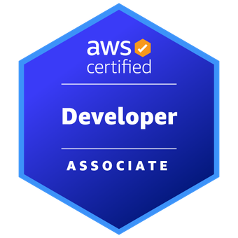

# DVA-C02 - AWS Certified Developer – Associate

[Voltar para a página principal](../../README.md)



<!-- TOC -->

- [1. Conta AWS e IAM](#1-conta-aws-e-iam)
  - [1.1. Conta AWS](#11-conta-aws)
  - [1.2. IAM](#12-iam)
  - [1.3. Custos](#13-custos)
  - [1.4. Assumindo um papel](#14-assumindo-um-papel)
  - [1.5. STS - Security Token Service](#15-sts---security-token-service)
  - [1.6. Access Control Methods](#16-access-control-methods)
- [2. CLI](#2-cli)
  - [2.1. Arquivos importantes](#21-arquivos-importantes)
  - [2.2. Assumindo um papel](#22-assumindo-um-papel)

<!-- /TOC -->

## 1. Conta AWS e IAM

### 1.1. Conta AWS

A conta root em AWS é a conta de administrador principal, com acesso total a todos os serviços e recursos da AWS. No entanto, recomenda-se usá-la apenas para criar usuários, grupos, políticas e papéis, e não para atividades do dia a dia.

- **Usuário (User):** Entidade com permissões específicas dentro da AWS. Eles representam pessoas ou aplicações que precisam de acesso aos recursos AWS.

- **Grupo (Group):** Coleção de usuários. Permissões são aplicadas ao grupo, e todos os usuários dentro dele herdam essas permissões.

- **Política (Policy):** Define permissões e especifica quais ações são permitidas ou negadas em quais recursos. Elas são escritas em formato JSON.

- **Papéis (Role):** Semelhante a um usuário, mas não é associada a uma pessoa específica. São usados para conceder permissões temporárias a usuários ou serviços que precisem acessar recursos.

### 1.2. IAM

O IAM (Identity and Access Management) é usado para gerenciar quem pode acessar os recursos AWS e de que forma. Ele permite a autenticação e autorização via API, console, e CLI, usando diferentes entidades chamadas principals.

### 1.3. Custos

Para uma gestão eficaz dos recursos na AWS, é crucial compreender e utilizar ferramentas que ajudem a monitorar e otimizar os custos dos serviços.

- **Budget:** Refere-se à criação e gerenciamento de orçamentos na AWS, onde você define limites de gastos e configura alertas para monitorar o uso e os custos dos serviços.

- **Cost Explorer:** É uma ferramenta usada para analisar os custos e o uso dos serviços na AWS. Permite visualizar tendências de gastos ao longo do tempo e identificar áreas onde os custos podem ser otimizados.

### 1.4. Assumindo um papel

1. Crie um role (AWS Account para o exemplo). Acesse-o o role e copie o ARN (algo como `arn:aws:iam::123/role/nome-role`).

2. Acesse o cadastro do usuário e adicione uma permissão inline JSON para ele:

   ```
   {
     "Version": "2012-10-17",
     "Statement": {
       "Effect": "Allow",
       "Action": "sts:AssumeRole",
       "Resource": "arn:aws:iam::123/role/nome-role"
     }
   }
   ```

   > Ela permite que o usuário troque de papéis temporariamente.

3. Acesse o role criado e copie o link para troca de papéis. Faça login via IAM de um usuário e acesse esse link. Algumas informações já estarão preenchidas. Basta clicar em trocar para ter acesso aos serviços especificados no role.

### 1.5. STS - Security Token Service

Serviço que fornece credenciais temporárias para aplicações acessarem outras aplicações.

### 1.6. Access Control Methods

- Role-Based Access Control (RBAC): Atribui permissões com base nas funções dos usuários dentro de uma organização, facilitando a gestão de acesso em grandes ambientes.
- Attribute-Based Access Control (ABAC): Oferece uma abordagem mais flexível e dinâmica, utilizando tags e múltiplos atributos (como localização e horário) para tomar decisões de acesso em tempo real.

## 2. CLI

- `aws help`: Apresenta ajuda sobre os serviços disponíveis
- `aws ec2 help`: Apresenta ajuda sobre os comandos disponíveis para o serviço EC2

---

- `aws configure`: Configura credenciais **default** de acesso AWS
- `aws configure --profile nome-perfil`: Configura credenciais de acesso AWS no perfil especificado

---

- `aws s3 ls`: Lista todos os buckets S3
- `aws s3 mb s3://my-bucket`: Cria o bucket **my-bucket**
- `aws s3 cp arquivo.txt s3://my-bucket`: Faz o upload do **arquivo.txt** para o bucket **my-bucket**
- `aws s3 ls s3://my-bucket`: Lista os arquivos no bucket **my-bucket**
- `aws s3 rb s3://my-bucket`: Remove o bucket **my-bucket** (não apaga bucket com conteúdo)
- `aws s3 rb s3://my-bucket --force`: Remove o bucket **my-bucket** mesmo com conteúdo

---

- `aws ec2 describe-instances`: Mostra detalhes das instâncias EC2

> Sempre que os comandos são executados, o perfil usado é o **default** a menos que especifiquemos um usando: `aws comando --profile nome-perfil`

### 2.1. Arquivos importantes

- `.aws/config`: Contém configurações, como região especificada
- `.aws/credentials`: Contém os dados da credencial em texto sem criptografia

> No Linux: O diretório `.aws` está onde os arquivos de instalação foram descompactados
> No Windows: O diretório `.aws` está na pasta `C:\Users\User`

### 2.2. Assumindo um papel

Copiar o código ARN do papel em IAM > Roles > NomeRole (algo como `arn:aws:iam::123/role/nome-role`) e colar usando este template no arquivo `.aws/config`:

```
[profile nome-role]
    role_arn = arn:aws:iam::123/role/nome-role
    source_profile = default
```

