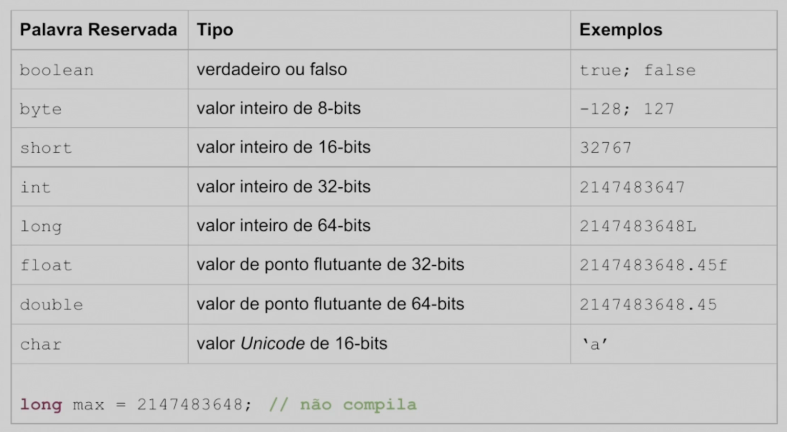
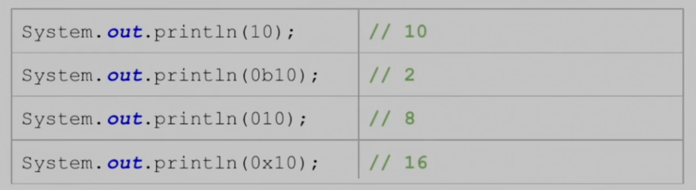
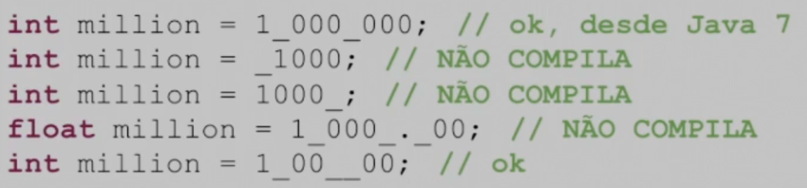
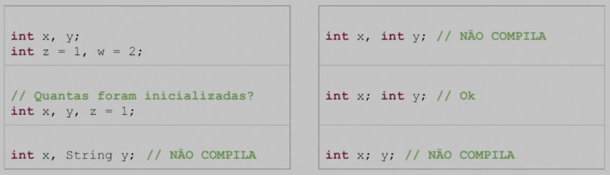
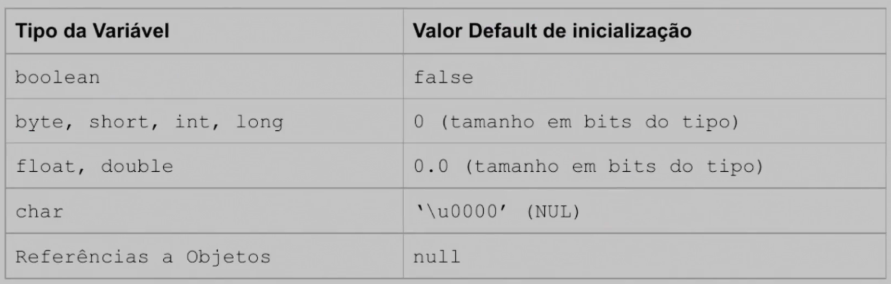
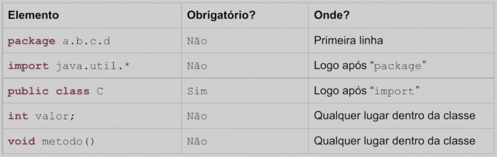
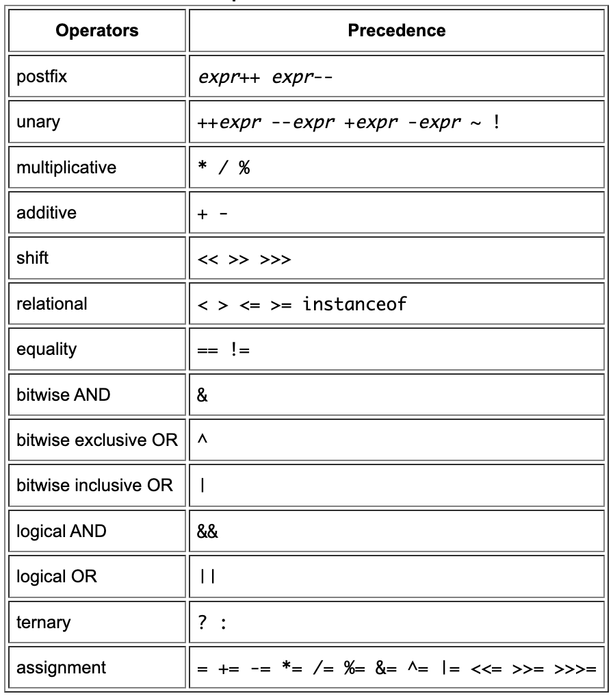
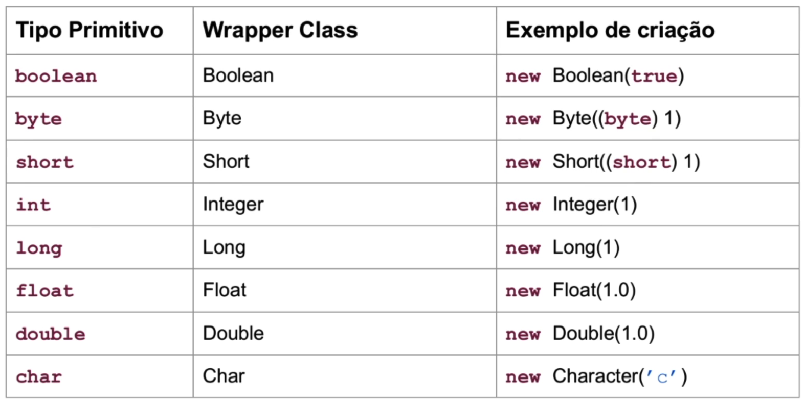
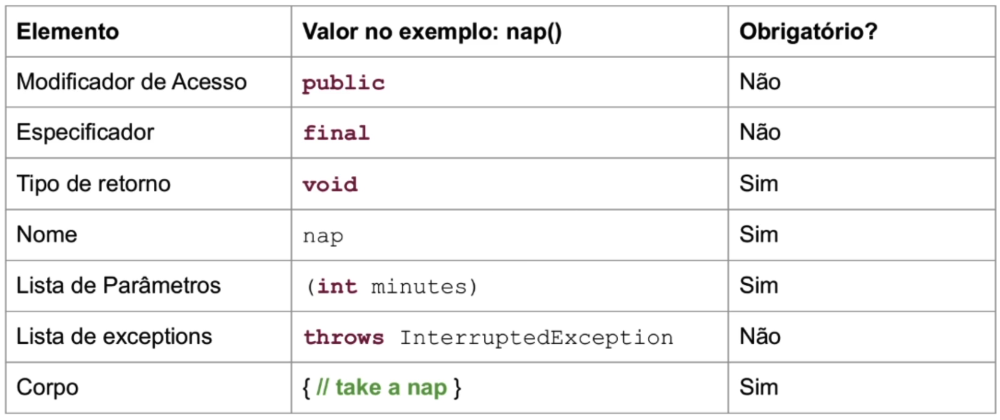

# 1Z0-808 - Oracle Certified Associate, Java SE 8 Programmer


<!-- TOC tocDepth:2..4 chapterDepth:2..4 -->

- [1. Blocos de construção](#1-blocos-de-construção)
  - [1.1. Comentários](#11-comentários)
  - [1.2. Estrutura de uma classe](#12-estrutura-de-uma-classe)
  - [1.3. Arquivos e classes](#13-arquivos-e-classes)
  - [1.4. Método main](#14-método-main)
  - [1.5. Compilação e execução](#15-compilação-e-execução)
  - [1.6. Pacotes](#16-pacotes)
  - [1.7. Criação de objetos](#17-criação-de-objetos)
  - [1.8. Blocos inicializadores de instância](#18-blocos-inicializadores-de-instância)
  - [1.9. Tipos primitivos x referências](#19-tipos-primitivos-x-referências)
  - [1.10. Declaração e inicialização de variáveis](#110-declaração-e-inicialização-de-variáveis)
  - [1.11. Ordem dos elementos na classe](#111-ordem-dos-elementos-na-classe)
  - [1.12. Destruindo objetos](#112-destruindo-objetos)
- [2. Operadores e instruções](#2-operadores-e-instruções)
  - [2.1. Tipos de operadores](#21-tipos-de-operadores)
  - [2.2. Precedência](#22-precedência)
  - [2.3. Operadores aritméticos](#23-operadores-aritméticos)
  - [2.4. Operadores relacionais](#24-operadores-relacionais)
  - [2.5. Operadores lógicos](#25-operadores-lógicos)
  - [2.6. Operadores de atribuição](#26-operadores-de-atribuição)
  - [2.7. Operadores de incremento e decremento](#27-operadores-de-incremento-e-decremento)
  - [2.8. Operadores bitwise](#28-operadores-bitwise)
  - [2.9. Operadores condicionais (ternários)](#29-operadores-condicionais-ternários)
  - [2.10. Operador instanceof](#210-operador-instanceof)
  - [2.11. Promoção numérica](#211-promoção-numérica)
  - [2.12. Estruturas de decisão](#212-estruturas-de-decisão)
    - [2.12.1. If-else](#2121-if-else)
    - [2.12.2. Ternário](#2122-ternário)
    - [2.12.3. Switch](#2123-switch)
  - [2.13. Estruturas de repetição](#213-estruturas-de-repetição)
    - [2.13.1. While](#2131-while)
    - [2.13.2. Do-while](#2132-do-while)
    - [2.13.3. For](#2133-for)
    - [2.13.4. Foreach](#2134-foreach)
    - [2.13.5. Break, continue e label](#2135-break-continue-e-label)
- [3. Core API](#3-core-api)
  - [3.1. String](#31-string)
    - [3.1.1. Concatenação](#311-concatenação)
    - [3.1.2. Métodos importantes](#312-métodos-importantes)
  - [3.2. StringBuilder](#32-stringbuilder)
    - [3.2.1. Métodos importantes](#321-métodos-importantes)
    - [3.2.2. StringBuilder x StringBuffer](#322-stringbuilder-x-stringbuffer)
  - [3.3. Comparação de objetos](#33-comparação-de-objetos)
  - [3.4. Array](#34-array)
    - [3.4.1. Ordenação](#341-ordenação)
    - [3.4.2. Busca](#342-busca)
    - [3.4.3. Varargs](#343-varargs)
    - [3.4.4. Multidimensionais](#344-multidimensionais)
  - [3.5. Wrappers](#35-wrappers)
  - [3.6. ArrayList](#36-arraylist)
    - [3.6.1. Métodos importantes](#361-métodos-importantes)
    - [3.6.2. Conversão e ordenação](#362-conversão-e-ordenação)
  - [3.7. Date e time](#37-date-e-time)
    - [3.7.1. Métodos importantes](#371-métodos-importantes)
    - [3.7.2. Period](#372-period)
    - [3.7.3. Formatação](#373-formatação)
- [4. Métodos e encapsulamento](#4-métodos-e-encapsulamento)
  - [4.1. Design de método](#41-design-de-método)
  - [4.2. Modificadores de acesso](#42-modificadores-de-acesso)
  - [4.3. Membros estáticos e instâncias](#43-membros-estáticos-e-instâncias)
  - [4.4. Constantes](#44-constantes)
  - [4.5. Importação estática](#45-importação-estática)
  - [4.6. Parâmetro e retorno](#46-parâmetro-e-retorno)
  - [4.7. Sobrecarga](#47-sobrecarga)
  - [4.8. Construtores](#48-construtores)
  - [4.9. Ordem de inicialização](#49-ordem-de-inicialização)
  - [4.10. Encapsulamento](#410-encapsulamento)
  - [4.11. Lambda](#411-lambda)
- [5. Design de Classes com Herança e Polimorfismo](#5-design-de-classes-com-herança-e-polimorfismo)
  - [5.1. Introdução a herança](#51-introdução-a-herança)
  - [5.2. Uso do super](#52-uso-do-super)
  - [5.3. Sobreescrita](#53-sobreescrita)
  - [5.4. Hiding](#54-hiding)
  - [5.5. Final](#55-final)
  - [5.6. Classes abstratas](#56-classes-abstratas)
  - [5.7. Interface](#57-interface)

<!-- /TOC -->

## 1. Blocos de construção

### 1.1. Comentários

```java
// Comentários de linha única: adicionar notas ou descrições breves.

/*
Comentários de bloco: podem abranger várias linhas.
São úteis para comentar seções maiores de código.
*/

/**
 * Documentação de comentários: usados para gerar documentação automática para o código usando a ferramenta javadoc.
 * Podem incluir informações sobre classes, métodos, parâmetros, retornos e mais.
 */
```

### 1.2. Estrutura de uma classe

Uma classe em Java é um `modelo` ou um plano para criar objetos. Os membros que a compõe incluem:

- `Atributos` (variáveis de instância): para armazenar dados;
- `Métodos` (funções/procedimentos de instância): para definir o comportamento dos objetos.

```java
public class Animal {
    String nome;
}
```

### 1.3. Arquivos e classes

Quando uma classe é declarada como pública em Java, `o nome do arquivo que a contém deve ser obrigatoriamente o mesmo nome da classe pública`.

Se a classe não é declarada como pública, ou seja, seu modificador de acesso é **package** (padrão), então o nome do arquivo não precisa ser o mesmo que o nome da classe. No entanto, é uma boa prática manter a correspondência entre o nome da classe e o nome do arquivo mesmo para classes não públicas, para tornar o código mais organizado e legível.

### 1.4. Método main

Serve como o ponto de entrada para a execução do programa.

```java
public class Programa {
    public static void main(String[] args) {
        System.out.println("Olá, mundo!");
    }
}
```

É declarado como `public` para que possa ser acessado de fora da classe e como `static` para que possa ser chamado sem criar uma instância da classe. Isso é necessário porque a execução do programa começa antes que qualquer objeto seja criado.

Pode receber argumentos de linha de comando como um array de strings (`String[] args`). Esses argumentos podem ser usados para passar informações ou configurações para o programa quando ele é executado. Também é possível usar `String ...args` (**varargs**).

### 1.5. Compilação e execução

Para compilar, usamos: `javac Programa.java` e para executar, usamos `java Programa`.

Para usar os argumentos, basta enviar após o nome do programa:

```sh
java Programa argumento1 "argumento dois" argumento3
```

```java
public class Programa {
    public static void main(String[] args) {
        System.out.println(args[0]); // argumento1
        System.out.println(args[1]); // argumento dois
        System.out.println(args[2]); // argumento3
    }
}
```

É necessário compilar todas as classes do projeto, indicando seu diretório:

```sh
javac dir1/ClasseA.java dir2/ClasseB.java
```

E para executar, use a anotação de ponto:

```java
java dir2.ClasseB
```

> Supondo que a classe B possui o método main.

### 1.6. Pacotes

Um pacote (`package`) é um mecanismo de organização de classes e interfaces em grupos relacionados. Ele ajuda a evitar conflitos de nomes entre classes, permite a modularização do código e facilita a organização de projetos de software em hierarquias lógicas. Os pacotes são representados como diretórios no sistema de arquivos.

- **Declaração de Pacote**: No início de um arquivo Java, você pode declarar a qual pacote a classe pertence usando a instrução package. Por exemplo:
  `package com.example.minhaplicacao;`

- **Importação de Classes**: Para usar classes de outros pacotes em seu código, você pode importá-las usando a instrução _import_. Por exemplo, se você quiser usar a classe MinhaClasse de um pacote chamado outropacote, você pode importá-la assim:
  `import outropacote.MinhaClasse;`

Se uma classe não tem uma declaração de pacote no início do arquivo, ela pertence ao pacote padrão. Classes no pacote padrão podem ser usadas diretamente sem importações, desde que estejam no mesmo pacote que as classes que as estão referenciando.

Também é possível usar wildcards () para importar todas as classes de um pacote: `import outropacote._;`. Pode-se usar wildcard somente no nome do pacote mais externo e não em subpacotes ou classes individuais dentro desse pacote. Além disso, é permitido apenas um wildcard por declaração de importação.

> Usar wildcard pode resultar em ambiguidade no código. Isso ocorre quando dois ou mais pacotes contêm classes ou interfaces com nomes idênticos ou conflitantes. Nesse cenário, o compilador pode não saber qual classe específica deve ser usada em um contexto particular, resultando em um erro de ambiguidade.
>
> Para resolver ambiguidades ao usar wildcards pode-se **importar classes específicas**, **utilizar o nome completo da classe** ou **renomear classes localmente** usando `import ... as`.

O pacote `java.lang` é automaticamente importado, não sendo necessária sua importação manual.

### 1.7. Criação de objetos

Em Java, a criação de objetos envolve o uso da palavra-chave "new" seguida pelo construtor da classe. Os passos básicos para criar um objeto são:

```java
// Declaração da Variável de Referência:
TipoObjeto nomeObjeto;

// Alocação de Memória e Inicialização:
nomeObjeto = new TipoObjeto();
```

O construtor é um método especial na classe responsável por configurar o estado inicial do objeto e é chamado sempre que um objeto é criado.

Depois de criado, você pode acessar os membros (atributos e métodos) do objeto usando a notação de ponto.

### 1.8. Blocos inicializadores de instância

É um bloco de código que é executado quando uma instância da classe é criada. Ele é usado para realizar a inicialização de instâncias ou execução de código `antes da execução dos construtores`. Existem dois tipos de blocos inicializadores de instância em Java: o bloco de inicialização de instância e o bloco de inicialização de instância estático:

```java
public class Exemplo {

    // Bloco de inicialização estático
    static {
        System.out.println("Bloco de inicialização estático executado");
    }

    // Bloco de inicialização de instância
    {
        System.out.println("Bloco de inicialização de instância executado");
    }

    int valor; // A variável de instância

    // Construtor
    public Exemplo() {
        valor = 10;
        System.out.println("Construtor executado");
    }

    public static void main(String[] args) {
        System.out.println("Início do programa");
        Exemplo exemplo1 = new Exemplo();
        Exemplo exemplo2 = new Exemplo();
        System.out.println("Fim do programa");
    }
}

/* Resultado:
   Bloco de inicialização estático executado
   Início do programa
   Bloco de inicialização de instância executado
   Construtor executado
   Bloco de inicialização de instância executado
   Construtor executado
   Fim do programa
*/
```

O bloco de inicialização estático, ele é declarado com a palavra-chave `static` e é executado uma única vez quando a classe é carregada, antes da criação de qualquer instância.

O bloco de inicialização de instância é executado cada vez que uma nova instância da classe é criada, antes do construtor.

> Atributos e blocos inicializadores de instância são executados na ordem em que aparecem no arquivo, só depois o construtor é executado. Portanto, o código abaixo gera erro:
>
> ```java
> {
>   System.out.println(valor);
>   int valor = 10;
> }
> ```

### 1.9. Tipos primitivos x referências

O Java possui 8 tipos primitivos:

 \
Para que um valor inteiro seja interpretado como `long`, é necessário acrescentar o `L` no final, caso contrário, será interpretado como `int`. O mesmo acontece para diferenciar `float` e `double`, mas agora usando a letra `f`.

**Bases numéricas**


- Começa com `0b`: binário
- Começa com `0`: octal
- Começa com `0x`: hexadecimal

Também podemos usar `_` para facilitar a leitura de números grandes **no código**: \
 \
Não usar no começo, no fim dos valores, e antes ou depois do `.`.

As referências são variáveis que referenciam um objeto. Não guardam valor, mas sim o `endereço` do espaço de memória no qual o valor está.

Somente o tipo referência pode receber `null` e pode possuir métodos e atributos.

### 1.10. Declaração e inicialização de variáveis

**Declarando múltiplas variáveis**


`Regras para identificadores`:

- Deve começar com **letra**, `$` ou `_`
- Pode conter **letras**, **números**, `$` ou `_`
- Não pode ser uma palavra reservada (Java é case-sensitive)

As variáveis locais (localizadas nos métodos) `não são inicializadas`. Gerarão erro caso tente usar antes de atribuir um valor a elas.

As variáveis de instância (atributos) ou classe (estáticas) têm valores padrão quando criadas: \


As `variáveis de classe` são declaradas usando a palavra-chave `static`. Essas variáveis pertencem à classe, em vez de a uma instância específica da classe. Portanto, elas **são compartilhadas por todas as instâncias da classe**.

Quanto ao escopo das variáveis:

- `Variáveis Locais`: escopo desde a declaração até o fim do bloco
- `Variáveis de Instância`: da declaração até o objeto ser coletado
- `Variáveis de Classe`: da declaração até o fim do programa

### 1.11. Ordem dos elementos na classe



### 1.12. Destruindo objetos

O `Garbage Collector` em Java é um mecanismo automático de gerenciamento de memória que remove objetos não referenciados, **liberando espaço na memória**. Ele opera de forma automática, identificando objetos que não têm mais referências no escopo de execução do programa. Embora seja possível chamar `System.gc()` para sugerir a execução do Garbage Collector, a efetiva coleta de objetos não é garantida nesse momento.

O método `finalize()` é chamado pelo Garbage Collector antes de liberar a memória ocupada por um objeto que está prestes a ser coletado. No entanto, sua execução não é garantida pois depende se um objeto é ou não coletado - nem todo objeto é necessariamente coletado.

## 2. Operadores e instruções

### 2.1. Tipos de operadores

- `Operadores Unários`: Atuam em um único operando. Exemplo: `-x`, `x++`

- `Operadores Binários`: Atuam em dois operandos.
  Exemplo: `a + b`

- `Operadores Ternários`: Atuam em três operandos.
  Exemplo: `x > 0 ? "Positivo" : "Negativo"`

### 2.2. Precedência

 \
De cima para baixo: da maior para a menor precedência.

### 2.3. Operadores aritméticos

- Adição: `+`
- Subtração: `-`
- Multiplicação: `*`
- Divisão: `/`
- Módulo: `%`

### 2.4. Operadores relacionais

- Igual a: `==`
- Diferente de: `!=`
- Maior que: `>`
- Menor que: `<`
- Maior ou igual a: `>=`
- Menor ou igual a: `<=`

### 2.5. Operadores lógicos

- E lógico: `&&`
- OU lógico: `||`
- NÃO lógico: `!`

### 2.6. Operadores de atribuição

- Atribuição: `=`
- Adição e atribuição: `+=`
- Subtração e atribuição: `-=`
- Multiplicação e atribuição: `*=`
- Divisão e atribuição: `/=`
- Módulo e atribuição: `%=`

### 2.7. Operadores de incremento e decremento

- Incremento: `++`
- Decremento: `--`

### 2.8. Operadores bitwise

- E bitwise: `&`
- OU bitwise: `|`
- OU exclusivo bitwise: `^`
- Complemento bitwise: `~`
- Deslocamento à esquerda: `<<`
- Deslocamento à direita com sinal: `>>`
- Deslocamento à direita sem sinal: `>>>`

> Quando usamos os operadores bitwise entre **expressões**, ambas são sempre avaliadas, independentemente do valor da primeira expressão.

### 2.9. Operadores condicionais (ternários)

- Operador ternário: `? `

### 2.10. Operador instanceof

- instanceof: `instanceof`

### 2.11. Promoção numérica

Quando operações são realizadas entre tipos numéricos menores e um tipo numérico maior, `o tipo menor é promovido ao tipo maior automaticamente` antes da operação ser realizada. Isso garante a precisão dos cálculos e evita a perda de dados.

> Ao tentarmos atribuir tipos maiores para menores implicitamente, geramos um erro:
>
> ```java
> int x;
> long y;
>
> x = x * y; // Erro pois o resultado é long
>
> x *= y; // Funciona pois esse tipo de operação tem cast automático
> ```

### 2.12. Estruturas de decisão

#### 2.12.1. If-else

O bloco `if-else` é uma estrutura de controle de fluxo que permite a execução condicional de código. Se a condição especificada no `if` é verdadeira, o bloco de código dentro do `if` é executado; caso contrário, o bloco dentro do `else` é executado. Por exemplo, considerando a variável idade:

```java
int idade = 20;

if (idade >= 18) {
    System.out.println("Maior de idade");
} else {
    System.out.println("Menor de idade");
}
```

#### 2.12.2. Ternário

Já o operador ternário é uma forma concisa de expressar uma estrutura condicional em uma única linha. Ele avalia uma condição e retorna um valor com base nessa condição. Por exemplo, ao verificar se um número é par ou ímpar:

```java
int numero = 7;
String resultado = (numero % 2 == 0) ? "Par" : "Ímpar";
```

#### 2.12.3. Switch

É uma estrutura de controle usada para `direcionar a execução do código com base no valor de uma expressão`. Cada caso no bloco switch representa um valor possível da expressão, e o código correspondente é executado quando um caso coincide:

```java
int numeroDia = 5;
String diaSemana;

switch (numeroDia) {
    case 1:
        diaSemana = "Domingo";
        break;
    case 2:
        diaSemana = "Segunda-feira";
        break;
    case 3:
        diaSemana = "Terça-feira";
        break;
    default:
        diaSemana = "Outro dia";
}
```

### 2.13. Estruturas de repetição

#### 2.13.1. While

O loop while é uma estrutura de controle de fluxo que `executa repetidamente um bloco de código enquanto uma condição é verdadeira`. Por exemplo, para imprimir os números de 1 a 5:

```java
int contador = 1;

while (contador <= 5) {
    System.out.println(contador);
    contador++;
}
```

#### 2.13.2. Do-while

O loop do-while é uma estrutura semelhante ao while, mas `garante que o bloco de código seja executado pelo menos uma vez`, pois a condição é verificada após a execução do bloco. Por exemplo, para imprimir os números de 1 a 5:

```java
int contador = 1;

do {
    System.out.println(contador);
    contador++;
} while (contador <= 5);
```

#### 2.13.3. For

O loop for é uma estrutura de controle de fluxo que simplifica a iteração sobre uma sequência de elementos. É composto por uma `inicialização, condição de continuação e expressão de iteração`. Por exemplo, para imprimir os números de 1 a 5:

```java
for (int i = 1; i <= 5; i++) {
    System.out.println(i);
}
```

> `for ( ; ; ) {}` gera um loop infinito, pois os componentes do `for` são opcionais.

> É possível ter mais de uma inicialização e iteração. Basta separar por vírgula:
>
> ```java
> for (int i = 0, j = 10; i < 5 && j > 5; i++, j--) {
>     System.out.println("i: " + i + ", j: " + j);
> }
> ```

#### 2.13.4. Foreach

O loop foreach (também conhecido como **enhanced for loop**) é usado para iterar sobre elementos em uma coleção ou array. Ele simplifica o processo de iteração, `eliminando a necessidade de controlar índices manualmente`. Por exemplo, para percorrer os elementos de um array:

```java
int[] numeros = {1, 2, 3, 4, 5};

for (int numero : numeros) {
    System.out.println(numero);
}
```

#### 2.13.5. Break, continue e label

A palavra-chave `break` é usada para **interromper a execução** de **loops ou switch statements**. Por exemplo, para sair de um loop for quando i atinge 3:

```java
for (int i = 0; i < 5; i++) {
    if (i == 3) {
        break; // Sai do loop quando i é 3
    }
    System.out.println(i);
}
```

A palavra-chave `continue` é usada para **pular a iteração** atual de um loop e continuar com a próxima. Com labels, pode ser direcionado para qual loop deve pular. Exemplo, pulando a iteração quando i é 3:

```java
outerLoop:
for (int i = 0; i < 3; i++) {
    innerLoop:
    for (int j = 0; j < 3; j++) {
        if (i == 1 && j == 1) {
            continue outerLoop; // Pula a iteração quando i é 1 e j é 1
        }
        System.out.println(i + " " + j);
    }
}
```

> O `break` também pode ser usado com labels para especificar de qual loop ou switch deve sair.

## 3. Core API

### 3.1. String

Sequência **imutável** de caracteres que pode ser criada de duas formas:

```java
String nome1 = "Nome";
String nome2 = new String("Nome");
```

#### 3.1.1. Concatenação

A concatenação de strings com o operador `+` segue a regra da **esquerda para a direita**. Por exemplo, ao concatenar inteiros e strings:

```java
int numero1 = 5;
int numero2 = 10;
String resultado = numero1 + numero2 + " é o resultado.";

System.out.println(resultado); // "15 é o resultado"
```

Note que, mesmo sendo imutável, é possível concatenar uma string com outros caracteres:

```java
String nome = "Meu";

nome += " Nome";

System.out.println(nome); // "Meu nome"
```

Porém, internamente ainda existe um lugar na memória apenas com o conteúdo `"Meu"`. O conteúdo impresso na tela é resultado da criação de outra string com valor concatenado, e a variável `nome` apenas mudou o endereço referenciado. Assim, podemos observar a imutabilidade.

#### 3.1.2. Métodos importantes

- `length`: Retorna o número de caracteres na string;
- `charAt`: Retorna o caractere na posição especificada;
- `indexOf`: Retorna a posição do primeiro caractere especificado;
- `substring`: Retorna uma substring com base nos índices fornecidos;
- `toLowerCase`: Converte a string para minúsculas;
- `toUpperCase`: Converte a string para maiúsculas;
- `equals`: Verifica se duas strings são iguais;
- `equalsIgnoreCase`: Verifica se duas strings são iguais, ignorando maiúsculas e minúsculas;
- `startsWith`: Verifica se a string começa com um determinado prefixo;
- `endsWith`: Verifica se a string termina com um determinado sufixo;
- `contains`: Verifica se a string contém uma determinada sequência de caracteres;
- `replace`: Substitui caracteres ou sequências de caracteres por outros;
- `trim`: Remove espaços em branco do início e do final da string.

### 3.2. StringBuilder

Diferente de `String`, a **StringBuilder** é mutável. Logo, é ideal para casos em que é necessário fazer concatenações e mudanças em uma string, pois essas mudanças não ocasionam a criação de valores intermediários em memória.

```java
StringBuilder sb = new StringBuilder("Olá, ");
sb.append("mundo!");
System.out.println(sb);  // Saída: Olá, mundo!
```

#### 3.2.1. Métodos importantes

Para StringBuilder **podemos usar os [métodos da classe String](#312-métodos-importantes)**, e outros métodos específicos:

- `append`: Adiciona dados ao final do StringBuilder.
- `insert`: Insere dados em uma posição específica.
- `delete`: Remove uma sequência de caracteres.
- `deleteCharAt`: Remove o caractere na posição especificada.
- `reverse`: Inverte a sequência de caracteres.
- `toString`: Converte o StringBuilder para uma string.

#### 3.2.2. StringBuilder x StringBuffer

A classe `StringBuffer` possui os mesmos métodos de `StringBuilder`. A principal diferença entre elas é a sincronização.

`StringBuffer` é sincronizado e, portanto, seguro para operações concorrentes, mas pode ser menos eficiente em cenários onde a concorrência não é um problema.

`StringBuilder` não é sincronizado, tornando-o mais eficiente em operações não concorrentes.

Por exemplo, em um aplicativo onde várias **threads** estão manipulando e modificando uma string compartilhada, é crucial **garantir que as operações sejam sincronizadas para evitar problemas de concorrência e inconsistências nos resultados**. Nesses casos, usar `StringBuffer` (que é **thread-safe** devido à sincronização) é mais apropriado para garantir a consistência dos dados compartilhados entre as **threads**.

### 3.3. Comparação de objetos

O operador `==` em Java compara referências de objetos, não os valores.

No entanto, para objetos String criados sem o uso do operador new, o Java usa um **pool de strings** interno, o que significa que strings idênticas compartilham a mesma referência na memória, tornando a comparação com `==` válida para verificar igualdade de valor.

No entanto, para garantir a comparação de conteúdo, é preferível usar o método `equals()`, que compara os valores das strings, não apenas as referências.

```java
public class ComparacaoDeObjetos {

    public static void main(String[] args) {
        // Criando strings usando o pool de strings
        String str1 = "Hello";
        String str2 = "Hello";
        // Criando string no HEAP
        String str3 = new String("Hello");

        // Usando == para comparar referências
        System.out.println(str1 == str2);  // true (mesma referência no pool)
        System.out.println(str1 == str3);  // false (referências diferentes)

        // Usando equals para comparar valores
        System.out.println(str1.equals(str2));  // true (mesmo valor)
        System.out.println(str1.equals(str3));  // true (mesmo valor, embora referências sejam diferentes)
    }
}
```

### 3.4. Array

Arrays em são estruturas de `tamanho fixo`, armazenando elementos de um `único tipo`.

Arrays de primitivos são inicializados com valores padrão (`0` para números, `false` para booleanos).

A forma de declarar arrays permite criar e inicializar com valores imediatamente. Quando mais de uma variável é criada na mesma linha, os colchetes podem ser colocados tanto com o tipo quanto com o nome da variável. Exemplos:

```java
// Declarando e inicializando um array de inteiros
int[] numeros = {1, 2, 3, 4, 5};

// Criando dois arrays de inteiros na mesma linha
int[] array1, array2;

// Criando um inteiro e um array de inteiro
int array3, array4[];
```

#### 3.4.1. Ordenação

A ordenação de arrays em Java é simplificada pela classe Arrays do pacote `java.util`.

```java
import java.util.Arrays;

int[] numeros = {5, 2, 8, 1, 3};
Arrays.sort(numeros);
System.out.println(Arrays.toString(numeros));
```

> É importante observar que, quando se trabalha com números representados como strings, a ordenação é `lexicográfica` e não leva em consideração os valores numéricos. Por exemplo, para strings `"2", "5" e "10", `, a ordenação lexicográfica resultará em `"10", "2" e "5"`, não refletindo a ordem numérica.

#### 3.4.2. Busca

A busca binária em um array, realizada pelo método binarySearch da classe Arrays, retorna o índice do elemento encontrado ou um índice negativo caso o elemento não seja encontrado.

Esse método assume que o array está ordenado. Se o array não estiver ordenado, o resultado pode ser imprevisível.

```java
int[] numeros = {8, 2, 5, 1, 6};

Arrays.sort(numeros); // {1, 2, 5, 6, 8}

int indice = Arrays.binarySearch(numeros, 4); // -3
```

O valor retornado, `-3`, representa:

- Por ser negativo, o elemento não foi encontrado;
- `-(-3) - 1` = `3 - 1` = `2`, indica onde o elemento deve ser inserido para manter a ordem.

#### 3.4.3. Varargs

A passagem de arrays via `varargs` (**argumentos de comprimento variável**) permite que você passe um número variável de elementos como argumentos para um método.

Para usar `varargs` com arrays, basta adicionar reticências após o tipo do array no parâmetro do método. O parâmetro `varargs` deve ser o último na lista de parâmetros do método.

```java
static void imprimirNumeros(int... nums) {
    for (int num : nums) {
        System.out.print(num + " ");
    }
}

public static void main(String[] args) {
    int[] numeros = {1, 2, 3, 4, 5};
    imprimirNumeros(numeros);
}
```

#### 3.4.4. Multidimensionais

São matrizes que contêm outras matrizes. A declaração de arrays multidimensionais pode ser feita de diferentes formas, como:

- `int[][] matriz = new int[x][];`
- `int matriz[][] = new int[y][];`
- `int[] matriz[] = new int[z][];`

Apesar de os tamanhos das últimas dimensões ser opcional, o tamanho da primeira dimensão sempre deve ser definido na declaração de arrays multidimensionais.

```java
int[][] matrizVariavel = new int[2][];

matrizVariavel[0] = new int[5];
matrizVariavel[1] = new int[8];
```

> Para interpretar, podemos dizer que foi criada uma matriz de duas linhas e colunas variáveis.
>
> A primeira linha possui 5 colunas e a segunda linha possui 8 colunas.

### 3.5. Wrappers

São classes que `encapsulam tipos primitivos`, permitindo que sejam tratados como objetos.

Métodos como `parseX` convertem strings para tipos primitivos (por exemplo, `Integer.parseInt("123")`), enquanto `valueOf` retorna objetos wrappers (por exemplo, `Integer.valueOf(123)`). O tipo `Char` não possui esses métodos.

O `autoboxing` converte automaticamente tipos primitivos em wrappers (por exemplo, `int` para `Integer`), e o `autounboxing` faz o inverso (por exemplo, `Integer` para `int`).

> É importante notar que wrappers podem aceitar valores nulos, ao contrário de tipos primitivos.



### 3.6. ArrayList

`ArrayList` uma implementação da interface `List` que oferece um **array dinâmico redimensionável**.

Pode ser criado de três maneiras: usando o construtor padrão (vazio), especificando a capacidade inicial através do construtor com um argumento de capacidade, ou inicializando-o com elementos de outra coleção.

O uso de generics permite a tipagem segura, mas ao instanciar um ArrayList, o tipo genérico só é necessário durante a declaração; durante a inicialização, o operador diamante <> pode ser usado.

```java
import java.util.ArrayList;
import java.util.List;

public class ExemploArrayList {
    public static void main(String[] args) {
        // Criando um ArrayList vazio
        List<String> lista1 = new ArrayList<>();

        // Criando um ArrayList com capacidade inicial
        List<Integer> lista2 = new ArrayList<>(10);

        // Criando um ArrayList com elementos de outra coleção
        List<Double> lista3 = new ArrayList<>(List.of(1.1, 2.2, 3.3));

        // Adicionando elementos dinamicamente
        lista1.add("Java");
        lista2.add(42);
        lista3.add(4.4);

        // Exibindo os elementos
        System.out.println("Lista 1: " + lista1);
        System.out.println("Lista 2: " + lista2);
        System.out.println("Lista 3: " + lista3);
    }
}
```

#### 3.6.1. Métodos importantes

- `add(elemento)` | `add(índice, elemento)`: Adiciona um elemento ao final da lista. Também aceita, como segundo elemento, o índice para o novo elemento.
- `remove(elemento)` | `remove(índice)`: Remove a primeira ocorrência do elemento especificado ou do elemento no índice especificado.
- `set(índice, elemento)`: Substitui o elemento no índice especificado pelo novo elemento.
- `isEmpty()`: Retorna **true** se a lista estiver vazia.
- `size()`: Retorna o número de elementos na lista.
- `clear()`: Remove todos os elementos da lista.
- `contains(elemento)`: Retorna **true** se a lista contiver o elemento especificado.
- `equals(outraLista)`: Compara se a lista é igual a outra lista, verificando se têm os mesmos elementos na mesma ordem.

#### 3.6.2. Conversão e ordenação

A conversão entre arrays e listas pode ser feita usando o método `toArray` para converter uma lista para um array, e o método `asList` para converter um array para uma lista.

> `asList` cria uma lista de tamanho fixo que aponta para o mesmo endereço de memória do array original.

Além disso, a ordenação de uma lista pode ser realizada usando `Collections.sort`.

```java
import java.util.Arrays;
import java.util.Collections;
import java.util.List;

public class ConversaoOrdenacao {
    public static void main(String[] args) {
        // Conversão de array para lista
        String[] array = {"c", "a", "b"};
        List<String> lista = Arrays.asList(array);

        // Modificando a lista modifica o array original
        lista.set(0, "x");
        System.out.println("Array após modificar a lista: " + Arrays.toString(array));
        // [x, a, b]

        // Conversão de lista para array
        String[] novoArray = lista.toArray(new String[0]);

        // Ordenação da lista
        Collections.sort(lista);
        System.out.println("Lista ordenada: " + lista);
        // [a, b, x]
    }
}
```

> A expressão `new String[0]` é utilizada ao converter uma lista para um array para garantir um comportamento consistente, mesmo quando a lista está vazia, assegurando um array do tipo correto, independentemente do tamanho da lista.

### 3.7. Date e time

As classes `LocalDate`, `LocalTime` e `LocalDateTime` fazem parte do pacote `java.time` e representam respectivamente `datas`, `horas` e `data e hora` combinadas sem considerar a zona de tempo.

O método `now` é usado para obter a data ou hora atual, enquanto o método `of` permite criar instâncias específicas dessas classes.

**`Não é possível criar instâncias usando new`**, pois essas classes possuem construtores privados.

O uso do **enum** `Month` é comum para representar meses, oferecendo uma abordagem mais segura e legível.

```java
import java.time.*;

public class ExemploDateTime {
    public static void main(String[] args) {
        // Obtendo a data atual
        LocalDate dataAtual = LocalDate.now();

        // Criando uma data específica
        LocalDate dataEspecifica = LocalDate.of(2000, Month.JANUARY, 1);

        // Obtendo a hora atual
        LocalTime horaAtual = LocalTime.now();

        // Criando uma data e hora específicas
        LocalDateTime dataHoraEspecifica = LocalDateTime.of(2023, Month.FEBRUARY, 28, 14, 30);
        System.out.println("Data e hora específicas: " + dataHoraEspecifica);
    }
}
```

#### 3.7.1. Métodos importantes

- `plusDays(long days)`: Adiciona um número especificado de dias.
- `plusMonths(long months)`: Adiciona um número especificado de meses.
- `plusYears(long years)`: Adiciona um número especificado de anos.
- `plusHours(long hours)`: Adiciona um número especificado de horas.
- `plusMinutes(long minutes)`: Adiciona um número especificado de minutos.
- `plusSeconds(long seconds)`: Adiciona um número especificado de segundos.
- `plusWeeks(long weeks)`: Adiciona um número especificado de semanas.
- `minusDays(long days)`: Subtrai um número especificado de dias.
- `minusMonths(long months)`: Subtrai um número especificado de meses.
- `minusYears(long years)`: Subtrai um número especificado de anos.
- `minusHours(long hours)`: Subtrai um número especificado de horas.
- `minusMinutes(long minutes)`: Subtrai um número especificado de minutos.
- `minusSeconds(long seconds)`: Subtrai um número especificado de segundos.
- `minusWeeks(long weeks)`: Subtrai um número especificado de semanas.

#### 3.7.2. Period

`Period` é uma classe do pacote `java.time` que representa um **período de tempo**, como a diferença entre duas datas. Além de calcular diferenças entre datas, é possível criar instâncias de `Period` para representar um período fixo, independente de datas específicas.

```java
import java.time.LocalDate;
import java.time.Period;

public class ExemploPeriod {
    public static void main(String[] args) {
        // Criando um período de uma semana
        Period umaSemana = Period.ofWeeks(1);

        // Adicionando uma semana a uma data específica
        LocalDate dataAtual = LocalDate.of(2022, 1, 1);
        LocalDate dataFutura = dataAtual.plus(umaSemana);

        System.out.println("Data atual: " + dataAtual);
        System.out.println("Data futura após uma semana: " + dataFutura);

        // Calculando o período entre duas datas
        LocalDate dataInicial = LocalDate.of(2022, 1, 1);
        LocalDate dataFinal = LocalDate.of(2023, 1, 1);
        Period periodoEntreDatas = Period.between(dataInicial, dataFinal);

        System.out.println("Diferença em anos: " + periodoEntreDatas.getYears());
        System.out.println("Diferença em meses: " + periodoEntreDatas.getMonths());
        System.out.println("Diferença em dias: " + periodoEntreDatas.getDays());
    }
}
```

#### 3.7.3. Formatação

Para formatar datas e horas, você pode usar métodos como `getYear`, `getMonth` etc., juntamente com a classe `DateTimeFormatter`.

O `DateTimeFormatter` fornece padrões predefinidos, como `DateTimeFormatter.ISO_DATE`, ou você pode criar seu próprio formato personalizado usando `ofPattern`.

```java
import java.time.LocalDateTime;
import java.time.format.DateTimeFormatter;

public class ExemploFormatarDatetime {
    public static void main(String[] args) {
        // Criando uma instância de LocalDateTime
        LocalDateTime dataHoraAtual = LocalDateTime.now();

        // Formatando usando padrão ISO_DATE
        String formatoPadrao = dataHoraAtual.format(DateTimeFormatter.ISO_DATE);
        System.out.println("Formato Padrão ISO_DATE: " + formatoPadrao);

        // Criando um formatador personalizado
        DateTimeFormatter meuFormatador = DateTimeFormatter.ofPattern("dd-MM-yyyy HH:mm:ss");
        String formatoPersonalizado = dataHoraAtual.format(meuFormatador);
        System.out.println("Formato Personalizado: " + formatoPersonalizado);
    }
}
```

> Os padrões de formatação de datas e horas são definidos pela classe `DateTimeFormatter`. Para encontrar a documentação oficial que lista os padrões disponíveis, você pode consultar a [documentação online da Oracle](https://docs.oracle.com/en/java/javase/17/docs/api/java.base/java/time/format/DateTimeFormatter.html).

## 4. Métodos e encapsulamento

### 4.1. Design de método

O design de métodos envolve vários elementos:

- **`Modificador de Acesso`**: Define a visibilidade do método (`public`, `private`, `protected`, ou `default/package-private`).

- **`Especificadores`**: Como `static`, `final`, ou `abstract`, que modificam o comportamento do método.

- **`Tipo de Retorno`**: Indica o tipo de dado que o método retorna, colocado **imediatamente antes** do nome do método.

- **`Nome`**: Deve começar com uma **letra**, cifrão (`$`) ou sublinhado (`_`).

- **`Parâmetros`**: Lista de variáveis separadas por vírgula, dentro dos parênteses.

- **`Exceções`**: Indicadas após a lista de parâmetros, caso o método possa lançar exceções.

- **`Corpo`**: Contém a lógica do método, definido por chaves `{}`.

> O nome do método e sua lista de parâmetros formam o que chamamos de **`assinatura do método`**.



Exemplos:

```java
public class ExemploMetodo {
    // Modificador de Acesso: public
    // Especificador:         static
    // Tipo de Retorno:       int
    // Nome:                  somar
    // Parâmetros:            (int a, int b)
    // Corpo:                 { return a + b; }
    public static int somar(int a, int b) {
        return a + b;
    }

    // Modificador de Acesso: private
    // Tipo de Retorno:       void
    // Nome:                  exibirMensagem
    // Parâmetros:            (String mensagem)
    // Corpo:                 { System.out.println(mensagem); }
    private void exibirMensagem(String mensagem) {
        System.out.println(mensagem);
    }
}
```

### 4.2. Modificadores de acesso

Os modificadores de acesso determinam a visibilidade de classes, métodos e variáveis em relação a outras classes. Existem quatro modificadores de acesso principais:

- `public`: O membro (classe, método, variável) é acessível de qualquer lugar. Por exemplo, um método declarado como `public` pode ser chamado de qualquer outra classe.

- `private`: O membro é acessível apenas dentro da própria classe. Isso significa que outros objetos ou classes não podem acessar diretamente membros privados.

- `protected`: O membro é acessível dentro da própria classe, subclasses (mesmo que estejam em pacotes diferentes) e para outras classes do mesmo pacote.

- `default (ou package-private)`: Se um membro não tem um modificador de acesso (não é `public`, `private` ou `protected`), ele é acessível apenas dentro do mesmo pacote. Este é o nível padrão se nenhum modificador de acesso for especificado.

### 4.3. Membros estáticos e instâncias

Membros de instância são associados a objetos específicos e podem chamar tanto métodos estáticos quanto de instância. Eles são acessados usando uma instância da classe.

Membros estáticos pertencem à classe, não a instâncias individuais. São declarados com a palavra-chave `static`, são acessados usando o nome da classe e só podem chamar outros métodos estáticos diretamente.

```java
public class ExemploStatic {
    // Membro estático
    public static int variavelEstatica = 10;

    // Membro de instância
    public int variavelDeInstancia = 20;

    // Método estático
    public static void metodoEstatico() {
        System.out.println("Método estático");
    }

    // Método de instância
    public void metodoDeInstancia() {
        System.out.println("Método de instância");
    }

    public static void main(String[] args) {
        // Acessando membro estático diretamente
        System.out.println(ExemploStatic.variavelEstatica);

        // Criando instância da classe
        ExemploStatic obj = new ExemploStatic();

        // Acessando membro de instância usando a instância
        System.out.println(obj.variavelDeInstancia);

        // Chamando método estático diretamente
        ExemploStatic.metodoEstatico();

        // Chamando método de instância usando a instância
        obj.metodoDeInstancia();
    }
}
```

### 4.4. Constantes

As constantes são definidas usando a palavra-chave `final`, indicando que seu valor não pode ser alterado após a atribuição inicial. No entanto, quando aplicada a uma lista, por exemplo, a imutabilidade se refere à incapacidade de atribuir uma nova referência à lista, mas os elementos individuais ainda podem ser modificados.

Além disso, uma constante pode ser declarada como `static final` e inicializada dentro de um bloco de inicialização `static`, garantindo que seja atribuída apenas uma vez, durante a inicialização da classe.

```java
public class ExemploConstantes {
    // Constante usando final
    public final int CONSTANTE_SIMPLES = 10;

    // Lista constante (não totalmente imutável)
    public final List<String> LISTA_CONSTANTE = new ArrayList<>(Arrays.asList("A", "B", "C"));

    // Constante estática usando final e inicializada em bloco estático
    public static final int CONSTANTE_ESTATICA;

    static {
        CONSTANTE_ESTATICA = 20;
    }

    public static void main(String[] args) {
        ExemploConstantes exemplo = new ExemploConstantes();

        // Tentativa de atribuir novo valor a uma constante resultaria em erro de compilação
        // exemplo.CONSTANTE_SIMPLES = 5;

        // Embora a lista seja constante, elementos individuais podem ser modificados
        exemplo.LISTA_CONSTANTE.set(0, "X");

        // Tentativa de atribuir novo valor à constante estática resultaria em erro de compilação
        // exemplo.CONSTANTE_ESTATICA = 30;
    }
}
```

### 4.5. Importação estática

Permite que `membros estáticos` de uma classe sejam referenciados diretamente sem usar o nome da classe. Um exemplo comum é o método `asList` da classe `Arrays`, que pode ser importado estaticamente para simplificar o código. No entanto, é importante observar que os membros importados estaticamente devem ser estáticos e não podem ter o mesmo nome para evitar conflitos.

```java
import static java.util.Arrays.asList; // Importação estática

public class ExemploImportacaoEstatica {
    public static void main(String[] args) {
        // Uso do método asList após importação estática
        List<String> lista = asList("A", "B", "C");
    }
}
```

### 4.6. Parâmetro e retorno

A passagem de parâmetros para métodos funciona de maneira que `o valor real do parâmetro` (primitivo ou referência) `é copiado para o método`. No caso de tipos primitivos, é uma cópia direta do valor.Para objetos, a cópia é da referência, não do objeto real. Isso significa que, se o método modifica o valor de um parâmetro primitivo, isso não afeta a variável original.

No entanto, para objetos, as alterações nos atributos do objeto refletirão fora do método. O retorno de métodos segue a mesma lógica, onde é retornado uma cópia do valor, seja primitivo ou referência.

### 4.7. Sobrecarga

A sobrecarga de método permite que você tenha `métodos com o mesmo nome` em uma classe, desde que eles tenham `assinaturas diferentes`.

Durante a chamada de um método sobrecarregado, o **compilador procura o método que melhor corresponde aos argumentos fornecidos**.

A ordem de tentativa de chamada segue essa ordem:

1. `Match Exato`: O compilador tenta encontrar um método com a assinatura exata que corresponda aos argumentos fornecidos.
1. `Tipos Maiores`: Se nenhum método com uma correspondência exata for encontrado, o compilador procura métodos onde os argumentos podem ser promovidos para tipos maiores. Por exemplo, se você passar um int, ele tentará encontrar um método que aceite um long se não houver um método que aceite diretamente um int.
1. `Autoboxing`: Se ainda não houver correspondência, o compilador procura métodos que envolvam autoboxing. Isso significa que, se você passar um tipo primitivo, o compilador procurará um método que aceite o tipo primitivo ou sua versão de classe wrapper.
1. `Varargs`: Se nenhuma correspondência exata, correspondência com tipos maiores ou autoboxing for encontrada, o compilador tentará encontrar um método com varargs (número variável de argumentos).

```java
public class ExemploSobrecarga {
    public static void main(String[] args) {
        ExemploSobrecarga exemplo = new ExemploSobrecarga();

        // Chamadas para um método sobrecarregado com uma, duas e três strings
        exemplo.metodoSobrecarregado("A");           // 1
        exemplo.metodoSobrecarregado("B", "C");      // 2
        exemplo.metodoSobrecarregado("D", "E", "F"); // 4
    }

    // Métodos sobrecarregados
    public void metodoSobrecarregado(String s) {
        System.out.println(1);
    }

    public void metodoSobrecarregado(String s1, String s2) {
        System.out.println(2);
    }

    public void metodoSobrecarregado(Object obj) {
        System.out.println(3);
    }

    public void metodoSobrecarregado(String... strings) {
        System.out.println(4);
    }
}
```

### 4.8. Construtores

Construtores são métodos especiais com o **mesmo nome da classe**, utilizados para inicializar objetos. Eles podem ser **sobrecarregados**, permitindo diferentes formas de inicialização.

Um `construtor vazio é criado implicitamente` se nenhum for definido, mas ao definir um, esse construtor padrão é substituído.

Construtores podem chamar outros construtores usando `this(...)`. Além disso, podem ser utilizados para inicializar campos final, desde que isso seja feito no próprio construtor ou dentro de um bloco de inicialização.

```java
public class Exemplo {
    private int valor;

    // Construtor padrão
    public Exemplo() {
        this.valor = 0;
    }

    // Construtor com parâmetro
    public Exemplo(int novoValor) {
        this.valor = novoValor;
    }

    // Construtor chamando outro construtor
    public Exemplo(String str) {
        this(Integer.parseInt(str));
    }
}
```

### 4.9. Ordem de inicialização

A ordem de inicialização em Java segue um padrão específico:

1. `Superclasse`: Se a classe possui uma superclasse, a inicialização dessa superclasse ocorre primeiro.
1. `Declaração e inicializadores static`: A execução de blocos de inicialização estáticos e a inicialização de atributos estáticos ocorrem na ordem em que são encontrados no código.
1. `Declaração e inicializadores de instância`: A declaração dos atributos e a execução de blocos de inicialização de instância ocorrem na ordem em que são encontrados no código.
1. `Construtor`: Finalmente, o construtor da classe é executado.

```java
public class Exemplo extends Superclasse {
    // Bloco de inicialização estática
    static {
        System.out.println("Bloco Estático");
    }

    // Atributo estático
    private static int atributoEstatico = inicializarAtributoEstatico();

    // Bloco de inicialização de instância
    {
        System.out.println("Bloco de Inicialização");
    }

    // Atributo de instância
    private int atributoInstancia = inicializarAtributoInstancia();

    // Construtor
    public Exemplo() {
        System.out.println("Construtor");
    }

    // Método auxiliar para inicializar atributo estático
    private static int inicializarAtributoEstatico() {
        System.out.println("Inicializando Atributo Estático");
        return 42;
    }

    // Método auxiliar para inicializar atributo de instância
    private int inicializarAtributoInstancia() {
        System.out.println("Inicializando Atributo de Instância");
        return 99;
    }

    // Método main
    public static void main(String[] args) {
        System.out.println("Método main");
        new Exemplo();
    }
}
```

Ordem resultante:

```
Bloco Estático
Inicializando Atributo Estático
Método main
Bloco de Inicialização
Inicializando Atributo de Instância
Construtor
```

### 4.10. Encapsulamento

`Prática de ocultar os detalhes internos de uma classe e permitir o acesso controlado aos seus membros`. Métodos **acessores (getters)** e **modificadores (setters)** são frequentemente utilizados para obter e definir os valores dos campos privados de uma classe, promovendo assim a segurança e a consistência no acesso aos dados.

> Para **getters de booleanos** geralmente usamos o prefixo `is` para melhorar a legibilidade do código.

```java
public class Exemplo {
    private int valor; // Campo privado

    // Método acessor (getter)
    public int getValor() {
        return valor;
    }

    // Método modificador (setter)
    public void setValor(int novoValor) {
        if (novoValor > 0) {
            this.valor = novoValor;
        }
    }

    public static void main(String[] args) {
        Exemplo exemplo = new Exemplo();

        // Usando o setter
        exemplo.setValor(42);

        // Usando o getter
        System.out.println("Valor: " + exemplo.getValor());
    }
}
```

### 4.11. Lambda

Lambda expressions são uma forma concisa de expressar funcionalidades. Elas permitem escrever código mais limpo e legível. Em uma expressão lambda, você pode omitir o tipo do parâmetro se o compilador puder inferir, e também pode não precisar de parênteses se houver apenas um parâmetro. Se o corpo da lambda tiver apenas uma instrução, não é necessário usar chaves.

```java
// Exemplo com lambda
interface Operacao {
    int calcular(int x, int y);
}

public class ExemploLambda {
    public static void main(String[] args) {
        // Uso da lambda sem tipo e sem parênteses
        Operacao soma = (a, b) -> a + b;
        Operacao subtracao = (a, b) -> a - b;

        // Chamada das operações
        System.out.println("Soma: " + soma.calcular(5, 3)); // Saída: 8
        System.out.println("Subtração: " + subtracao.calcular(5, 3)); // Saída: 2
    }
}
```

## 5. Design de Classes com Herança e Polimorfismo

### 5.1. Introdução a herança

A herança permite que uma classe (**subclasse**) `herde características e comportamentos` de outra classe (**superclasse**). A palavra-chave `extends` é usada para estabelecer essa relação.

A **superclasse** fornece os atributos e métodos que a **subclasse** pode usar ou sobrescrever. Uma classe pode herdar de apenas uma classe (não há herança múltipla), mas pode implementar várias interfaces.

Toda classe em Java, direta ou indiretamente, herda da classe `Object`. Ao criar um objeto, as classes na hierarquia são acionadas de cima para baixo, permitindo inicializações e execuções de construtores em cascata.

```java
// Superclasse
class Animal {
    void fazerSom() {
        System.out.println("Barulho genérico de animal");
    }
}

// Subclasse que herda de Animal
class Cachorro extends Animal {
    void correr() {
        System.out.println("Cachorro correndo");
    }
}

public class ExemploHeranca {
    public static void main(String[] args) {
        Cachorro meuCachorro = new Cachorro();
        meuCachorro.fazerSom(); // Saída: Barulho genérico de animal
        meuCachorro.correr();   // Saída: Cachorro correndo
    }
}
```

### 5.2. Uso do super

O `super()` em é usado para chamar o construtor da classe pai (**superclasse**). Ele deve ser o primeiro comando em um construtor de uma classe filha (**subclasse**).

Se o construtor da **superclasse** requer argumentos, a **subclasse** deve implementar um construtor correspondente e fornecer os valores necessários. Isso garante que a inicialização da parte da **superclasse** seja feita corretamente.

Além disso, é possível usar `this()` para chamar outro construtor da mesma classe, permitindo diferentes formas de inicialização.

> Se não houver uma chamada explícita para `super(...)` na primeira linha do construtor da **subclasse**, o compilador insere implicitamente uma chamada para o construtor padrão da **superclasse**. Isso ocorre apenas se a **superclasse** tiver um construtor sem argumentos.

```java
// Superclasse
class Animal {
    String tipo;

    // Construtor com argumento
    Animal(String tipo) {
        this.tipo = tipo;
    }
}

// Subclasse
class Cachorro extends Animal {
    String raca;

    // Construtor que chama o construtor da superclasse usando super()
    Cachorro(String tipo, String raca) {
        super(tipo);  // Chama o construtor da superclasse
        this.raca = raca;
    }
}

public class ExemploSuper {
    public static void main(String[] args) {
        // Criando objeto da subclasse
        Cachorro meuCachorro = new Cachorro("Mamífero", "Labrador");

        // Acesso aos atributos
        System.out.println("Tipo: " + meuCachorro.tipo); // Saída: Tipo: Mamífero
        System.out.println("Raça: " + meuCachorro.raca); // Saída: Raça: Labrador
    }
}
```

Além do uso de `super()` em construtores, a palavra-chave `super` também pode ser usada como uma referência à **superclasse** fora do contexto de construtores.

Quando você está dentro de uma **subclasse**, pode usar `super` para acessar membros (métodos ou campos) da **superclasse**, especialmente quando há uma sobrescrita de métodos na **subclasse** e você deseja chamar a implementação da **superclasse**.

```java
class Animal {
    void fazerBarulho() {
        System.out.println("Animal fazendo barulho...");
    }
}

class Cachorro extends Animal {
    void latir() {
        System.out.println("Cachorro latindo...");
    }

    void interacao() {
        super.fazerBarulho();  // Chamando o método da classe base (Animal)
        latir();               // Chamando o método da classe atual (Cachorro)
    }
}

public class Main {
    public static void main(String[] args) {
        Cachorro meuCachorro = new Cachorro();
        meuCachorro.interacao();
    }
}

```

### 5.3. Sobreescrita

Na sobreescrita de métodos, a anotação `@Override` é utilizada para indicar explicitamente que um método na **subclasse** está sobrescrevendo um método da **superclasse**. Ambos os métodos devem ter a mesma assinatura. O tipo de retorno pode ser `covariante`, o que significa que pode ser um subtipo do tipo de retorno do método na **superclasse**.

Além disso, a visibilidade do método na **subclasse** deve ser igual ou mais acessível que na **superclasse**. Não é permitido lançar exceções mais abrangentes na **subclasse** do que na **superclasse**.

> Caso a assinatura não seja a mesma, ocorre `sobrecarga` de método e não **sobreescrita**.

```java
class Animal {
    void fazerBarulho() {
        System.out.println("Animal fazendo barulho...");
    }
}

class Cachorro extends Animal {
    @Override
    void fazerBarulho() {
        System.out.println("Cachorro latindo...");
    }
}

public class Main {
    public static void main(String[] args) {
        Cachorro meuCachorro = new Cachorro();
        meuCachorro.fazerBarulho();
        // Resultado:
        // Cachorro latindo...
    }
}
```

### 5.4. Hiding

Hiding refere-se à prática de uma **subclasse** ter um membro (campo ou método) com o mesmo nome que um membro na **superclasse**. Quando isso ocorre, o membro da **subclasse** "oculta" o membro da **superclasse** para a **subclasse**.

### 5.5. Final

A palavra-chave `final` pode ser usada em classes e métodos.

Ao aplicar `final` a uma classe, você impede que outras classes estendam (herdem) dela. Isso é útil quando você deseja que a classe seja uma implementação final e não projetada para extensão.

Quando aplicado a um método, o `final` impede a sobreescrita (overriding) desse método nas **subclasses**, garantindo que a implementação na **superclasse** seja a final.

### 5.6. Classes abstratas

São utilizadas para fornecer uma base para outras classes, mas `não deseja que a própria classe abstrata seja instanciada`. Elas **podem ter métodos concretos** (com implementação) **ou abstratos** (sem implementação).

Se uma classe contém pelo menos um método abstrato, ela deve ser marcada como abstrata. As subclasses que herdam de uma classe abstrata devem implementar todos os métodos abstratos ou também serem declaradas como abstratas.

```java
// Classe abstrata com método concreto
abstract class ClasseAbstrata {
    void metodoConcreto() {
        System.out.println("Isso é um método concreto na classe abstrata.");
    }

    // Método abstrato
    abstract void metodoAbstrato();
}

// Subclasse que estende a classe abstrata
class SubClasse extends ClasseAbstrata {
    // Implementação do método abstrato
    void metodoAbstrato() {
        System.out.println("Isso é uma implementação do método abstrato na subclasse.");
    }
}

public class Exemplo {
    public static void main(String[] args) {
        SubClasse exemplo = new SubClasse();
        exemplo.metodoConcreto();
        exemplo.metodoAbstrato();

        // ERRO: não é possível implementar classe abstrata:
        // ClasseAbstrata classeAbstrata = new ClasseAbstrata();
    }
}
```

### 5.7. Interface

São utilizadas para definir um conjunto de métodos abstratos e constantes que outras classes podem implementar. Em uma interface, os `métodos são automaticamente públicos e abstratos`, e as constantes são públicas, estáticas e finais.

Uma classe pode implementar várias interfaces, proporcionando uma forma de alcançar a "múltipla herança" em Java.

```java
// Interface com método abstrato
interface ExemploInterface {
    void metodoAbstrato();

    // Constante na interface
    int CONSTANTE = 42;
}

// Implementação da interface em uma classe
class MinhaClasse implements ExemploInterface {
    // Implementação do método abstrato
    public void metodoAbstrato() {
        System.out.println("Implementação do método abstrato.");
    }
}

public class Exemplo {
    public static void main(String[] args) {
        // Instância da classe que implementa a interface
        MinhaClasse minhaInstancia = new MinhaClasse();

        // Chamada do método implementado
        minhaInstancia.metodoAbstrato();

        // Acesso à constante da interface
        System.out.println("Valor da constante: " + ExemploInterface.CONSTANTE);
    }
}
```

Além disso, **uma interface pode `estender` uma ou mais interfaces**, proporcionando uma forma de **herança múltipla** para interfaces. Quando uma interface estende outra, ela herda todos os métodos abstratos e constantes da interface pai. Isso permite criar hierarquias de interfaces, onde uma interface mais específica pode herdar de interfaces mais genéricas.

Uma interface pode ser composta por atributos constantes, métodos padrão (com implementação) e métodos estáticos:

- `Atributo (Constante)`: Por natureza é `public static final`, é uma constante que deve ser inicializada na declaração.

- `Método Default`: Declarado com `default`, fornece uma implementação padrão na interface. Não pode ser `final`, `static` ou `abstract`, e pode ser sobreescrito pelas classes que implementam a interface.

- `Métodos Estáticos`: São sempre `public` e não são herdados pelas classes que implementam a interface. São chamados diretamente na interface.
